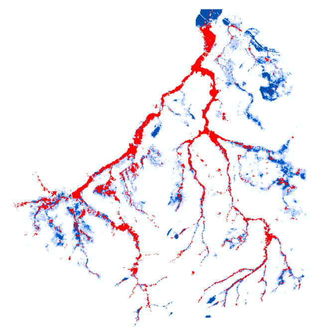

```{r packages, include=FALSE}
library(sf)
library(terra)
library(tidyverse)
library(dplyr)
library(here)
library(readxl)
library(viridis)
library(mapview)
library(tools)     # Handig voor file_ext()
library(beepr) # voor de grap
library(leaflet) # Nodig voor colorFactor
library(qgisprocess)
library(jsonlite)
library(whitebox)
library(progress)

```

## Overzicht en opzet

Het script berekent de combineerbaarheid van de natuurdoelen (Toekomstlaag ANB, versie 2025) met overstromingen vanuit rivieren (fluviaal), door intense neerslag (pluviaal) en door beveractiviteit.

## 1. Data inladen en klaarmaken

De data zitten in een map "data" onder de folder van het **studiegebied** (rivierbeek, kleine_nete, dommel, herk_mombeek, ijzer, dijle). De folders van de studiegebieden zitten in de map scenarios, op hetzelfde niveau als het bestand `scenarios.Rproj`. Definieer in de eerste regel het studiegebied.

> | C:/R/NARA2026/nara2026-git/scenarios
> |    `scenarios.Rproj`
> |    \|—– data
> |          `Overstromingstolerantie_habitats_gis.xlsx`
> |    \|—– src -\> `07_combi_overstromingen.Rmd`
> |    \|—– rivierbeek
> |          \|—– data -\>

### 1.1. Kies bestanden

De volgende datasets worden gebruikt:

- toekomstlaag.shp -\> polygonen natuurdoelen
- overstromingsdiepte_t100_flu_plu.tif -\> waterdiepte voor fluviale en pluviale overstromingen bij toekomstig klimaat t100 (basiskaarten via WCS: [v2025](https://beta.waterinfo.be/web/?0) & herschaald naar 10 x 10 m). Voor combinatie fluviale en pluviale kaarten: zie ArcGIS-model `floodplain_rem`
  - De pluviale overstromingsgevaarkaart wordt gebruikt om de overstromingszones van de kleinere waterlopen in kaart te brengen. Om alleen de overstromingscellen mee te nemen die grenzen aan een waterloop, wordt een costdistance-analyse vanuit de waterlopen uitgevoerd, waarbij de niet-verstroomde cellen een barrière vormen. Geïsoleerde overstromingszones die alleen via afspoeling overstromen, worden zo uitgesloten.
- overstromingstolerantie_habitats_gis.xlsx -\> tabel combineerbaarheid natuur en overstromingen
- rem.tif -\> relative elevation model = relatieve hoogte van de vallei tov de waterhoogte in een waterloop. Geeft een benadering van de overstromingsvlakte van de rivier bij afwezigheid van dijken.
  - -\> zie ArcGIS-model `floodplain_rem`

```{r bestanden_folders}

studiegebied <- "rivierbeek"

# Kies de bestanden die je nodig hebt
# ecosysteem.tif is steeds nodig als referentieraster

targets <- c("ecosysteem.tif", "toekomstlaag.shp", "overstromingsdiepte_t100_flu_plu.tif", "dhm.tif", "vha.shp", "overstromingstolerantie_habitats_gis.xlsx")

# In welke folders zitten de data?

search_paths <- c(str_c("C:/R/NARA2026/nara2026-git/scenarios/", studiegebied, "/data"),
  "C:/R/NARA2026/nara2026-git/scenarios/data"
)

```

### 1.2. Data inladen

Het script laadt alle bestanden in de lijst `targets` in, zet de extent en de crs van alle rasters om naar die van de kaart **ecosysteem** en ze de kaarten in de Global environment.

```{r data, message=FALSE, warning=FALSE }

# 1. Inladen bestanden

all_available_files <- list.files(search_paths, full.names = TRUE, recursive = TRUE)

# Filter de lijst: behoud alleen de bestanden die in je 'targets' lijst staan
files_to_load <- all_available_files[basename(all_available_files) %in% targets]

# functie om de bestanden in te laden (tifs, shapes en xlsx)
load_file <- function(path) {
  ext <- tolower(file_ext(path))
  obj <- switch(ext,
    "shp"  = st_read(path, quiet = TRUE),
    "tif"  = rast(path),
    "xlsx" = read_excel(path),
    stop(paste("Bestandstype niet ondersteund:", ext))
  )
  return(obj)
}

data_list <- lapply(files_to_load, load_file)

names(data_list) <- file_path_sans_ext(basename(files_to_load))

# 2. CRS en extent gelijkstellen

ref_raster <- data_list$ecosysteem

# Functie om rasters te harmoniseren
harmoniseer_raster <- function(r, ref) {
  # Controleer of het object een raster is
  if (!inherits(r, "SpatRaster")) {
    return(r) 
  }
  # 'near' voor categorische data (codes), 'bilinear' voor continue data
  is_cat <- is.factor(r) || is.bool(r)
  method_type <- if(is_cat) "near" else "bilinear"
  # CRS, extent en resolutie van ref_raster
  r_gelijkaardig <- project(r, ref, method = method_type)
  # Bijknippen met ref_raster
  r_geclipt <- mask(r_gelijkaardig, ref)
  return(r_geclipt)
}

# Pas functie toe op de hele lijst
data_list_ok <- lapply(data_list, harmoniseer_raster, ref = ref_raster)


# 3. Zet bestanden in je Global Environment
list2env(data_list_ok, envir = .GlobalEnv)
```

## 2. Combineerbaarheid met overstromingen

De combineerbaarheid van de natuurdoelen met overstromingen wordt bepaald op basis van de waterdiepte bij een overstroming met terugkeerperiode van 100 jaar (**t100**) onder het **toekomstig klimaat** (2050). De tolerantiescores (0 = niet tolerant -\> 3 = tolerant) zijn afkomstig uit de studie van De Nocker. De tabel `overstromingstolerantie_habitats_gis` geeft tolerantiescores voor winter- (w) en zomeroverstromingen (z) bij verschillende dieptes (d \< 20 cm, d tussen 20 en 50 cm en d \> 50 cm). De meeste De Nocker-types kunnen aan meerdere habitattypes gekoppeld worden en omgekeerd. Voor habitattypes die meerdere De Nocker-types hebben, werd voor elke kolom (seizoen & diepte) een hoogste en laagste waarde bepaald op basis van het meest en minst gevoelige type. Bijvoorbeeld:

- wd20 = tolerantie voor een **winter**overstroming met waterdiepte minder dan **20 cm**, op basis van het **meest tolerante** vegetatietype
- minzd50 = tolerantie voor een **zomer**overstroming met waterdiepte meer dan **50 cm**, op basis van het **minst tolerante** vegetatietype

In deze analyse gebruiken we de scores voor de **minst tolerante types bij een winsteroveroverstroming**. Dat komt overeen met een *worst case* scenario bij een zware winteroverstroming. Zomeroverstromingen laten we buiten beschouwing omdat die eerder zeldzaam zijn (cf. waterbom).

Stappen:

1.  Selectie van percelen met vegetaties die minstens 30% van het perceel bedekken
2.  Tolerantiescores koppelen aan vegetaties (minw\*\*d) -\> bij meerdere vegetatietypes per perceel: kies minst tolerante type
3.  Schrijf de tolerantiescores voor elk van de dieptes weg als apart raster
4.  Vergelijk de tolerantierasters met de waterdiepte

**Opmerking**: het script vergelijkt de waterdiepte pixel per pixel met de tolerantie per perceel -\> ook waterdiepte per perceel bereken zodat de vergelijking volledig op perceelsniveau gebeurt?

```{r combineerbaarheid}

# Data hernoemen
percelen <- toekomstlaag
tbl_tolerantie <- overstromingstolerantie_habitats_gis
waterdiepte <- overstromingsdiepte_t100_flu_plu

# 1. Tabel transformeren voor koppeling
# We maken een 'long' format om makkelijker te filteren en te matchen
percelen_df <- as.data.frame(percelen) %>%
  mutate(ID_perceel = row_number()) %>%
  pivot_longer(
    cols = starts_with("HAB"), 
    names_to = "HAB_nr", 
    values_to = "HAB_type"
  ) %>%
  # Match de bedekkingsgraad (pHAB) bij het juiste HAB_type
  mutate(p_nr = sub("HAB", "pHAB", HAB_nr)) %>%
  rowwise() %>%
  mutate(bedekking = get(p_nr)) %>%
  filter(bedekking > 30) # Criterium: alleen bedekkingsgraad > 30% telt mee

# 2. Koppel de tolerantiescores uit Excel
percelen_scores <- percelen_df %>%
  left_join(tbl_tolerantie, by = c("HAB_type" = "habitat")) %>%
  group_by(ID_perceel) %>%
  # Kies per perceel het vegetatietype met de laagste tolerantie
  summarise(
    min_wd20   = min(minwd20, na.rm = TRUE),
    min_w20d50 = min(minw20d50, na.rm = TRUE),
    min_w50d   = min(minw50d, na.rm = TRUE)
  ) %>%
  mutate(across(starts_with("min_"), ~ ifelse(is.infinite(.), NA, .))) # inf op NA zetten

# Voeg scores terug toe aan de vector data
percelen_final <- merge(percelen, percelen_scores, by.x = "row.names", by.y = "ID_perceel", all.x = FALSE)

# 3. Maak een basisraster (10x10m) op basis van de extent van de ecosysteemkaart
target_res <- 10
r_base <- rast(ext(ecosysteem), resolution = target_res, crs = crs(ecosysteem))

# Rasteriseer de 3 tolerantiescores naar 10x10m
r_wd20   <- rasterize(percelen_final, r_base, field = "min_wd20")
r_w20d50 <- rasterize(percelen_final, r_base, field = "min_w20d50")
r_w50d   <- rasterize(percelen_final, r_base, field = "min_w50d")


# 4. Bereken de combineerbaarheid
combineerbaarheid <- ifel(waterdiepte < 20, r_wd20,
                 ifel(waterdiepte >= 20 & waterdiepte <= 50, r_w20d50,
                  ifel(waterdiepte > 50, r_w50d, NA)))

combineerbaarheid_t100 <- mask(combineerbaarheid, waterdiepte)

# 0 = niet combineerbaar - 3 = combineerbaar
# Voor de finale beoordeling: score 0 en 1 zijn niet combineerbaar
combineerbaarheid_t100 <- ifel(combineerbaarheid_t100 <= 1, 1, 2)

mapview(combineerbaarheid_t100)

# Opslaan van het resultaat
writeRaster(combineerbaarheid_t100, "combineerbaarheid_t100.tif", overwrite = TRUE)

```

## 3. Combineerbaarheid met beveractiviteit

Om de combineerbaarheid van de natuurdoelen met overstromingen door beveractiviteit te bepalen, hanteren we dezelfde uitgangsprincipes als die voor de opmaak van de indicatorkaart combineerbaarheid vegetatie met overstromingen door bever uit het soortbeschermingsprogramma ([Bijlage SBP bever](https://ecopedia.s3.eu-central-1.amazonaws.com/pdfs/soortenbeschermingsprogramma_bever.pdf) en [kaart](https://natuurenbos.vlaanderen.be/sites/default/files/documenten/indicatorkaart_combineerbaarheid_vegetatie_met_overstromingen_door_bever.pdf)). Daarbij wordt gebruik gemaakt van de combineerbaarheidsscores uit [De Nocker (2007)](https://pureportal.inbo.be/files/5836757/DeNocker_etal_2007_MultifunctionaliteitOverstromingsgebiedenSamenvatting.pdf) voor een **langdurige** overstroming (\> 14 dagen) tijdens de vegetatieperiode (**zomer**) met een overstromingsdiepte van **meer dan 20 cm**.

Alleen natuurdoelen die in een overstroombaar deel van een waterloop liggen (t100), worden in rekening gebracht om te vermijden dat locaties waar geen bevers voorkomen ook als niet-combineerbaar beoordeeld worden.

**Opmerking**: t100 of REM gebruiken om zones af te bakenen waar bevers kunnen voorkomen? t100 houdt rekening met het huidige waterbeheer (incl. aanwezigheid dijken), terwijl REM kijkt naar wat onder water kan staan als het water in een waterloop stijgt tot maximaal 0.8 m boven oever.

{width="300"}

Score combineerbaarheid: 0 = dik probleem; 3 = geen probleem

```{r bever}

# percelen_df uit de vorige analyse

# Koppel de tolerantiescores uit Excel
percelen_scores_bever <- percelen_df %>%
  left_join(tbl_tolerantie, by = c("HAB_type" = "habitat")) %>%
  group_by(ID_perceel) %>%
  # Kies per perceel het vegetatietype met de laagste tolerantie
  summarise(
    min_z20d50 = min(minz20d50, na.rm = TRUE), # cf score SBP
    z20d50 = min(z20d50, na.rm = TRUE), # max. tolerantiescore zomer
    min_w20d50 = min(minw20d50, na.rm = TRUE) # min. tolerantiescore winter
  ) %>%
  mutate(across(starts_with("min_"), ~ ifelse(is.infinite(.), NA, .))) # inf op NA zetten

# Voeg scores terug toe aan de vector data
percelen_final <- merge(percelen, percelen_scores_bever, by.x = "row.names", by.y = "ID_perceel", all.x = FALSE)

# 3. Maak een basisraster (10x10m) op basis van de extent van de ecosysteemkaart
target_res <- 10
r_base <- rast(ext(ecosysteem), resolution = target_res, crs = crs(ecosysteem))

# Rasteriseer de tolerantiescores naar 10x10m
r_z20d50   <- rasterize(percelen_final, r_base, field = "min_z20d50")
r_w20d50   <- rasterize(percelen_final, r_base, field = "min_w20d50")
r_z20d50_max   <- rasterize(percelen_final, r_base, field = "z20d50")

# Voor de finale beoordeling: score 0 en 1 zijn niet combineerbaar

combineerbaar_bever <- ifel(r_z20d50_max <= 1, 1, 2)

# Alleen natuur in overstroombare valleien in rekening brengen
combineerbaar_bever_t100 <- mask(combineerbaar_bever, waterdiepte)


plot(combineerbaar_bever_t100)

mapview(combineerbaarheid_t100) + mapview(combineerbaar_bever_t100)
```

## 4. Afbakenen zones met zelfde waterdiepte

Clusteren van cellen met eenzelfde waterdiepte

```{r zones}

intolerant <- ifel(combineerbaarheid_t100 <= 1, 1, NA)

r_tol <- intolerant
r_dhm <- dhm

# 2. Identificeer unieke clusters van niet-tolerante cellen
# Patches groepeert aangrenzende cellen met waarde 1
clusters <- patches(r_tol, directions = 8, zeroAsNA = TRUE)

vha_terra <- vect(vha)
celgrootte <- res(dhm)[1]
rivieren_buffer <- buffer(vha_terra, width = celgrootte / 2)
rivieren_raster <- rasterize(rivieren_buffer, dhm, touches = TRUE, field = 1, background = NA)

overstroombaar_barriere <- ifel(waterdiepte > 0, 0, NA)
rivier_barriere <- ifel(is.na(rivieren_raster), 0, NA)

mask <- ifel(is.na(rivier_barriere) | is.na(overstroombaar_barriere), NA, 0)

# clusters opkuisen door rivieren uit te knippen en clusters < 5 cellen te verwijderen
clusters_clean <- clusters + rivier_barriere

f <- freq(clusters_clean)
clusters_clean[clusters_clean %in% f$value[f$count < 5]] <- NA


cluster_stats <- zonal(dhm, clusters_clean, fun = "mean", na.rm = TRUE)

# Maak er een handige opzoekvector van: c("ID" = hoogte)
hoogte_lookup <- setNames(cluster_stats[[2]], cluster_stats[[1]])


# Cluster ID's verzamelen
cluster_ids <- as.character(names(hoogte_lookup))
cluster_ids <- cluster_ids[cluster_ids != "0"] # Verwijder eventuele achtergrondcellen

distance_resultaten <- list()

# Loop door de clusters
for (id in cluster_ids) {
  cat("Verwerken van cluster:", id, "\n")
  
  # 1. Haal de vooraf berekende hoogte direct op (0 milliseconden)
  hoogte <- hoogte_lookup[id]
  if (is.na(hoogte)) next
  
  # 2. Startpunt definiëren
  start_cluster <- clusters_clean == as.integer(id)
  start_cluster <- ifel(start_cluster, 1, NA) 
  
  # dhm > hoogte -> barriere voor distance-analyse 
  is_te_hoog <- dhm > hoogte
  barriere_hoogte <- classify(is_te_hoog, rcl = matrix(c(0, 0, 1, NA), ncol = 2, byrow = TRUE))
  
  # Voeg alle barrières samen met cover
  geupdatet_masker <- mask(barriere_hoogte, mask, maskvalues = NA, updatevalue = NA)  
  
  input_grid <- cover(start_cluster, geupdatet_masker)

  # Crop de input naar de zone die er werkelijk toe doet
  # Dit voorkomt dat gridDist rekent op de lege 90% van je kaart
  focal_area <- trim(input_grid) 
  
  # Voer de distance-analyse uit op de gecropte zone
  dist_focal <- gridDist(focal_area, target = 1)
  
  # Breid het resultaat weer uit naar de originele kaartgrootte
  dist_cluster <- extend(dist_focal, dhm)
  
  # Sla het resultaat op
  distance_resultaten[[id]] <- dist_cluster
}


# Resultaten combineren
raster_multilaag <- rast(distance_resultaten)

eindkaart_min_afstand <- app(raster_multilaag, fun = "min", na.rm = TRUE)

clusters_verbonden <- ifel(!is.na(eindkaart_min_afstand), 1, NA)
```
