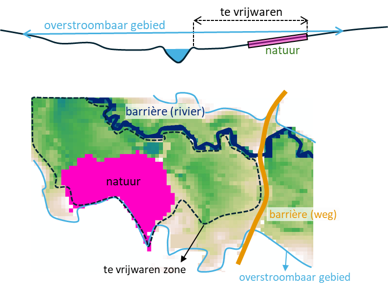
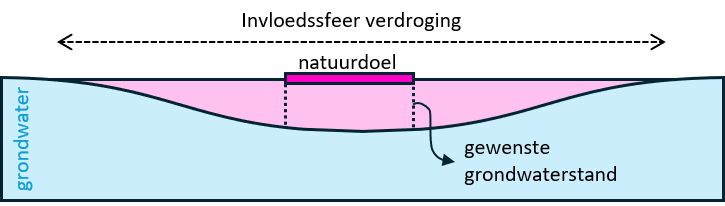

```{r packages, include=FALSE}
library(sf)
library(terra)
library(tidyverse)
library(dplyr)
library(here)
library(readxl)
library(viridis)
library(mapview)
library(tools)     # Handig voor file_ext()
library(beepr) # voor de grap
library(leaflet) # Nodig voor colorFactor
library(qgisprocess)
library(jsonlite)
library(whitebox)
library(progress)

```

## Overzicht en opzet

Het script berekent de combineerbaarheid van de natuurdoelen (Toekomstlaag ANB, versie 2025) met (1) overstromingen vanuit rivieren (fluviaal), door intense neerslag (pluviaal) en door beveractiviteit, (2) vernatting door peilverhoging in rivieren en (3) vernatting voor veenherstel.

Voor de combineerbaarheid met **overstromingen en vernatting** worden in een eerste stap de niet combineerbare cellen geselecteerd. In een tweede stap wordt de zone afgebakend die ook gevrijwaard moet worden van vernatting of overstromingen om de intolerante natuurdoelen te realiseren. Omdat zowel de overstromingen als de vernatting vanuit de rivier komen, bakenen we daarvoor de zones af die tussen de intolerante natuurdoelen en de rivier liggen op basis van de waterdiepte bij overstromingen.

{width="333"}

Bij **veenherstel** bakenen we de zone rond de niet-combineerbare natuurdoelen af waarbinnen het grondwater onder het maaiveld zakt i.f.v. het grondwaterregime dat nodig is om het natuurdoel te realiseren.

{width="351"}

## 1. Data inladen en klaarmaken

De data zitten in een map "data" onder de folder van het **studiegebied** (rivierbeek, kleine_nete, dommel, herk_mombeek, ijzer, dijle). De folders van de studiegebieden zitten in de map scenarios, op hetzelfde niveau als het bestand `scenarios.Rproj`. Definieer in de eerste regel het studiegebied.

> | C:/R/NARA2026/nara2026-git/scenarios
> |    `scenarios.Rproj`
> |    \|—– data
> |          `Overstromingstolerantie_habitats_gis.xlsx`
> |    \|—– src -\> `07_combi_overstromingen.Rmd`
> |    \|—– rivierbeek
> |          \|—– data -\>

### 1.1. Kies bestanden

De volgende datasets worden gebruikt:

- toekomstlaag.shp -\> polygonen natuurdoelen
- overstromingsdiepte_t100_flu_plu.tif -\> waterdiepte voor fluviale en pluviale overstromingen bij toekomstig klimaat t100 (basiskaarten via WCS: [v2025](https://beta.waterinfo.be/web/?0) & herschaald naar 10 x 10 m). Voor combinatie fluviale en pluviale kaarten: zie ArcGIS-model `floodplain_rem`
  - De pluviale overstromingsgevaarkaart wordt gebruikt om de overstromingszones van de kleinere waterlopen in kaart te brengen. Om alleen de overstromingscellen mee te nemen die grenzen aan een waterloop, wordt een costdistance-analyse vanuit de waterlopen uitgevoerd, waarbij de niet-verstroomde cellen een barrière vormen. Geïsoleerde overstromingszones die alleen via afspoeling overstromen, worden zo uitgesloten.
- overstromingstolerantie_habitats_gis.xlsx -\> tabel combineerbaarheid natuur en overstromingen
- grondwaterregime_habitats.xlsx -\> tabel met vereisten van habitattypen en rbb's voor het grondwaterregime (vier klassen voor het grondwaterregime -\> cf. indeling signaalkaart en meetnet natuurlijk milieu)
- vha.shp -\> waterlopen als barrières voor distance-analyse
- wegen.shp -\> wegen als barrières voor distance-analyse
- veen1970_poly.shp -\> veengebieden

```{r bestanden_folders}

studiegebied <- "kleine_nete"

# Kies de bestanden die je nodig hebt
# ecosysteem.tif is steeds nodig als referentieraster

targets <- c("ecosysteem_2022.tif", "toekomstlaag.shp", "veen1970_poly.shp", "wegen.shp", "overstromingsdiepte_t100_flu_plu.tif", "vha.shp", "textuur.tif", "overstromingstolerantie_habitats_gis.xlsx", "grondwaterregime_habitats.xlsx")

# In welke folders zitten de data?

search_paths <- c(str_c("C:/R/NARA2026/nara2026-git/scenarios/", studiegebied, "/data"),
  "C:/R/NARA2026/nara2026-git/scenarios/data"
)

```

### 1.2. Data inladen

Het script laadt alle bestanden in de lijst `targets` in, zet de extent en de crs van alle rasters om naar die van de kaart **ecosysteem** en ze de kaarten in de Global environment.

```{r data, message=FALSE, warning=FALSE }

# 1. Inladen bestanden

all_available_files <- list.files(search_paths, full.names = TRUE, recursive = TRUE)

# Filter de lijst: behoud alleen de bestanden die in je 'targets' lijst staan
files_to_load <- all_available_files[basename(all_available_files) %in% targets]

# functie om de bestanden in te laden (tifs, shapes en xlsx)
load_file <- function(path) {
  ext <- tolower(file_ext(path))
  obj <- switch(ext,
    "shp"  = st_read(path, quiet = TRUE),
    "tif"  = rast(path),
    "xlsx" = read_excel(path),
    stop(paste("Bestandstype niet ondersteund:", ext))
  )
  return(obj)
}

data_list <- lapply(files_to_load, load_file)

names(data_list) <- file_path_sans_ext(basename(files_to_load))

# 2. CRS en extent gelijkstellen

ref_raster <- data_list$ecosysteem_2022

# Functie om rasters te harmoniseren
harmoniseer_raster <- function(r, ref) {
  # Controleer of het object een raster is
  if (!inherits(r, "SpatRaster")) {
    return(r) 
  }
  # 'near' voor categorische data (codes), 'bilinear' voor continue data
  is_cat <- is.factor(r) || is.bool(r)
  method_type <- if(is_cat) "near" else "bilinear"
  # CRS, extent en resolutie van ref_raster
  r_gelijkaardig <- project(r, ref, method = method_type)
  # Bijknippen met ref_raster
  r_geclipt <- mask(r_gelijkaardig, ref)
  return(r_geclipt)
}

# Pas functie toe op de hele lijst
data_list_ok <- lapply(data_list, harmoniseer_raster, ref = ref_raster)


# 3. Zet bestanden in je Global Environment
list2env(data_list_ok, envir = .GlobalEnv)
```

## 2. Overstromingen

### 2.1. t100

De combineerbaarheid van de natuurdoelen met overstromingen wordt bepaald op basis van de waterdiepte bij een overstroming met terugkeerperiode van 100 jaar (**t100**) onder het **toekomstig klimaat** (2050). De tolerantiescores (0 = niet tolerant -\> 3 = tolerant) zijn afkomstig uit de studie van De Nocker. De tabel `overstromingstolerantie_habitats_gis` geeft tolerantiescores voor winter- (w) en zomeroverstromingen (z) bij verschillende dieptes (d \< 20 cm, d tussen 20 en 50 cm en d \> 50 cm). De meeste De Nocker-types kunnen aan meerdere habitattypes gekoppeld worden en omgekeerd. Voor habitattypes die meerdere De Nocker-types hebben, werd voor elke kolom (seizoen & diepte) een hoogste en laagste waarde bepaald op basis van het meest en minst gevoelige type. Bijvoorbeeld:

- wd20 = tolerantie voor een **winter**overstroming met waterdiepte minder dan **20 cm**, op basis van het **meest tolerante** vegetatietype
- minzd50 = tolerantie voor een **zomer**overstroming met waterdiepte meer dan **50 cm**, op basis van het **minst tolerante** vegetatietype

In deze analyse gebruiken we de scores voor de **minst tolerante types bij een winsteroveroverstroming**. Dat komt overeen met een *worst case* scenario bij een zware winteroverstroming. Zomeroverstromingen laten we buiten beschouwing omdat die eerder zeldzaam zijn (cf. waterbom).

Stappen:

- Stap 1 - Selectie van percelen met vegetaties die minstens 30% van het perceel bedekken
- Stap 2 - Tolerantiescores koppelen aan vegetaties (minw\*\*d) -\> bij meerdere vegetatietypes per perceel: kies minst tolerante type
- Stap 3 - Schrijf de tolerantiescores voor elk van de dieptes weg als apart raster
- Stap 4 - Vergelijk de tolerantierasters met de waterdiepte

**Opmerking**: het script vergelijkt de waterdiepte pixel per pixel met de tolerantie per perceel -\> ook waterdiepte per perceel bereken zodat de vergelijking volledig op perceelsniveau gebeurt?

**Stap 1 - Selecteer natuurdoelen die minstens 30% van perceel bedekken**

```{r natuurdoelen_30_percent}

percelen <- toekomstlaag

# Selectie van natuurdoelen die minstens 30% van een perceel bedekken
percelen_df <- as.data.frame(percelen) %>%
  mutate(ID_perceel = row_number()) %>%
  pivot_longer(
    cols = starts_with("HAB"), 
    names_to = "HAB_nr", 
    values_to = "HAB_type"
  ) %>%
  # Match de bedekkingsgraad (pHAB) bij het juiste HAB_type
  mutate(p_nr = sub("HAB", "pHAB", HAB_nr)) %>%
  rowwise() %>%
  mutate(bedekking = get(p_nr)) %>%
  filter(bedekking > 30) # Criterium: alleen bedekkingsgraad > 30% telt mee

```

**Stap 2 - 4 - tolerantiescores per perceel en combineerbaarheid met overstromingen per perceel**

```{r combi_t100}

tbl_tolerantie <- overstromingstolerantie_habitats_gis
waterdiepte <- overstromingsdiepte_t100_flu_plu

# 1. Koppel de tolerantiescores aan de geselecteerde doelen
percelen_scores <- percelen_df %>%
  left_join(tbl_tolerantie, by = c("HAB_type" = "habitat")) %>%
  group_by(ID_perceel) %>%
  # Kies per perceel het vegetatietype met de laagste tolerantie
  summarise(
    min_wd20   = min(minwd20, na.rm = TRUE),
    min_w20d50 = min(minw20d50, na.rm = TRUE),
    min_w50d   = min(minw50d, na.rm = TRUE)
  ) %>%
  mutate(across(starts_with("min_"), ~ ifelse(is.infinite(.), NA, .))) # inf op NA zetten

# Voeg scores terug toe aan de vector data
percelen_final <- merge(percelen, percelen_scores, by.x = "row.names", by.y = "ID_perceel", all.x = FALSE)

# 2. Maak een basisraster (10x10m) op basis van de extent van de ecosysteemkaart
target_res <- 10
r_base <- rast(ext(ecosysteem_2022), resolution = target_res, crs = crs(ecosysteem_2022))

# Rasteriseer de 3 tolerantiescores naar 10x10m
r_wd20   <- rasterize(percelen_final, r_base, field = "min_wd20")
r_w20d50 <- rasterize(percelen_final, r_base, field = "min_w20d50")
r_w50d   <- rasterize(percelen_final, r_base, field = "min_w50d")


# 3. Bereken de combineerbaarheid
combineerbaarheid <- ifel(waterdiepte < 20, r_wd20,
                 ifel(waterdiepte >= 20 & waterdiepte <= 50, r_w20d50,
                  ifel(waterdiepte > 50, r_w50d, NA)))

combineerbaarheid_t100 <- mask(combineerbaarheid, waterdiepte)

# 0 = niet combineerbaar - 3 = combineerbaar
# Voor de finale beoordeling: score 0 en 1 zijn niet combineerbaar
combineerbaarheid_t100 <- ifel(combineerbaarheid_t100 <= 1, 1, NA)

mapview(combineerbaarheid_t100)

# Resultaat opslaan (1 = niet combineerbaar)
writeRaster(combineerbaarheid_t100, filename = str_c("C:/R/NARA2026/nara2026-git/scenarios/", studiegebied, "/data/combineerbaarheid_t100.tif"), overwrite = TRUE)

```

### 2.2. Beverdammen

Om de combineerbaarheid van de natuurdoelen met overstromingen door beveractiviteit te bepalen, hanteren we dezelfde uitgangsprincipes als die voor de opmaak van de indicatorkaart combineerbaarheid vegetatie met overstromingen door bever uit het soortbeschermingsprogramma ([Bijlage SBP bever](https://ecopedia.s3.eu-central-1.amazonaws.com/pdfs/soortenbeschermingsprogramma_bever.pdf) en [kaart](https://natuurenbos.vlaanderen.be/sites/default/files/documenten/indicatorkaart_combineerbaarheid_vegetatie_met_overstromingen_door_bever.pdf)). Daarbij wordt gebruik gemaakt van de combineerbaarheidsscores uit [De Nocker (2007)](https://pureportal.inbo.be/files/5836757/DeNocker_etal_2007_MultifunctionaliteitOverstromingsgebiedenSamenvatting.pdf) voor een **langdurige** overstroming (\> 14 dagen) tijdens de vegetatieperiode (**zomer**) met een overstromingsdiepte van **meer dan 20 cm**.

Alleen natuurdoelen die in een overstroombaar deel van een waterloop liggen (t100), worden in rekening gebracht om te vermijden dat locaties waar geen bevers voorkomen ook als niet-combineerbaar beoordeeld worden.

Score combineerbaarheid: 0 = dik probleem; 3 = geen probleem

```{r combi_bever}

# percelen_df uit de vorige analyse

# Koppel de tolerantiescores uit Excel
percelen_scores_bever <- percelen_df %>%
  left_join(tbl_tolerantie, by = c("HAB_type" = "habitat")) %>%
  group_by(ID_perceel) %>%
  # Kies per perceel het vegetatietype met de laagste tolerantie
  summarise(
    min_zd20 = min(zd20, na.rm = TRUE),
    min_z20d50 = min(z20d50, na.rm = TRUE),
    min_z50d = min(z50d, na.rm = TRUE)
  ) %>%
  mutate(across(starts_with("min_"), ~ ifelse(is.infinite(.), NA, .))) # inf op NA zetten

# Voeg scores terug toe aan de vector data
percelen_final <- merge(percelen, percelen_scores_bever, by.x = "row.names", by.y = "ID_perceel", all.x = FALSE)

# 3. Maak een basisraster (10x10m) op basis van de extent van de ecosysteemkaart
target_res <- 10
r_base <- rast(ext(ecosysteem_2022), resolution = target_res, crs = crs(ecosysteem_2022))

# Rasteriseer de tolerantiescores naar 10x10m
r_zd20 <- rasterize(percelen_final, r_base, field = "min_zd20")
r_z20d50   <- rasterize(percelen_final, r_base, field = "min_z20d50")
r_z50d   <- rasterize(percelen_final, r_base, field = "min_z50d")


# 4. Bereken de combineerbaarheid ifv de diepteligging van de natuurdoelen
combineerbaarheid <- ifel(waterdiepte < 20, r_zd20,
                 ifel(waterdiepte >= 20 & waterdiepte <= 50, r_z20d50,
                  ifel(waterdiepte > 50, r_z50d, NA)))

# 0 = niet combineerbaar - 3 = combineerbaar
# Voor de finale beoordeling: score 0 en 1 zijn niet combineerbaar
combineerbaar_bever <- ifel(combineerbaarheid <= 1, 1, NA)

# Alleen natuur in overstroombare valleien in rekening brengen
combineerbaar_bever_t100 <- mask(combineerbaar_bever, waterdiepte)

# Resultaat opslaan (1 = niet combineerbaar)
writeRaster(combineerbaar_bever_t100, filename = str_c("C:/R/NARA2026/nara2026-git/scenarios/", studiegebied, "/data/combineerbaar_bever_t100.tif"), overwrite = TRUE)
```

Opkuisen tijdelijke bestanden

```{r clear}

behouden <- c("combineerbaarheid_t100", "waterdiepte", "combineerbaar_bever_t100", "ecosysteem", "wegen", "vha")

rm(list = setdiff(ls(), behouden))

# 2. Verwijder tijdelijke rasterbestanden die terra op je harde schijf heeft geparkeerd
tmpFiles(remove = TRUE, old = TRUE)

# 3. Dwing R om het RAM-geheugen onmiddellelijk vrij te geven aan je computer
gc()
```

### 2.3. Zones vrijwaren van overstromingen

Het onderstaande script bakent de zones af die niet mogen overstromen om natuurdoelen die niet bestand zijn tegen overstromingen te vrijwaren. Daarbij gaan we ervan uit dat alle cellen in overstroombaar gebied die grenzen aan de te vrijwaren natuurcellen en lager of even hoog als de natuurcellen liggen, niet mogen overstromen.

De zones die niet mogen overstromen worden geïdentificeerd via een **patches-analyse** die nagaat welke cellen die lager gelegen zijn dan de natuurcellen een aaneengesloten geheel vormen met de natuurcellen. Daarbij bakent een masker de zones af die een barrière vormen voor de analyse (= hoger gelegen cellen of cellen die aan de andere kant van de waterloop liggen). De volgende stappen worden doorlopen:

- Stap 1 - definieer het masker met cellen die een barrière vormen voor de patches-analyse.
  - Alleen **overstroombare cellen** worden in rekening gebracht -\> pluviale en fluviale t100-kaart
  - **Rivieren** vormen een barrière (dijken kunnen er bv. voor zorgen dat de ene oever kan overstromen en de andere niet)
  - **Wegen** vormen een barrière (transportinfrastructuur wordt vaak gevrijwaard van overstromingen)
- Stap 2 - maak clusters van de cellen met natuurdoelen die niet mogen overstromen. Daarvoor gebruiken we de resultaten van de analyse van combineerbaarheid van natuurdoelen met overstromingen. Omdat de verrasterde percelen van de toekomstkaart niet overal afgestemd zijn op de ecosysteemkaart (bv. overlap met waterlopen), snijden we ze bij met de verrasterde waterlopen. Clusters kleiner dan **10 cellen (0.1 ha)** laten we buiten beschouwing.
- Stap 3 - Voor elk cluster wordt de bijbehorende zone afgebakend die niet mag overstromen. Voorafgaand aan de patches-analyse wordt het barrièremasker geüpdatet met de cellen in de overstromingszone (t100) die hoger liggen (= minder diep) dan de natuurcellen.
  - Als drempelwaarde nemen we de P10-waarde van de waterdiepte binnen een cluster.
  - Het script loopt doorheen de afzonderlijke clusters. Bij veel clusters kan het daarom lang duren om het volledige gebied te analyseren. Om de rekentijd te beperken groeperen we clustercellen per 10 cm diepte (bv. clusters met een P10-diepte van 101 cm, 102 cm en 104 cm analyseren we samen in de groep van 100 cm diepte).

```{r zones_overstroming}

# Stap 1 - Masker

# 1.1. Alleen overstroombare cellen (t100)

overstroombaar_barriere <- ifel(waterdiepte > 0, 0, NA)

# 1.2. Rivieren als barrière toevoegen
vha_terra <- vect(vha)
celgrootte <- res(waterdiepte)[1]
rivieren_buffer <- buffer(vha_terra, width = celgrootte / 2)
rivieren_raster <- rasterize(rivieren_buffer, waterdiepte, touches = TRUE, field = 1, background = NA)

rivier_barriere <- ifel(is.na(rivieren_raster), 0, NA)

mask <- ifel(is.na(rivier_barriere) | is.na(overstroombaar_barriere), NA, 0)

# 1.3. Wegen als barriere toevoegen

buffer_breedte <- sqrt(celgrootte^2 + celgrootte^2) / 2 
# Buffer de wegen
wegen_gebufferd <- buffer(vect(wegen), width = buffer_breedte)
# Verrasteren
wegen_barriere <- rasterize(wegen_gebufferd, ecosysteem_2022, touches = TRUE, field = NA, background = 0)

mask <- ifel(is.na(mask) | is.na(wegen_barriere), NA, 0)

# Stap 2 - Identificeer unieke clusters van niet-tolerante cellen

# Resultaat analyse combineerbaarheid
intolerant <- combineerbaarheid_t100
intolerant <- combineerbaar_bever_t100

# Rivieren inbranden als barrière 
intolerant_riv <- intolerant + rivier_barriere

# Clusters maken
clusters <- patches(intolerant_riv, directions = 8, zeroAsNA = TRUE)

# clusters < 10 cellen verwijderen
f <- freq(clusters)
clusters_clean <- clusters
clusters_clean[clusters_clean %in% f$value[f$count < 10]] <- NA


cluster_stats <- zonal(
  waterdiepte,
  clusters_clean,
  fun = function(x) quantile(x, probs = 0.10, na.rm = TRUE)
)

diepte_lookup <- setNames(cluster_stats[[2]], cluster_stats[[1]])

cluster_info <- data.frame(
  id = as.integer(names(diepte_lookup)),
  diepte = as.numeric(diepte_lookup)
)

cluster_info <- cluster_info[cluster_info$id != 0, ]

# Groeperen clusters: ipv elke cluster apart te berekenen, groeperen we ze per 10 cm diepte
cluster_info$klasse <- round(cluster_info$diepte / 10, 0) * 10


# Initialiseren
bereikbaar <- rast(clusters_clean)
values(bereikbaar) <- NA

buffer_afstand <- 1000

klassen <- sort(
  unique(cluster_info$klasse),
  decreasing = TRUE
)

for(d in klassen){

  cat("\n")
  cat("Diepteklasse:", d, "\n")

  ids <- cluster_info$id[cluster_info$klasse == d]

  cat("Aantal clusters:", length(ids), "\n")

  start_clusters <- ifel(clusters_clean %in% ids, 1, NA)

  if(global(!is.na(start_clusters),
            "sum",
            na.rm=TRUE)[1,1] == 0)
    next
  
  # gezamenlijke bounding box
  start_trim <- trim(start_clusters)

  bb <- ext(start_trim)

  bb_buffer <- ext(
    xmin(bb) - buffer_afstand,
    xmax(bb) + buffer_afstand,
    ymin(bb) - buffer_afstand,
    ymax(bb) + buffer_afstand
  )

  # lokale uitsnede

  wd_local <- crop(waterdiepte, bb_buffer, snap = "out")

  mask_local <- crop(mask, bb_buffer, snap = "out")

  start_local <- crop(start_clusters, bb_buffer, snap = "out")

  # toegankelijk raster

  toegankelijk <- ifel(wd_local >= d, 1, NA)

  toegankelijk <- mask(toegankelijk, mask_local)

  # connected components

  cc <- patches(toegankelijk, directions = 8, zeroAsNA = TRUE)

  # componenten waarin minstens één cluster van deze klasse ligt

  cc_start <- mask(cc, start_local)

  comp_ids <- unique(values(cc_start))

  comp_ids <- comp_ids[!is.na(comp_ids)]

  if(length(comp_ids) == 0)
    next

  # selecteer componenten
  selectie <- cc %in% comp_ids

  selectie <- ifel(selectie, 1, NA)

  # terug projecteren naar originele extent

  selectie_full <- extend(selectie, bereikbaar)

  bereikbaar <- cover(bereikbaar, selectie_full)

  # Opkuisen tijdelijke bestanden
  rm(start_clusters, start_trim, wd_local, mask_local, start_local, toegankelijk, cc, cc_start, selectie, selectie_full)

  gc()
}

overstromingsvrije_clusters_bever <- bereikbaar

mapview(waterdiepte, na.color = "transparent") + mapview(overstromingsvrije_clusters, col.regions = "cadetblue2", na.color = "transparent") + mapview(clusters_clean, col.regions = "darkgreen", na.color = "transparent")

writeRaster(overstromingsvrije_clusters_bever, filename = str_c("C:/R/NARA2026/nara2026-git/scenarios/", studiegebied, "/data/intolerant_zone_bever.tif"), overwrite = TRUE)

```

## 3. Vernatting

### 3.1. Opstuwing rivier

#### a) Vernattingszone afbakenen

Het script bakent rond rivieren die in aanmerking komen voor hydrologisch herstel een zone af waarbinnen de grondwatertafel kan stijgen door de opstuwing in de herstelde rivier. Alleen de niet-kunstmatige onbevaarbare waterlopen van 1ste tot en met derde categorie die niet beheerd worden door de polders komen in aanmerking.

Voor de afbakening van de vernattingszone rond rivieren zijn er twee opties:

- Optie 1 (preferentieel) steunt op de doorlatendheid van de bodem (textuur) en de ondergrond (watervoerende lagen van de HCOV). Op basis daarvan wordt een weerstandskaart gemaakt die als input gebruikt wordt voor een cost distance analyse. De maximaal toegelaten cost is bepaald door de cumulatieve cost op 200 m van een rivier in de best doorlatende zone. Die aanpak heeft als voordeel dat de vernattingszone varieert in functie van de doorlatendheid van de bodem in de hele vallei.
- Optie 2 steunt op de doorlatendheid van de bodem (textuur) thv de rivier en bakent een vaste buffer per textuurklasse af. Dat heeft het voordeel van de eenvoud, maar negeert de doorlatendheid in de rest van de vallei. Een riviercel die op een veenbodem ligt, krijgt een brede buffer, ook als de bodem op 10 m van de rivier wijzigt in een kleibodem.

##### Optie 1

```{r vernattingszone_optie1}

# 1. Waterlopen voor analyse
vha_select <- vha %>%
  dplyr::filter(CATC %in% c(1, 2, 3) & (is.na(BEHEER) | !grepl("^P", BEHEER)) & (CODSTATOWL != "KWL" | is.na(CODSTATOWL)) & !CODTYPOWL %in% c("Pz", "Pb"))

r_vha <- rasterize(vha_select, ecosysteem_2022, touches = TRUE, field = 1)

# verticale doorlatendheid van de bodem (ksat) via textuur bodemkaart
ksat_v <- c(
  "G" = 10, "Z" = 1, "S" = 0.4, "P" = 0.15, "L" = 0.08,
  "V" = 0.05, "M" = 0.03, "X" = 0.1, "A" = 0.01, "E" = 0.001, "U" = 0.0001)

rat <- cats(textuur)[[1]]
rat <- rat[1:2]
names(rat) <- c("value", "textuur")

# Functie om ksat voor combinaties van textuurklassen (bv. U-A-S) te berekenen
calc_k <- function(t_string) {
  parts <- str_split(t_string, "-")[[1]]
  vals <- ksat_v[parts]
  return(mean(vals, na.rm = TRUE))
}

ksat_values <- rat %>%
  rowwise() %>%
  mutate(ksat_waarde = calc_k(textuur)) %>%
  ungroup()

ksat_v_r <- classify(textuur, ksat_values[, c("value", "ksat_waarde")])

# T (transmissiviteit (m2/d))
# Begrens de aquiferdikte tot 20m om de transmissiviteit niet te groot te maken
aquifer_20m <- clamp(aquifer_hcov, lower = 0, upper = 20)
transmis <- ksat_h_hcov * (aquifer_20m + 0.1) # klein getal bij optellen om niet 0 te worden

geleidbaarheid <- sqrt(transmis * ksat_v_r)
weerstand <- 1 / (geleidbaarheid + 0.001)

# Zoek de minimale frictiewaarde in het raster (de best doorlatende bodem, bijv. diep veen)
f_min_val <- global(weerstand, fun = function(x) quantile(x, probs = 0.01, na.rm = TRUE))[[1]]

# Maximale vernattingsafstand (200 meter) in de meest doorlatende bodem
max_cost <- 200 * f_min_val

# Riviercellen in weerstandskaart branden met waarde -999.
weerstand_target <- weerstand
weerstand_target[r_vha == 1] <- -999

# Bereken de cost-distance (geaccumuleerde weerstand vanaf de riviercellen)
r_cost_dist <- costDist(weerstand_target, target = -999)

vernattingszone <- ifel(r_cost_dist <= max_cost, 1, NA)

```

##### Optie 2

```{r vernattingszone_optie2}

vallei <- ifel(overstromingsdiepte_t100_flu_plu > 0, 1, NA)
vallei <- crop(vallei, ecosysteem_2022)

# Stap 1: tabel met vernattingsafstanden maken 

# Tabel met vernattingsafstanden per textuurklasse
dist_nat <- c(
  "G" = 500, "Z" = 200, "S" = 200, "P" = 150, "L" = 100,
  "V" = 500, "M" = 30, "X" = 30, "A" = 100, "E" = 30, "U" = 30)

rat <- cats(textuur)[[1]] # Raster Attribute Table
names(rat) <- c("value", "textuur")
rat <- rat %>% 
  select("value", "textuur")

# Functie om dist voor combinaties van textuurklassen (bv. U-A-S) te berekenen
calc_dist <- function(t_string) {
  parts <- str_split(t_string, "-")[[1]]
  vals <- dist_nat[parts]
  return(mean(vals, na.rm = TRUE))
}

tbl_dist_nat <- rat %>%
  rowwise() %>%
  mutate(afstand = calc_dist(textuur)) %>%
  ungroup()

# Stap 2: De vernattingsafstanden koppelen aan de waterloopsegmenten

# CRS van kaarten gelijkmaken + selectie VHA (alleen stromende waterlopen en kleinste weglaten) -> polderlopen (Pz, Pb) nog verwijderen
vha_select <- st_transform(vha, st_crs(ecosysteem_2022)) %>%
  dplyr::filter(CATC %in% c(1, 2, 3) & CODTYPOWL %in% c(NA, "Rzg", "Rg", "Rk", "Mlz", "RtNt", "BkK", "Bk", "BgK", "Bg", "Pz", "Pb"))

textuur <- project(textuur, ecosysteem_2022)

# Dominante textuurklasse per lijnsegment bepalen
ext_waarden <- terra::extract(textuur, vha_select, touches = TRUE)

# Functie om de modus (meest voorkomende waarde) te berekenen
get_mode <- function(x) {
  x <- na.omit(x)
  if (length(x) == 0) return(NA)
  ux <- unique(x)
  ux[which.max(tabulate(match(x, ux)))]
}

# De naam van de rasterkolom dynamisch ophalen
raster_naam <- names(textuur)[1]

# Bereken de dominante klasse per uniek ID
dominante_klassen <- ext_waarden %>%
  filter(!is.na(.data[[raster_naam]])) %>% 
  group_by(ID) %>%
  summarise(dominante_klasse = get_mode(.data[[raster_naam]]))

# Afstanden koppelen uit dist_values
dominante_klassen <- dominante_klassen %>%
  left_join(tbl_dist_nat, by = c("dominante_klasse" = "textuur"))

# Voeg een ID toe aan de originele waterlopen om te kunnen matchen
vha_select$ID <- 1:nrow(vha_select)
vha_met_afstand <- vha_select %>%
  left_join(dominante_klassen, by = "ID") %>%
  filter(!is.na(afstand))


# Stap 3: buffer rond de vha-segmenten maken

# Variabele buffer aanmaken
vha_buffer <- st_buffer(vha_met_afstand, dist = vha_met_afstand$afstand)

# Verrasteren van het eindresultaat
buffer_vector <- vect(vha_buffer) # Omzetten naar terra-formaat
buffer_rast <- rasterize(
  x = buffer_vector, 
  y = ecosysteem_2022, 
  field = "afstand", 
  fun = "min", 
  background = NA
)

# Stap 4: de vernattingsafstand beperken tot de overstromingszone

# Vernattingszone beperken tot grenzen overstromingskaart (t100) -> weglaten, de t100 is op veel plaatsen te smal of afwezig
vernattingszone <- ifel(!is.na(buffer_rast * vallei), 1, NA)
```

#### b) niet combineerbare natuurdoelen

```{r combi_vernatting}

# percelen_df uit de vorige analyse = percelen met alle habitattypes die minstens 30% van het perceel bedekken. Per perceel kunnen dus meerdere rijen voorkomen.

tbl_regime <- grondwaterregime_habitats # tabel met grondwaterregimes

# Koppel de tolerantiescores uit Excel
percelen_scores_glg <- percelen_df %>%
  left_join(tbl_regime, by = c("HAB_type" = "habitat")) %>%
  group_by(ID_perceel) %>%
  # Kies per perceel het vegetatietype met de laagste grondwaterstand
  summarise(max_glg = max(groep_glg, na.rm = TRUE)) %>%
  mutate(across(starts_with("max_"), ~ ifelse(is.infinite(.), NA, .))) # inf op NA zetten

# Voeg scores terug toe aan de vector data
percelen_final <- merge(percelen, percelen_scores_glg, by.x = "row.names", by.y = "ID_perceel", all.x = FALSE)

# 3. Maak een basisraster (10x10m) op basis van de extent van de ecosysteemkaart
r_base <- rast(ext(ecosysteem_2022), resolution = 10, crs = crs(ecosysteem_2022))

# Verraster de tolerantiescores naar 10x10m
r_maxglg <- rasterize(percelen_final, r_base, field = "max_glg")


# Bij vernatting stijgt glg minstens tot 0.5 m -mv -> glg 4 (vochtig) en 5 (droog) zijn niet combineerbaar
combineerbaar_vernatting <- ifel(r_maxglg >= 4, 1, NA)

# Alleen natuur in vernattingszone in rekening brengen
combineerbaar_vernattingszone <- mask(combineerbaar_vernatting, vernattingszone)

# Resultaat opslaan (1 = niet combineerbaar)
writeRaster(combineerbaar_vernattingszone, filename = str_c("C:/R/NARA2026/nara2026-git/scenarios/", studiegebied, "/data/combineerbaar_vernattingszone.tif"), overwrite = TRUE)
```

### 3.2. Zones vrijwaren van vernatting

##### Optie 1

-\> We draaien de stroomrichting van het model voor de afbakening van de vernattingszone om: in plaats van vanaf de rivier naar buiten te rekenen, rekenen we nu vanaf de conflictcellen naar de rivier. Ririviercellen die binnen het frictie-budget van een conflictcel liggen worden geselecteerd (score 1).

```{r zones_vernatting_optie1}
# Voor de selectie van riviercellen die niet hersteld mogen worden, gebruiken we de omgekeerde aanpak van die voor de afbakening van de vernattingszones.

# Zorg dat de conflictkaart 1 is op de conflictlocaties en NA op de rest.
r_conflict <- ifel(combineerbaar_vernattingszone == 1, 1, NA)

# We nemen het weerstandsraster en branden de conflictcellen in met -999.
weerstand_conflict <- weerstand
weerstand_conflict[r_conflict == 1] <- -999

# OPTIONEEL: Rivieren als barrière toevoegen
# vha_terra <- vect(vha)
# celgrootte <- res(vernattingszone)[1]
# rivieren_buffer <- buffer(vha_terra, width = celgrootte / 2)
# rivieren_raster <- rasterize(rivieren_buffer, vernattingszone, touches = TRUE, field = 1, background = NA)
# 
# rivier_barriere <- ifel(is.na(rivieren_raster), 0, NA)
# 
# weerstand_conflict <- weerstand_conflict + rivier_barriere

# Bereken de kostenafstand vanaf de conflictlocaties de vallei in.
# Dit geeft voor elke cel in de vallei aan hoe 'dichtbij' (in termen van weerstand)
# het dichtstbijzijnde conflict ligt.
r_cost_from_conflict <- costDist(weerstand_conflict, target = -999)

vernattingszone_conflict <- ifel(r_cost_from_conflict * vernattingszone > max_cost, NA, 1)

# We selecteren nu de riviercellen (r_vha == 1) die binnen het frictie-budget 
# van een conflictcel liggen (r_cost_from_conflict <= max_cost).
# Deze krijgen waarde 1, de rest wordt NA.
intolerant_vha_vernatting <- ifel(r_vha == 1 & r_cost_from_conflict <= max_cost, 1, NA)

# mapview(vernattingszone_conflict, col.regions = "lightblue", na.color = "transparent") + mapview(r_conflict, col.regions = "red", na.color = "transparent") + mapview(intolerant_vha_vernatting, na.color = "transparent")

writeRaster(intolerant_vha_vernatting, filename = str_c("C:/R/NARA2026/nara2026-git/scenarios/", studiegebied, "/data/intolerant_vha_vernatting.tif"), overwrite = TRUE)
```

##### Optie 2

-\> Volgt dezelfde aanpak als die voor overstromingen (niet kiezen omdat de overstromingscontouren op veel plaatsen afwezig zijn of veel kleiner zijn dan de vernattingszones)

```{r zones_vernatting_optie2}

# Stap 1 - Masker

# 1.1. Alleen overstroombare cellen (t100)

overstroombaar_barriere <- ifel(waterdiepte > 0, 0, NA)
vernatting_barriere <- ifel(vernattingszone > 0, 0, NA)

# 1.2. Rivieren als barrière toevoegen
vha_terra <- vect(vha)
celgrootte <- res(vernattingszone)[1]
rivieren_buffer <- buffer(vha_terra, width = celgrootte / 2)
rivieren_raster <- rasterize(rivieren_buffer, vernattingszone, touches = TRUE, field = 1, background = NA)

rivier_barriere <- ifel(is.na(rivieren_raster), 0, NA)

mask <- ifel(is.na(rivier_barriere) | is.na(vernatting_barriere), NA, 0)

# 1.3. Wegen als barriere toevoegen

buffer_breedte <- sqrt(celgrootte^2 + celgrootte^2) / 2 
# Buffer de wegen
wegen_gebufferd <- buffer(vect(wegen), width = buffer_breedte)
# Verrasteren
wegen_barriere <- rasterize(wegen_gebufferd, ecosysteem_2022, touches = TRUE, field = NA, background = 0)

mask <- ifel(is.na(mask) | is.na(wegen_barriere), NA, 0)

# Stap 2 - Identificeer unieke clusters van niet-tolerante cellen

# Resultaat analyse combineerbaarheid
intolerant <- combineerbaar_vernatting_t100

# Rivieren inbranden als barrière 
intolerant_riv <- intolerant + rivier_barriere

# Clusters maken
clusters <- patches(intolerant_riv, directions = 8, zeroAsNA = TRUE)

# clusters < 10 cellen verwijderen
f <- freq(clusters)
clusters_clean <- clusters
clusters_clean[clusters_clean %in% f$value[f$count < 10]] <- NA


cluster_stats <- zonal(
  waterdiepte,
  clusters_clean,
  fun = function(x) quantile(x, probs = 0.10, na.rm = TRUE)
)

diepte_lookup <- setNames(cluster_stats[[2]], cluster_stats[[1]])

cluster_info <- data.frame(
  id = as.integer(names(diepte_lookup)),
  diepte = as.numeric(diepte_lookup)
)

cluster_info <- cluster_info[cluster_info$id != 0, ]

# Drempelwaarde: ipv elke cluster apart te berekenen, groeperen we ze per 10 cm diepte
cluster_info$klasse <- round(cluster_info$diepte / 10, 0) * 10

# Initialiseren
bereikbaar_nat <- rast(clusters_clean)
values(bereikbaar_nat) <- NA


buffer_afstand <- 1000

klassen <- sort(
  unique(cluster_info$klasse),
  decreasing = TRUE
)

for(d in klassen){

  cat("\n")
  cat("Diepteklasse:", d, "\n")

  ids <- cluster_info$id[cluster_info$klasse == d]

  cat("Aantal clusters:", length(ids), "\n")

  start_clusters <- ifel(clusters_clean %in% ids, 1, NA)

  if(global(!is.na(start_clusters),
            "sum",
            na.rm=TRUE)[1,1] == 0)
    next
  
  # gezamenlijke bounding box
  start_trim <- trim(start_clusters)

  bb <- ext(start_trim)

  bb_buffer <- ext(
    xmin(bb) - buffer_afstand,
    xmax(bb) + buffer_afstand,
    ymin(bb) - buffer_afstand,
    ymax(bb) + buffer_afstand
  )

  # lokale uitsnede

  wd_local <- crop(waterdiepte, bb_buffer, snap = "out")

  mask_local <- crop(mask, bb_buffer, snap = "out")

  start_local <- crop(start_clusters, bb_buffer, snap = "out")

  # toegankelijk raster

  toegankelijk <- ifel(wd_local >= d, 1, NA)

  toegankelijk <- mask(toegankelijk, mask_local)

  # connected components

  cc <- patches(toegankelijk, directions = 8, zeroAsNA = TRUE)

  # componenten waarin minstens één cluster van deze klasse ligt

  cc_start <- mask(cc, start_local)

  comp_ids <- unique(values(cc_start))

  comp_ids <- comp_ids[!is.na(comp_ids)]

  if(length(comp_ids) == 0)
    next

  # selecteer componenten
  selectie <- cc %in% comp_ids

  selectie <- ifel(selectie, 1, NA)

  # terug projecteren naar originele extent

  selectie_full <- extend(selectie, bereikbaar_nat)

  bereikbaar_nat <- cover(bereikbaar_nat, selectie_full)

  # Opkuisen tijdelijke bestanden
  rm(start_clusters, start_trim, wd_local, mask_local, start_local, toegankelijk, cc, cc_start, selectie, selectie_full)

  gc()
}

vernattingsvrije_clusters <- bereikbaar_nat

mapview(vernattingsvrije_clusters, col.regions = "cadetblue2", na.color = "transparent") + mapview(clusters_clean, col.regions = "darkgreen", na.color = "transparent")

writeRaster(vernattingsvrije_clusters, filename = str_c("C:/R/NARA2026/nara2026-git/scenarios/", studiegebied, "/data/intolerant_zone_vernatting.tif"), overwrite = TRUE)
```

## 4. Veenherstel

Oppervlakteveen -\> alleen combineerbaar met zeer natte vegetaties

Ondiep veen -\> combineerbaar met zeer natte en natte vegetaties

### a) Grondwaterregimes natuurdoelen

```{r combi_veen}

# percelen_df uit de vorige analyse = percelen met alle habitattypes die minstens 30% van het perceel bedekken. Per perceel kunnen dus meerdere rijen voorkomen.

tbl_regime <- grondwaterregime_habitats # tabel met grondwaterregimes

# Koppel de tolerantiescores uit Excel
percelen_scores_glg <- percelen_df %>%
  left_join(tbl_regime, by = c("HAB_type" = "habitat")) %>%
  group_by(ID_perceel) %>%
  # Kies per perceel het vegetatietype met de laagste grondwaterstand
  summarise(max_glg = max(groep_glg, na.rm = TRUE)) %>%
  mutate(across(starts_with("max_"), ~ ifelse(is.infinite(.), NA, .))) # inf op NA zetten

# Voeg scores terug toe aan de vector data
percelen_final <- merge(percelen, percelen_scores_glg, by.x = "row.names", by.y = "ID_perceel", all.x = FALSE)

# 3. Maak een basisraster (10x10m) op basis van de extent van de ecosysteemkaart
target_res <- 10
r_base <- rast(ext(ecosysteem_2022), resolution = target_res, crs = crs(ecosysteem_2022))

# Rasteriseer het gewenste grondwaterregime naar 10x10m
r_maxglg <- rasterize(percelen_final, r_base, field = "max_glg")

```

### b) Invloedssfeer verdroging

De invloedssfeer van een peilverlaging in veengebied is o.a. afhankelijk van de diepte van de peilverlaging, de veenkwaliteit, de doorlatendheid van de ondergrond en de aanwezigheid van kwel. In een veengebied met een doorlatende ondergrond en in afwezigheid van kwel kan een peilverlaging ver doordringen in het veenpakket (\> 100 m). In gebieden waar permante kwel zorgt voor een aanvoer van grondwater naar het veenpakket, is de invloed van lokale ontwatering kleiner (\~10 - 20 m).

We schatten de afname van de grondwaterverlaging met de afstand tot het perceel in met een exponentieel vervalmodel (gebaseerd na de stationaire oplossing voor grondwaterstroming met een constante weerstand).

```{r veen_verdrogingssfeer}

# Veenkaart verrasteren
# 1 = oppervlakteveen 
# 2 = ondiep veen (< 75 cm onder maaiveld)

veen <- veen1970_poly

target_res <- 10
r_base <- rast(ext(veen1970_poly), resolution = target_res, crs = crs(ecosysteem_2022))

r_veen   <- crop(rasterize(veen1970_poly, r_base, field = "gridcode"), ecosysteem_2022)


# grondwaterregimes
glg_natuur <- ifel(r_maxglg %in% c(1, 2), 0, ifel(r_maxglg == 3, 0.25, ifel(r_maxglg == 4, 0.5, 1.2)))

glg_veen <- ifel(r_veen == 1, 0, ifel(r_veen == 2, 0.5, NA))
glg_veen <- resample(glg_veen, glg_natuur, method = "near")

# Verschil glg natuur - glg veen
glg_verschil <- glg_natuur - glg_veen


# In vloedssfeer verdroging

# Lekfactor (m; wortel van transmissiviteit van het watervoerend pakket, gedeeld door de verticale weerstand van de (veen)deklaag) -> benadering 100 m
lambda <- 100 

# Maak een leeg raster
invloedszone <- rast(glg_verschil)
values(invloedszone) <- NA

# 3. Iteratieve berekening via klassen (Discretisatie)
# We lopen door de continue waarden heen met stappen van 0.05 meter.
stappen <- seq(0.25, 1.2, by = 0.05)

for (h0 in stappen) {
  # Selecteer cellen die binnen de huidige schijf van de verlaging vallen
  # bron_cellen <- (glg_verschil > (h0 - 0.025)) & (glg_verschil <= (h0 + 0.025))
  bron_cellen <- ifel(glg_verschil == h0, 1, NA)

    # Bereken de afstand vanaf deze subset van cellen
  dist_raster <- distance(bron_cellen, maxdist = 2*lambda)
    
    # Bereken de maximale invloedsafstand met peildaling max. 0.2 m
  max_afstand <- lambda * log(h0 / 0.2)
    
    # Voeg cellen die binnen deze straal liggen toe
  invloedszone[dist_raster <= max_afstand] <- 1

}

# 4. De bronpercelen toevoegen
invloedszone[!is.na(glg_verschil) & glg_verschil >= 0.2] <- 1

# Beperken tot veenbodems
invloedszone_veen <- ifel(!is.na(resample(r_veen, invloedszone, method = "near")) & invloedszone == 1, 1, NA)


writeRaster(invloedszone_veen, filename = str_c("C:/R/NARA2026/nara2026-git/scenarios/", studiegebied, "/data/intolerant_zone_veenherstel.tif"), overwrite = TRUE)


mapview(gebied, color = "red", alpha.regions = 0, na.color = "transparent") + mapview(r_veen, zcol = "brown", na.color = "transparent", alpha.regions = 0.5) + mapview(invloedszone_veen, col.regions = "lightblue", na.color = "transparent")

```

Kaarten

```{r kaarten}

percelen_gebied <- st_intersection(percelen, gebied)
r_percelen <- rasterize(percelen_gebied, ecosysteem_2022)


mapview(gebied, color = "red", alpha.regions = 0, na.color = "transparent") +
  mapview(r_percelen, col.regions = "darkgreen", na.color = "transparent", alpha.regions = 0.5) +
  mapview(overstromingsvrije_clusters, col.regions = "darkblue", na.color = "transparent", alpha.regions = 0.5) +
    mapview(combineerbaarheid_t100, col.regions = "red", na.color = "transparent", alpha.regions = 0.5)

mapview(gebied, color = "red", alpha.regions = 0, na.color = "transparent") +
  mapview(r_percelen, col.regions = "darkgreen", na.color = "transparent", alpha.regions = 0.5) +
  mapview(vernattingsvrije_clusters, col.regions = "darkblue", na.color = "transparent", alpha.regions = 0.5) +
    mapview(combineerbaar_vernatting_t100, col.regions = "red", na.color = "transparent", alpha.regions = 0.5)

mapview(gebied, color = "red", alpha.regions = 0, na.color = "transparent") +
  mapview(r_percelen, col.regions = "darkgreen", na.color = "transparent", alpha.regions = 0.5) +
  mapview(overstromingsvrije_clusters_bever, col.regions = "darkblue", na.color = "transparent", alpha.regions = 0.5) +
    mapview(combineerbaar_bever_t100, col.regions = "red", na.color = "transparent", alpha.regions = 0.5)

mapview(gebied, color = "red", alpha.regions = 0, na.color = "transparent") +
  mapview(r_percelen, col.regions = "darkgreen", na.color = "transparent", alpha.regions = 0.5) +
  mapview(r_veen, col.regions = "brown", na.color = "transparent", alpha.regions = 0.5) +
    mapview(invloedszone_veen, col.regions = "darkblue", na.color = "transparent", alpha.regions = 0.5)


```
