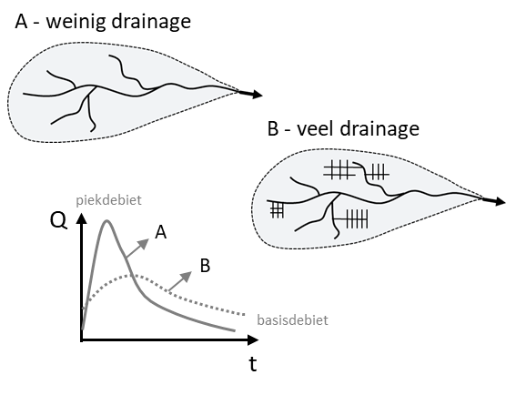

```{r packages, include=FALSE}
library(sf)
library(terra)
library(tidyverse)
library(here)
library(readxl)
library(viridis)
library(mapview)
library(tools)     # Handig voor file_ext()
library(beepr) # voor de grap
library(qgisprocess)
library(jsonlite)
library(leaflet)

```

## 1. Data inladen en klaarmaken

De data zitten in een map "data" onder de folder van het **studiegebied** (rivierbeek, kleine_nete, dommel, herk_mombeek, ijzer, dijle). De folders van de studiegebieden zitten in de map scenarios, op hetzelfde niveau als het bestand `scenarios.Rproj`. Definieer in de eerste regel het studiegebied.

> | C:/R/NARA2026/nara2026-git/scenarios
> |    `scenarios.Rproj`
> |    \|—– data
> |    \|—– src -\> `08b_landbouw_drainage.Rmd`
> |    \|—– rivierbeek
> |          \|—– data -\>

### 1.1. Kies bestanden

Deze datasets zijn specifiek voor dit script:

- ecosysteem_2022.tif -\> ecosysteemkaart 2022 zonder buffer
- gebied.shp -\> polygoon van het gebied
- tempnat.tif -\> tijdelijk natte gebieden watersysteemkaart UA
- permnat.tif -\> tijdelijk natte gebieden watersysteemkaart UA
- verplichting_peilgestuurd.shp -\> beleidskaart peilgestuurde drainage
- pgd_potent.tif -\> potentiekaart peilgestuurde drainage (OP-PEIL -\> aangepast voor scenario's met ArcMap model `geschiktheid_peilgestuurde_drainage)`
- lbgp_2022.shp -\> landbouwgebruikspercelen 2022
- droogteintensiteit.tif -\> agrarische droogte-intensiteit 2050 schaal Vlaanderen (klimaatportaal)
- voedingsgebied_combi.tif -\> voedingsgebieden van de natuurgebieden
- natuur_ecosysteem_sc1.tif / natuur_ecosysteem_sc2.tif / natuur_ecosysteem_sc3.tif -\> aangepaste ecosysteemkaarten voor natuurdoelen (script `04_IHD`).

Het onderstaande script gaat op zoek naar de benodigde bestanden in de datamappen van de scenariofolder.

```{r bestanden_folders}

studiegebied <- "kleine_nete"

# Kies de bestanden die je nodig hebt
# ecosysteem.tif is steeds nodig als referentieraster

targets <- c("ecosysteem_2022.tif", "gebied.shp", "tempnat.tif", "permnat.tif", "verplichting_peilgestuurd.shp", "pgd_potent.tif", "droogteintensiteit.tif", "lbgp_2022.shp", "voedingsgebied_combi.tif", "natuur_ecosysteem_sc1.tif", "natuur_ecosysteem_sc2.tif", "natuur_ecosysteem_sc3.tif")

# In welke folders zitten de data?

search_paths <- c(str_c("C:/R/NARA2026/nara2026-git/scenarios/", studiegebied, "/data"), "C:/R/NARA2026/nara2026-git/scenarios/data", str_c("C:/R/NARA2026/nara2026-git/scenarios/", studiegebied, "/output")
)

```

### 1.2. Data inladen

Het script laadt alle bestanden in de lijst `targets` in, zet de extent en de crs van alle rasters om naar die van de kaart **ecosysteem** en zet de kaarten in de Global environment.

```{r data, message=FALSE, warning=FALSE }

# 1. Inladen bestanden

all_available_files <- list.files(search_paths, full.names = TRUE, recursive = TRUE)

# Filter de lijst: behoud alleen de bestanden die in je 'targets' lijst staan
files_to_load <- all_available_files[basename(all_available_files) %in% targets]

# functie om de bestanden in te laden (tifs, shapes en xlsx)
load_file <- function(path) {
  ext <- tolower(file_ext(path))
  obj <- switch(ext,
    "shp"  = st_read(path, quiet = TRUE),
    "tif"  = rast(path),
    "xlsx" = read_excel(path),
    stop(paste("Bestandstype niet ondersteund:", ext))
  )
  return(obj)
}

data_list <- lapply(files_to_load, load_file)

names(data_list) <- file_path_sans_ext(basename(files_to_load))

# 2. CRS en extent gelijkstellen

ref_raster <- data_list$ecosysteem_2022

# Functie om rasters te harmoniseren
harmoniseer_raster <- function(r, ref) {
  # Controleer of het object een raster is
  if (!inherits(r, "SpatRaster")) {
    return(r) 
  }
  # 'near' voor categorische data (codes), 'bilinear' voor continue data
  is_cat <- is.factor(r) || is.bool(r)
  method_type <- if(is_cat) "near" else "bilinear"
  # CRS, extent en resolutie van ref_raster
  r_gelijkaardig <- project(r, ref, method = method_type)
  # Bijknippen met ref_raster
  r_geclipt <- mask(r_gelijkaardig, ref)
  return(r_geclipt)
}

# Pas functie toe op de hele lijst
data_list_ok <- lapply(data_list, harmoniseer_raster, ref = ref_raster)


# 3. Zet bestanden in je Global Environment
list2env(data_list_ok, envir = .GlobalEnv)
```

## 2. Scenario's

### 2.0. Hulpkaarten

De **geschikte cellen** voor het verminderen van drainage zijn de tijdelijk en permanent natte gebieden uit de watersysteemkaart van de UA die mogelijk kansrijk, kansrijk of zeer kansrijk zijn volgens de geschiktheidskaart peilgestuurde drainage van het OP-PEIL-project en die geen ruimtebeslag, moeras of water zijn. Rond de natte zones wordt een bijkomende zone van 20 m afgebakend omdat grachten meestal wat doorlopen tot buiten de natte gebieden.

```{r peilgestuurd}

#///////////////////////////////////////////////////////
# Geschikte cellen voor dedrainage 
#///////////////////////////////////////////////////////

# 1. In tijdelijk en permanent natte gebieden
nat <- ifel(!is.na(permnat) | !is.na(tempnat), 1, NA)

# Opkuisen fragmenten < 5 cellen
nat_patches <- patches(nat, directions = 8)
f <- freq(nat_patches)
nat_clean <- nat_patches
nat_clean[nat_clean %in% f$value[f$count <= 5]] <- NA

nat_buffer <- buffer(nat_clean, width = 20) %>% 
  ifel(1, NA)


# 2. Cellen met hoge potentie voor peilgestuurde drainage
pgd_potentie <- round(pgd_potent, 0)


# 3. Combineren en filteren (score 1 = weinig kansrijk)
potentie_dedrain <- ifel(!is.na(nat_buffer) & !is.na(pgd_potentie) & pgd_potentie > 1, pgd_potentie, NA)

# Grachten dempen of verondiepen -> niet in ruimtebeslag (niet combineerbaar met bebouwing) en niet in moeras, estuaria of water (reeds nat)
geschikt_ecos <- ifel(ecosysteem_2022 >= 200 & ecosysteem_2022 < 700, 1, NA)

potentie_dedrain <- ifel(!is.na(geschikt_ecos) & !is.na(potentie_dedrain), potentie_dedrain, NA)
  

geschikte_cellen <- ifel(!is.na(potentie_dedrain), 1, NA)


#///////////////////////////////////////////////////////
# Akkerpercelen met droogtestress  
#///////////////////////////////////////////////////////
  
# cf. methode klimaatportaal: Akkerpercelen (lgbp_2022) met droogte-intensiteit op een locatie binnen perceel > 1

lbgp_2022 <- st_transform(lbgp_2022, st_crs(ecosysteem_2022))

lbgp_2022$eco_mode <- exact_extract(ecosysteem_2022, lbgp_2022, 'mode', progress = TRUE)

lbgp_2022$droogte_max <- exact_extract(droogteintensiteit, lbgp_2022, 'max', progress = TRUE)

landb_droogtestress <- lbgp_2022 %>%
  filter(eco_mode %in% c(201, 202, 203, 204, 205, 301), droogte_max >= 1)


#///////////////////////////////////////////////////////
# Verplichtingskaart peilgestuurde drainage 
#///////////////////////////////////////////////////////

# Verplicht bij nieuwe ondergrondse drainage of bij volledige vernieuwing

verplichting_peilgestuurd <- st_transform(verplichting_peilgestuurd, crs(ecosysteem_2022))

peilgestuurd <- mask(rasterize(verplichting_peilgestuurd, ecosysteem_2022, field = 1), ecosysteem_2022, updatevalue = NA)
```

### 2.1. Scenario 1

**a) Geschiktheid en doelen**

De **doeloppervlakte** voor maatregelen om de drainage te verminderen wordt berekend als 25% van de oppervlakte van de geschikte cellen (zie `2.0 Hulpkaarten`).

In scenario 1 wordt de doeloppervlakte geplaatst op landbouwpercelen met droogtestress. De geschiktheid voor plaatsing van de cellen wordt bepaald door:

- De geschiktheid voor dedrainage (`potentie_dedrain`)
- De verplichting voor peilgestuurde drainage (`peilgestuurd`)
- De aanwezigheid van landbouwcellen met droogtestress (`landb_droogtestress`)

```{r geschiktheid_sc1}

# landbouwcellen

landbouw <- ifel(ecosysteem_2022 %in% c(201, 202, 203, 204, 205, 301), 1, NA)

# Landbouwpercelen met droogtestress

r_landb_droogtestress <- mask(rasterize(landb_droogtestress, ecosysteem_2022, field = 1), ecosysteem_2022, updatevalue = NA)

droogtestress <- ifel(distance(r_landb_droogtestress) <= 100, 1, NA)

# Geschiktheidskaart: geschikte cellen met droogtestress

geschikt_sc1 <- ifel(!is.na(landbouw) & !is.na(droogtestress) & !is.na(peilgestuurd), 100 + potentie_dedrain, potentie_dedrain)


# Bereken de doeloppervlakte (25% van de geschikte cellen)

f <- freq(geschikte_cellen)

sc1_doel <- round(0.25 * f[f$value == 1, "count"], 0)


# Doel als % van de opp. van het gebied
opp_totaal <- pull(global(ecosysteem_2022, "notNA"))

round(100*sc1_doel/opp_totaal, 1)

```

**b) Allocatie maatregelen**

De doeloppervlakte (`sc1_doel`) wordt gealloceerd volgens de geschiktheid van de cellen (hoogste geschiktheid eerst). Alleen landbouwcellen komen in aanmerking.

De geselecteerde cellen krijgen code 220 in de nieuwe kaart (`ecosysteem_aangepast`).

```{r allocatie_sc1}

# Nieuwe codes voor aanpassing ecosysteemkaart
code_dedrain <- 220


# 1. Identificeer de clusters van aaneengesloten cellen 
patches_sc1 <- patches(geschikt_sc1, values = TRUE, directions = 8)

# 2. Omzetten naar een data.frame met coördinaten
# We nemen de celindex mee om later de waarden exact terug te kunnen plaatsen
df <- as.data.frame(c(ecosysteem_2022, geschikt_sc1, patches_sc1), cells = TRUE, na.rm = TRUE)

colnames(df) <- c("cell", "eco_code", "score", "patch")

df <- df[!is.na(df$eco_code), ]

patch_info <- df |>
  group_by(patch) |>
  summarise(
    score = mean(score), # gemiddelde score per patch
    oppervlakte = n(),
    .groups = "drop"
  ) |>
  arrange(desc(score))


# 3. Plaats eerst de cellen per volledige cluster

geselecteerde_patches <- c()
totaal <- 0
i <- 1

while(i <= nrow(patch_info)){
  huidige_score <- patch_info$score[i]
  scoregroep <-
    patch_info |>
    filter(score == huidige_score)
  # eerste patch van deze scoregroep
  eerste <- which(patch_info$score == huidige_score)[1]
  # zijn we nog ruim onder het doel?
  if(totaal + scoregroep$oppervlakte[1] < sc1_doel){
    for(j in 1:nrow(scoregroep)){
      if(totaal + scoregroep$oppervlakte[j] <= sc1_doel){
        geselecteerde_patches <-
          c(geselecteerde_patches,
            scoregroep$patch[j])
        totaal <- totaal + scoregroep$oppervlakte[j]
      }
    }
  } else {
    break
  }
  i <- eerste + nrow(scoregroep)
}

# 4. Plaats de resterende cellen
# Verzamel de cellen van de al geselecteerde (volledige) patches
top_cellen <- df$cell[df$patch %in% geselecteerde_patches]

# Hoeveel cellen komen we tekort?
nog_nodig <- sc1_doel - length(top_cellen)

if (nog_nodig > 0) {
  laatste_score <- patch_info$score[i]
  kandidaten <- patch_info |> 
    filter(score == laatste_score) |> 
    arrange(oppervlakte)
  for (k in seq_len(nrow(kandidaten))) {
    if (nog_nodig <= 0) break
    # Haal alle cel-IDs op van de huidige kandidaat-patch
    kandidaat_cellen <- df$cell[df$patch == kandidaten$patch[k]]
    aantal_in_patch <- length(kandidaat_cellen)
    if (aantal_in_patch <= nog_nodig) {
      # selecteer de hele patch
      top_cellen <- c(top_cellen, kandidaat_cellen)
      nog_nodig <- nog_nodig - aantal_in_patch
    } else {
      # patch te groot -> neem exact aantal cellen dat nog nodig is
      top_cellen <- c(top_cellen, kandidaat_cellen[1:nog_nodig])
      nog_nodig <- 0
    }
  }
}


# 5. De originele ecosysteemkaart aanpassen
top_cellen <- df$cell[df$patch %in% geselecteerde_patches]

ecosysteem_dedrain <- deepcopy(ecosysteem_2022)

ecosysteem_dedrain[top_cellen] <- code_dedrain

sc1_dedrain_cellen <- ifel(ecosysteem_dedrain == 220, 1, NA)


writeRaster(ecosysteem_dedrain, filename = str_c("C:/R/NARA2026/nara2026-git/scenarios/", studiegebied, "/output/sc1_ecosysteem_dedrain.tif"), overwrite = TRUE)

```

### 2.2. Scenario 2

**a) Geschiktheid en doelen**

De doeloppervlakte (`sc2_doel` = `sc1_doel`) wordt geplaatst in het afstroomgebied van natuur en op plaatsen waar er natte natuur bijkomt volgens scenario 2 (resultaat script `04_IHD`).

***Opmerking**: wat met gedraineerde bossen (rabatten)?*

```{r geschiktheid_sc2}

natte_natuur <- natuur_ecosysteem_sc2 != ecosysteem_2022


```

**b) Allocatie maatregelen**

```{r allocatie_sc2}


```

### 2.3. Scenario 3

**a) Geschiktheid en doelen**

```{r geschiktheid_sc3}

# 1. Bereken de geschiktheidsscore op basis van de tijdelijk en permanent natte gebieden en de verplichtingskaart peilgestuurde drainage
nat <- ifel(!is.na(permnat) | !is.na(tempnat), 1, NA)

# Opkuisen fragmenten < 5 cellen
nat_patches <- patches(nat, directions = 8)
f <- freq(nat_patches)
nat_clean <- nat_patches
nat_clean[nat_clean %in% f$value[f$count <= 5]] <- NA

nat_buffer <- buffer(nat_clean, width = 50) %>% 
  ifel(1, NA)
nat_peilgestuurd <- ifel(!is.na(nat_buffer) & !is.na(peilgestuurd), 2, ifel(!is.na(nat_buffer) & is.na(peilgestuurd), 1, NA))

mask_effect <- nat_peilgestuurd %in% c(1, 2)

# 2. Maskering: Alleen de toegestane ecosysteem-cellen en nat_peilgestuurd > 0
# Selecteer akkers ()
mask_ecosysteem <- ecosysteem_2022 %in% c(201)

finaal_masker <- mask_ecosysteem & mask_effect

# 3. Pas het masker toe op de totaalscore
# Cellen die niet aan de voorwaarden voldoen worden NA
geschiktheidskaart <- mask(nat_peilgestuurd, finaal_masker, maskvalues = 0)

# bereken de doeloppervlakte (25% van de geschikte cellen)
counts <- freq(finaal_masker)
opp_dedrain <- round(0.25 * counts[counts$value == 1, "count"], 0)
```

**b) Allocatie maatregelen**

```{r allocatie_sc3}


```

## 4. Impact van maatregelen

Drainage verlaagt de grondwaterstand tot een niveau dat geschikt is voor land- en bosbouw. Door die verlaging neemt de grondwatervoorraad in de bodem af. Onder niet-gedraineerde omstandigheden zou dit water langzaam via de bodem naar de valleien stromen, waar het instaat voor de voeding van rivieren. Het **basisdebiet** van de rivieren is hoofdzakelijk afhankelijk van deze trage grondwaterstroming.

Door drainage wordt een deel van dat grondwater versneld afgevoerd via het grachtenstelsel. Hierdoor nemen piekdebieten toe en daalt het basisdebiet.

{width="300"}

- Stap 1: bereken verlies grondwatervoorraad (m³)
  - 1a - Bereken grondwaterstijging
    - Maak kaart van beoogde grondwaterstand op basis van drainagedieptes Staes (-1 m voor akkers, -0.5 voor grasland)
    - Maak verschilkaart met ghg die gebaseerd is op de drainageklassen van de bodemkaart -\> verschil = **grondwaterstijging bij dedrainage**
  - 1b -
- Stap 2: bereken effect op basisdebiet

```{r impact_drainage}

# Stap 1 - 


```

## 5. Kaart maken

Het script maakt een ecosysteemkaart van het gebied, op basis van de originele ecosystemen of de aangepaste ecosysteemkaart.

*Opmerking: de legende toont intervallen i.p.v. discrete klassen -\> 100.5-101.5 moet 101 zijn, 101.5-102.5 met 102 zijn, etc.*

```{r kaarten}

# colormap voor de ecosysteemklassen inladen (geëxporteerd uit Arcmap)
clr_data <- read.table("C:/R/NARA2026/nara2026-git/scenarios/ecosysteemkaart_niv2_2022_v13.clr")
named_colors <- rgb(clr_data$V2, clr_data$V3, clr_data$V4, maxColorValue = 255)
names(named_colors) <- as.character(clr_data$V1)

# Kleur voor aangepaste cellen in ecosysteem_aangepast
named_colors["9998"] <- "#FF00CC" # voor de nieuwe maatregelen
named_colors["9999"] <- "#CCFF00" # voor infiltratie


df_colors <- data.frame(
  code = as.numeric(names(named_colors)),
  hex  = as.vector(named_colors),
  stringsAsFactors = FALSE
)

# Kies kaart: origineel (ecosysteem) of aangepaste versie (ecosysteem_dedrain)
kaart <- ecosysteem_dedrain

# aanwezige codes
r_codes <- sort(unique(values(kaart)))
r_codes <- na.omit(r_codes)

# kleuren filteren
df_use <- df_colors[df_colors$code %in% r_codes, ]

# kleuren exact in volgorde van rastercodes
df_use <- df_use[match(r_codes, df_use$code), ]


cols <- df_use$hex

# Klassegrenzen voor categorische waarden (anders beschouwt mapview de klassen als continue variabele)
ats <- c(r_codes - 0.5, max(r_codes) + 0.5)


mapview(
  kaart,
  col.regions = cols,
  at = ats,
  na.color = "transparent",
  legend = TRUE
)

```
