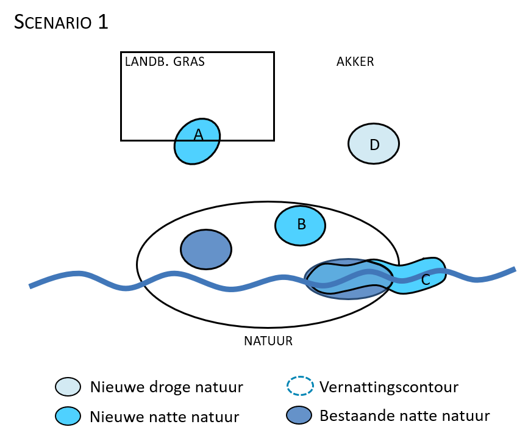
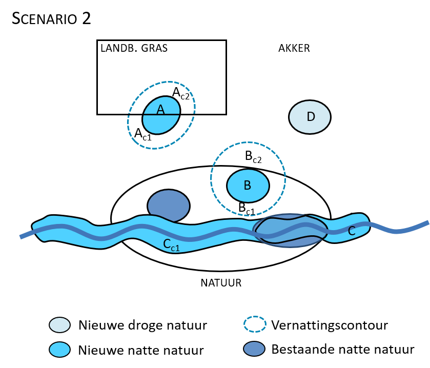

```{r packages, include=FALSE}
library(data.table)
library(sf)
library(terra)
library(dplyr)
library(tidyverse)
library(here)
library(readxl)
library(viridis)
library(mapview)
library(tools)     # Handig voor file_ext()
library(beepr)
library(leaflet) # Nodig voor colorFactor
library(exactextractr)
library(qgisprocess)


```

## 0. Data inladen en klaarmaken

De data zitten in de mappen "output" en "data" onder de folder van het `studiegebied` (rivierbeek, kleine_nete, dommel, herk_mombeek, ijzer, dijle). De folders van de studiegebieden zitten in de map scenarios, op hetzelfde niveau als het bestand `scenarios.Rproj`. Definieer in de eerste regel het studiegebied.

> | C:/R/NARA2026/nara2026-git/scenarios
> |    `scenarios.Rproj`
> |    \|—– data
> |    \|—– src -\> `10_compilatie.Rmd`
> |    \|—– `studiegebied`
> |          \|—– data
> |          \|—– output
> |          \|—– temp

### 0.1. Kies bestanden

De volgende datasets worden gebruikt:

- gebied.shp -\> polygoon gebied
- ecosysteem_2022.tif -\> ecosysteemkaart 2022 zonder buffer
- toekomstlaag.tif -\> natuurdoelen
- deel_3_reclass_natdoel.xlsx -\> tabel voor reclass natuurdoelen toekomstlaag naar ecosysteemcodes (kolommen 'habitat' -\> 'eco')
- deel_3_reclass_lu.xlsx -\> tabel voor reclass bodemgebruik onder invloed van wijziging grondwaterstand
- natuur_ecosysteem_sc1/2/3.tif -\> ecosysteemkaart met resultaat script plaatsing **natuurdoelen** (`04_IHD.Rmd`)
- sc1/2/3_ecosysteem_infilt.tif -\> ecosysteemkaart met resultaat script plaatsing **infiltratiemaatregelen** (`08_landbouw_infiltratie.Rmd`) -\> infiltratiecellen hebben code `210`
- sc1/2/3_ecosysteem_dedrain.tif -\> ecosysteemkaart met resultaat script plaatsing **dedrainagemaatregelen** (`08b_landbouw_drainage.Rmd`)
- sc1/2/3_bosuitbreiding.tif -\> nieuw geplaatste **boscellen** (`01_Bosuitbreiding.Rmd`). In scenario 3 is de bosuitbreiding het resultaat van scenario 2 + de extra boscellen uit de natuurdoelenkaart die nog niet in scenario 2 zitten.
- vernattingscontour_sc2/3.tif -\> vernattingscontouren natte natuur in de toekomstlaag en veenherstel

Nog aanvullen:

- ecosysteemkaart met resultaat script plaatsing **ontharding** (`03_Ontharding.Rmd`)

```{r bestanden_folders}

studiegebied <- "kleine_nete"

# Kies de bestanden die je nodig hebt

targets <- c("gebied.shp", "ecosysteem_2022.tif", "toekomstlaag.shp", "deel_3_reclass_natdoel.xlsx", "deel_3_reclass_lu.xlsx", "natuur_ecosysteem_sc1.tif", "natuur_ecosysteem_sc2.tif", "natuur_ecosysteem_sc3.tif", "sc1_ecosysteem_infilt.tif", "sc2_ecosysteem_infilt.tif", "sc3_ecosysteem_infilt.tif", "sc1_ecosysteem_dedrain.tif", "sc2_ecosysteem_dedrain.tif", "sc3_ecosysteem_dedrain.tif", "sc1_bosuitbreiding.tif", "sc2_bosuitbreiding.tif", "sc3_bosuitbreiding.tif", "vernattingscontour_sc2.tif", "vernattingscontour_sc3.tif")

# In welke folders zitten de data?

search_paths <- c(str_c("C:/R/NARA2026/nara2026-git/scenarios/", studiegebied, "/data"), "C:/R/NARA2026/nara2026-git/scenarios/data", str_c("C:/R/NARA2026/nara2026-git/scenarios/", studiegebied, "/output")
)

```

### 0.2. Data inladen

Het script laadt alle bestanden in de lijst `targets` in, zet de extent en de crs van alle rasters om naar die van de kaart **ecosysteem_2022** en ze de kaarten in de Global environment.

```{r data, message=FALSE, warning=FALSE }

# 1. Inladen bestanden

all_available_files <- list.files(search_paths, full.names = TRUE, recursive = TRUE)

# Filter de lijst: behoud alleen de bestanden die in je 'targets' lijst staan
files_to_load <- all_available_files[basename(all_available_files) %in% targets]

# functie om de bestanden in te laden (tifs, shapes en xlsx)
load_file <- function(path) {
  ext <- tolower(file_ext(path))
  obj <- switch(ext,
    "shp"  = st_read(path, quiet = TRUE),
    "tif"  = rast(path),
    "xlsx" = read_excel(path),
    stop(paste("Bestandstype niet ondersteund:", ext))
  )
  return(obj)
}

data_list <- lapply(files_to_load, load_file)

names(data_list) <- file_path_sans_ext(basename(files_to_load))

# 2. CRS en extent gelijkstellen

ref_raster <- data_list$ecosysteem_2022

# Functie om rasters te harmoniseren
harmoniseer_raster <- function(r, ref) {
  # Controleer of het object een raster is
  if (!inherits(r, "SpatRaster")) {
    return(r)
  }
  # 'near' voor categorische data (codes), 'bilinear' voor continue data
  is_cat <- is.factor(r) || is.bool(r)
  method_type <- if(is_cat) "near" else "bilinear"
  # CRS, extent en resolutie van ref_raster
  r_gelijkaardig <- project(r, ref, method = method_type)
  # Bijknippen met ref_raster
  r_geclipt <- mask(r_gelijkaardig, ref)
  return(r_geclipt)
}

# Pas functie toe op de hele lijst
data_list_ok <- lapply(data_list, harmoniseer_raster, ref = ref_raster)


# 3. Zet bestanden in je Global Environment
# list2env(data_list_ok, envir = .GlobalEnv)
list2env(data_list, envir = .GlobalEnv)
```

## 1. Toekomstlaag

Het script verrastert de percelen van de toekomstlaag en past ze in in de ecosysteemkaart.

Een perceel bestaat vaak uit een complex van meerdere streefbeelden (HAB1, HAB2, ...) met verschillende bedekkingsgraden (pHAB1, pHAB2, ...). Bij het verrasteren van de toekomstlaag brengen we alleen het natuurdoel met de grootste oppervlakte binnen het perceel in beeld (HAB1)

De BWK-codes waarop de ecosysteemkaart gebaseerd zijn komen niet steeds één-op-één overeen met de natuurstreefbeelden. Daardoor kan het voorkomen dat een perceel waarop geen natuuromvorming plaatsvindt, in de scenario's toch in een andere ecosysteemklasse terechtkomt omdat het streefbeeld niet overeenkomt met de BWK-code waarop de ecosysteemkaart 2022 gebaseerd is. Om deze afwijkingen niet te streng af te straffen, wordt de ecosysteemkaart_2022 in een aantal gevallen niet aangepast, ook als de verrasterde toekomstlaag een andere code aangeeft:

- Wetlands kunnen overlappen met poelen: ecosysteem_2022 (701, 901) \<-\> toekomstlaag (902)
- Heide en open bodem kunnen overlappen met semi-natuurlijk grasland, poelen en veengebied: ecosysteem_2022 (501, 602) \<-\> toekomstlaag (302, 501, 902, 702)
- Veengebied kan overlappen met heide en poelen: ecosysteem_2022 (702) \<-\> toekomstlaag (501, 902)

```{r toekomstlaag}

#////////////////////////////////////////////////////
# Nieuwe ecosysteemkaart met natuurdoelen toekomstlaag
#////////////////////////////////////////////////////

# Toekomstlaag bijsnijden en verrasteren op basis van HAB1
percelen <- st_intersection(toekomstlaag, gebied)

rcl_hab <- deel_3_reclass_natdoel # reclass tabel habitat -> eco

percelen_hab1 <- percelen |>
  left_join(rcl_hab, by = c("HAB1" = "habitat"))

toekomst_eco <- rasterize(percelen_hab1, ecosysteem_2022, field = "eco")

# Correctie verrasterde toekomstlaag voor onzekere classificatie (verandering tov 2022 minder streng beoordelen): 

# Definieer de uitzonderingen
uitzonderingen <- 
  ecosysteem_2022 %in% c(101, 102, 801, 802) | # geen verandering op bebouwing, infrastructuur of rivieren
  is.na(toekomst_eco) |
  toekomst_eco == 0 | # code 0 in toekomstlaag = geen habitat
  (ecosysteem_2022 %in% c(701, 901) & toekomst_eco == 902) |
  (ecosysteem_2022 %in% c(501, 602) & toekomst_eco %in% c(302, 501, 902, 702)) |
  (ecosysteem_2022 == 702 & toekomst_eco %in% c(501, 902))

ecosysteem_2050 <- ifel(uitzonderingen, ecosysteem_2022, toekomst_eco)

# Aanpassen codes grasland (302) en bos (402) voor aanwezigheid GWATES -> codes worden 320 (natte graslanden) en 410 (valleibos)
# gwates in de toekomstlaag
gwates_2050 <- rasterize(percelen_hab1, ecosysteem_2022, field = "gwates")

ecosysteem_2050_gwates <- ifel(!is.na(gwates_2050) & !is.na(ecosysteem_2050), ecosysteem_2050, NA)

ecosysteem_2050_nat <- ifel(!is.na(ecosysteem_2050_gwates) & ecosysteem_2050_gwates == 302, 320, ifel(!is.na(ecosysteem_2050_gwates) & ecosysteem_2050_gwates == 401, 410, ecosysteem_2050))

writeRaster(ecosysteem_2050_nat, filename = str_c("C:/R/NARA2026/nara2026-git/scenarios/", studiegebied, "/output/ecosysteem_2050_nat.tif"), overwrite = TRUE)

ecosysteem_2050_nat <- rast(str_c("C:/R/NARA2026/nara2026-git/scenarios/", studiegebied, "/output/ecosysteem_2050_nat.tif"))

```

## 2. Scenario's

### 2.1. Scenario 1

De **terrestrische natuurdoelen** worden volledig gerealiseerd ongeacht mogelijke conflicten tussen terrestrische natuurtypes of met andere landgebruiken (bv. landbouw). De **aquatische natuurdoelen** (habitat 3260, visdoelen, veenherstel, herstel vrijstromende rivieren, bever) worden alleen gerealiseerd als ze niet in conflict komen met terrestrische natuurdoelen en landbouw wordt maximaal gespaard.

Mogelijke vernattingscontouren van terrestrische natuurdoelen die buiten de perimeter van natuurgebied vallen en dus een mogelijke impact hebben op het omliggende landgebruik leiden niet tot wijzigingen van dat landgebruik (Figuur 1). Mogelijke conflicten door vernatting binnen en buiten natuurgebied worden in beeld gebracht als knelpunten bij de bespreking van de scenario's.

{width="350"}

```{r scenario1}

#//////////////////////////////////////////////////////////////
# 1. Nieuwe natuur volgens toekomstlaag en aquatische natuur
#//////////////////////////////////////////////////////////////

# De laag met nieuwe natte natuur (aquatische doelen) bepaalt het onderscheid tussen droge, natte en zeer natte types en de toekomstlaag bepaalt het onderscheid tussen open natuurtypes en bos. 

# ecosysteem_2050_nat -> ecosysteemkaart met natuurdoelen volgens toekomstlaag

# natuur_ecosysteem_sc1 -> veranderingen tgv realisatie aquatische natuur met codes 320, 410, 420, 701 en 702

vernatting <- ifel(ecosysteem_2022 != natuur_ecosysteem_sc1, natuur_ecosysteem_sc1, NA)


# Combinatieregels

# 1. Haal de unieke aanwezige codes op uit beide rasters
v_vals <- unique(vernatting)[,1]
e_vals <- unique(ecosysteem_2050_nat)[,1]

# 2. Genereer alle mogelijke combinaties van aanwezige codes
combi <- expand.grid(v = v_vals[!is.na(v_vals)], e = e_vals[!is.na(e_vals)])

# 3. Pas alle voorrangs- en combinatieregels toe op de tabel
lookup_table <- combi %>%
  mutate(
    # Bepaal of het type in 2050 een bos of open natuur is
    is_bos = e %in% c(103, 400, 401, 402, 403, 404, 410, 420),
    resultaat = case_when(
      # Regel 1: Codes > 700 in toekomstlaag primeren altijd (moeras, wetland, water, slikken/schorren)
      e > 700 ~ e,
      # Regel 2: Codes < 302 en code 400 in toekomstlaag -> vernatting primeert altijd
      e < 302 | e == 400 ~ v,
      # Regel 3: Codes 320, 501 en 602 in toekomstlaag primeren op 320 en 410 in vernatting
      e %in% c(320, 501, 602) & v %in% c(320, 410) ~ e,
      # Regel 4: ZEER NATTE vernatting (701, 702, 420)
      # Combinatie met bos uit toekomstlaag -> 420 (zeer nat bos)
      # Combinatie met open type uit toekomstlaag -> 701 (zeer nat open, voorkeur 701)
      v %in% c(701, 702, 420) & is_bos  ~ 420,
      v %in% c(701, 702) & !is_bos ~ v,
      v %in% c(420) & !is_bos ~ 701,
      # Regel 5: NATTE vernatting (320, 410)
      # Combinatie met bos uit toekomstlaag -> 410 (nat bos)
      # Combinatie met open type uit toekomstlaag -> 320 (nat open)
      v %in% c(320, 410) & is_bos  ~ 410,
      v %in% c(320, 410) & !is_bos ~ 320,
      # Fallback (indien niet gevangen door bovenstaande regels)
      TRUE ~ v
    )
  )

# 4. Maak een unieke sleutel per combinatie (v * 10000 + e)
m_reclass <- lookup_table %>%
  mutate(key = v * 10000 + e) %>%
  select(key, resultaat) %>%
  as.matrix()

# 5. Voer de berekening uit op de rasters
r_key <- vernatting * 10000 + ecosysteem_2050_nat
tussenstap1_sc1 <- classify(r_key, m_reclass)

tussenstap1_sc1 <- cover(tussenstap1_sc1, ecosysteem_2050_nat) # NA's vervangen door score toekomstlaag


# Overzichtstabel veranderingen (niet-natuur codes: "vernatting" primeert op "ecosysteem_2050_nat" voor landbouw en stedelijk, "ecosysteem_2050_nat" primeert op "vernatting" voor water, slikken en schorren)
library(kableExtra)

tabel_gekleurd <- lookup_table %>%
  filter(e %in% c(201, 302, 320, 401, 410, 501, 602, 701, 801)) %>%
  mutate(
    # Check of de code is gewijzigd ten opzichte van ecosysteem_2050_nat
    is_gewijzigd = resultaat != e,
    
    # Geef gewijzigde codes een opvallende achtergrondkleur (bijv. zacht rood)
    cel_waarde = ifelse(
      is_gewijzigd,
      cell_spec(resultaat, background = "#ffcccc", color = "#990000", bold = TRUE),
      cell_spec(resultaat, color = "#333333")
    )
  ) %>%
  select(v, e, cel_waarde) %>%
  pivot_wider(
    names_from = e,
    values_from = cel_waarde
  ) %>%
  rename(`vernatting` = v) # header voor de eerste kolom

tabel_gekleurd %>%
  kbl(escape = FALSE, align = "c") %>%
  kable_styling(bootstrap_options = c("bordered", "hover"), full_width = FALSE) %>%
  add_header_above(c(" " = 1, "ecosysteem_2050_nat" = 9))


#//////////////////////////////////////////////////////////////
# 2. Extra boscellen toevoegen
#//////////////////////////////////////////////////////////////

# Als het bosuitbreidingsdoel uit AGNAS kleiner is dan de oppervlakte bos die er bijkomt volgens de toekomstlaag, dan zijn de bosuitbreidingsrasters (sc1/2/3_bosuitbreiding) leeg. O.a bij de Kleine Nete is dat het geval. 

# Droge open ecosystemen worden droog loofbos (401), natte graslanden (320) worden valleibos (410) en zeer natte ecosystemen (701, 702) worden moerasbos (420)
tussenstap2_sc1 <- ifel(tussenstap1_sc1 %in% c(104, 201, 202, 203, 204, 205, 300, 301, 302, 501, 602) & !is.na(sc1_bosuitbreiding), 402,
             ifel(tussenstap1_sc1 %in% c(320) & !is.na(sc1_bosuitbreiding), 410,
                  ifel(tussenstap1_sc1 %in% c(710, 720) & !is.na(sc1_bosuitbreiding), 420, tussenstap1_sc1)))


# Tussenstap 2 wordt gebruikt als input voor de plaatsing van dedrainagemaatregelen
writeRaster(tussenstap2_sc1, filename = str_c("C:/R/NARA2026/nara2026-git/scenarios/", studiegebied, "/output/tussenstap2_sc1.tif"), overwrite = TRUE)


#//////////////////////////////////////////////////////////////
# 3. Dedrainagemaatregelen toevoegen
#//////////////////////////////////////////////////////////////

# sc1_ecosysteem_dedrain -> akkers met dedrainagemaatregelen hebben code 220, maar blijven akkers in scenario  1. Op andere cellen worden geen maatregelen genomen. Deze kaart verschilt dus niet van de originele kaart (ecosysteem_2022) -> niet in rekening brengen

sc1_ecosysteem_dedrain <- rast(str_c("C:/R/NARA2026/nara2026-git/scenarios/", studiegebied, "/output/sc1_ecosysteem_dedrain.tif"))

tussenstap3_sc1 <- ifel(sc1_ecosysteem_dedrain == 220, tussenstap2_sc1, sc1_ecosysteem_dedrain)

# Tussenstap 3 wordt gebruikt als input voor de plaatsing van infiltratiecellen
writeRaster(tussenstap3_sc1, filename = str_c("C:/R/NARA2026/nara2026-git/scenarios/", studiegebied, "/output/tussenstap3_sc1.tif"), overwrite = TRUE)


#//////////////////////////////////////////////////////////////
# 4. Infiltratiecellen toevoegen
#//////////////////////////////////////////////////////////////

sc1_ecosysteem_infilt # in sc1 en 2 blijven dit akkers / in sc3 is er een versie waar het akkers blijven (75%-scenario) en een versie waar de cellen van sc2 veranderen in grasland/bos

test <- ifel(sc1_ecosysteem_infilt == 210, tussenstap3, NA)

# Tussenstap 4 wordt gebruikt als input voor de plaatsing van infiltratiecellen
writeRaster(tussenstap4, filename = str_c("C:/R/NARA2026/nara2026-git/scenarios/", studiegebied, "/output/tussenstap4.tif"), overwrite = TRUE)
```

### 2.2. Scenario 2

**a) Nieuwe natuur volgens toekomstlaag en aquatische natuur**

De **terrestrische natuurdoelen** worden gerealiseerd ongeacht mogelijke conflicten met andere landgebruiken (bv. landbouw), behalve op plaatsen waar ze niet matchen met hydrologisch herstel voor de aquatische doelen. De **aquatische natuurdoelen** (habitat 3260, visdoelen, veenherstel, herstel vrijstromende rivieren, bever) worden gerealiseerd ook als ze in conflict komen met terrestrische natuurdoelen of landbouw.

Mogelijke vernattingscontouren van terrestrische natuurdoelen die buiten de perimeter van natuurgebied vallen en dus een mogelijke impact hebben op het omliggende landgebruik leiden tot wijzigingen van dat landgebruik (Figuur 2 - B~c2~ en A~c1~). Op locaties waar een vernatting plaatsvindt door de realisatie van natuurdoelen maar het landgebruik compatibel is, blijft het landgebruik ongewijzigd (bv. beperkte vernatting thv grasland: A~c2~). Ook bij vernatting binnen natuurgebied wijzigen de voorziene natuurdoelen naar een natter type als ze originele doelen niet matchen met vernatting (C~c1~ en B~c1~).

{width="350"}

```{r scenario2}

#//////////////////////////////////////////////////////////////
# 1. Nieuwe natuur volgens toekomstlaag en aquatische natuur
#//////////////////////////////////////////////////////////////

# De laag met nieuwe natte natuur (aquatische doelen) bepaalt het onderscheid tussen droge, natte en zeer natte types en de toekomstlaag bepaalt het onderscheid tussen open natuurtypes en bos. 

# ecosysteem_2050_nat -> ecosysteemkaart met natuurdoelen volgens toekomstlaag

# natuur_ecosysteem_sc2 -> veranderingen tgv vernatting met met codes 320, 410, 420, 701 en 702

vernatting <- ifel(ecosysteem_2022 != natuur_ecosysteem_sc2, natuur_ecosysteem_sc2, NA)


# Combinatieregels

# 1. Haal de unieke aanwezige codes op uit beide rasters
v_vals <- unique(vernatting)[,1]
e_vals <- unique(ecosysteem_2050_nat)[,1]

# 2. Genereer alle mogelijke combinaties van aanwezige codes
combi <- expand.grid(v = v_vals[!is.na(v_vals)], e = e_vals[!is.na(e_vals)])

# 3. Pas alle voorrangs- en combinatieregels toe op de tabel
lookup_table <- combi %>%
  mutate(
    # Bepaal of het type in 2050 een bos of open natuur is
    is_bos = e %in% c(103, 400, 401, 402, 403, 404, 410, 420),
    resultaat = case_when(
      # Regel 1: Codes > 700 in toekomstlaag primeren altijd (moeras, wetland, water, slikken/schorren)
      e > 700 ~ e,
      # Regel 2: Codes < 302 en code 400 in toekomstlaag -> vernatting primeert altijd
      e < 302 | e == 400 ~ v,
      # Regel 3: Codes 320, 501 en 602 in toekomstlaag primeren op 320 en 410 in vernatting
      e %in% c(320, 501, 602) & v %in% c(320, 410) ~ e,
      # Regel 4: ZEER NATTE vernatting (701, 702, 420)
      # Combinatie met bos uit toekomstlaag -> 420 (zeer nat bos)
      # Combinatie met open type uit toekomstlaag -> 701 (zeer nat open, voorkeur 701)
      v %in% c(701, 702, 420) & is_bos  ~ 420,
      v %in% c(701, 702) & !is_bos ~ v,
      v %in% c(420) & !is_bos ~ 701,
      # Regel 5: NATTE vernatting (320, 410)
      # Combinatie met bos uit toekomstlaag -> 410 (nat bos)
      # Combinatie met open type uit toekomstlaag -> 320 (nat open)
      v %in% c(320, 410) & is_bos  ~ 410,
      v %in% c(320, 410) & !is_bos ~ 320,
      # Fallback (indien niet gevangen door bovenstaande regels)
      TRUE ~ v
    )
  )

# 4. Maak een unieke sleutel per combinatie (v * 10000 + e)
m_reclass <- lookup_table %>%
  mutate(key = v * 10000 + e) %>%
  select(key, resultaat) %>%
  as.matrix()

# 5. Voer de berekening uit op de rasters
r_key <- vernatting * 10000 + ecosysteem_2050_nat

tussenstap1_sc2 <- classify(r_key, m_reclass)

tussenstap1_sc2 <- cover(tussenstap1_sc2, ecosysteem_2050_nat) # NA's vervangen door score toekomstlaag

```

**b) Vernattingscontouren toevoegen en vegetatie aanpassen**

De vernattingscontouren geven aan waar er vernatting optreedt tgv de realisatie van natte natuur in de toekomstlaag en veenherstel. De contouren worden berekend via het script `x6_vernattingscontouren`.

Ter hoogte van de vernattingscontouren kan de huidige bodembedekking of een toekomstig natuurdoel wijzigen ifv van de grondwaterstijging. Bijvoorbeeld: als de grondwaterstand tgv veenherstel stijgt tot tegen het maaiveld zullen akkerteelten of droge natuurtypes onhoudbaar zijn op die cellen. Het vernattingseffect dijnt uit in de omgeving rond de vernatte percelen en beïnvloedt ook daar de aanwezige vegetaties.

De vernattingscontouren worden alleen in rekening gebracht bij de aanpassing van de ecosysteemkaart in scenario's 2 en 3. In scenario 1 worden ze alleen gebruikt bij de bespreking van mogelijke conflicten tussen landgebruiken.

Voor het aanpassen van de ecosysteemklassen binnen de vernattingscontouren gebruiken we een omzettingstabel die aangeeft hoe de oorspronkelijke ecosysteemklassen veranderen onder een nieuw glg-niveau (`deel_3_reclass_lu`). De codes in de omzettingstabel verwijzen naar een glg-zone: 1 (0m-25m -mv), 2 (0.25m-0.5m), 3 (0.5m-0.75m), 4 (0.75m-1m -mv).

```{r vernattingscontouren_sc2}

# De vernattingszones krijgen codes 1 (0m-25m -mv), 2 (0.25m-0.5m), 3 (0.5m-0.75m), 4 (0.75m-1m -mv)

# 1. Vernattingscontouren volgens de toekomstlaag 

# vernattingscontour_scx geeft de grondwaterstand aan op plaatsen waar er een vernatting optreedt door natuurontwikkeling volgens de toekomstlaag. Natuurcellen waar de grondwaterstand al hoog genoeg is en er dus geen bijkomende vernatting nodig is, maken geen deel uit van de kaart.

lookup <- deel_3_reclass_lu |>
  select(code, "glg1", "glg2", "glg3", "glg4")

eco_1 <- subst(tussenstap1_sc2, from = lookup$code, to = lookup[["glg1"]])
eco_2 <- subst(tussenstap1_sc2, from = lookup$code, to = lookup[["glg2"]])
eco_3 <- subst(tussenstap1_sc2, from = lookup$code, to = lookup[["glg3"]])
eco_4 <- subst(tussenstap1_sc2, from = lookup$code, to = lookup[["glg4"]])

# Combineer alles = ecosysteemcellen met vernatting door dedrainage  
tussenstap1_sc2_2 <- ifel(!is.na(vernattingscontour_sc2) & vernattingscontour_sc2 == 1, eco_1,
                               ifel(!is.na(vernattingscontour_sc2) & vernattingscontour_sc2 == 2, eco_2,
                                    ifel(!is.na(vernattingscontour_sc2) & vernattingscontour_sc2 == 3, eco_3,
                                         ifel(!is.na(vernattingscontour_sc2) & vernattingscontour_sc2 == 4, eco_4, 
                                              tussenstap1_sc2))))

gekozen_eco <- selectRange(c(eco_1, eco_2, eco_3, eco_4), vernattingscontour_sc2)

tussenstap1_sc2_2 <- cover(gekozen_eco, tussenstap1_sc2)

# writeRaster(tussenstap1_sc2_2, filename = str_c("C:/R/NARA2026/nara2026-git/scenarios/", studiegebied, "/output/tussenstap_test.tif"), overwrite = TRUE)

```

**c) Toevoegen extra bos en maatregelen voor dedrainage en infiltratie**

```{r tussenstap2_sc2}

#//////////////////////////////////////////////////////////////
# 2. Extra boscellen toevoegen
#//////////////////////////////////////////////////////////////

# Droge open ecosystemen worden droog loofbos (401), natte graslanden (320) worden valleibos (410) en zeer natte ecosystemen (701, 702) worden moerasbos (420)
tussenstap2_sc2 <- ifel(tussenstap1_sc2_2 %in% c(104, 201, 202, 203, 204, 205, 300, 301, 302, 501, 602) & !is.na(sc2_bosuitbreiding), 402,
                        ifel(tussenstap1_sc2_2 %in% c(320) & !is.na(sc2_bosuitbreiding), 410,
                             ifel(tussenstap1_sc2_2 %in% c(710, 720) & !is.na(sc2_bosuitbreiding), 420, tussenstap1_sc2_2)))


# Tussenstap 2 wordt gebruikt als input voor de plaatsing van dedrainagemaatregelen
writeRaster(tussenstap2_sc2, filename = str_c("C:/R/NARA2026/nara2026-git/scenarios/", studiegebied, "/output/tussenstap2_sc2.tif"), overwrite = TRUE)


#//////////////////////////////////////////////////////////////
# 3. Dedrainagemaatregelen toevoegen
#//////////////////////////////////////////////////////////////

# sc2_dedrain_cellen -> cellen met dedrainagemaatregelen. Een deel daarvan wordt natuur door de vernatting, het andere deel zijn landbouwcellen waar het landgebruik behouden blijft, maar de grondwaterstand verhoogd wordt via aangepaste drainage.

tussenstap3_sc2 <- ifel(!is.na(sc2_dedrain_cellen) & tussenstap2_sc2 %in% c(201, 202, 203, 204, 205), 220, ifel(!is.na(sc2_dedrain_cellen) & tussenstap2_sc2 %in% c(300, 301), 330, tussenstap2_sc2))


# Tussenstap 3 wordt gebruikt als input voor de plaatsing van infiltratiecellen
writeRaster(tussenstap3_sc2, filename = str_c("C:/R/NARA2026/nara2026-git/scenarios/", studiegebied, "/output/tussenstap3_sc2.tif"), overwrite = TRUE)


#//////////////////////////////////////////////////////////////
# 4. Infiltratiecellen toevoegen
#//////////////////////////////////////////////////////////////

sc2_ecosysteem_infilt # in sc1 en 2 blijven dit akkers / in sc3 is er een versie waar het akkers blijven (75%-scenario) en een versie waar de cellen van sc2 veranderen in grasland/bos

test <- ifel(sc2_ecosysteem_infilt == 210, tussenstap3, NA)

# Tussenstap 4 wordt gebruikt als input voor de plaatsing van infiltratiecellen
writeRaster(tussenstap4, filename = str_c("C:/R/NARA2026/nara2026-git/scenarios/", studiegebied, "/output/tussenstap4.tif"), overwrite = TRUE)
```

### 2.3. Scenario 3

**a) Nieuwe natuur volgens toekomstlaag en aquatische natuur**

```{r scenario3}

#//////////////////////////////////////////////////////////////
# 1. Nieuwe natuur volgens toekomstlaag en aquatische natuur
#//////////////////////////////////////////////////////////////

# De laag met nieuwe natte natuur (aquatische doelen) bepaalt het onderscheid tussen droge, natte en zeer natte types en de toekomstlaag bepaalt het onderscheid tussen open natuurtypes en bos. 

# ecosysteem_2050_nat -> ecosysteemkaart met natuurdoelen volgens toekomstlaag

# natuur_ecosysteem_sc3 -> veranderingen tgv vernatting met met codes 320, 410, 420, 701 en 702

vernatting <- ifel(ecosysteem_2022 != natuur_ecosysteem_sc3, natuur_ecosysteem_sc3, NA)


# Combinatieregels

# 1. Haal de unieke aanwezige codes op uit beide rasters
v_vals <- unique(vernatting)[,1]
e_vals <- unique(ecosysteem_2050_nat)[,1]

# 2. Genereer alle mogelijke combinaties van aanwezige codes
combi <- expand.grid(v = v_vals[!is.na(v_vals)], e = e_vals[!is.na(e_vals)])

# 3. Pas alle voorrangs- en combinatieregels toe op de tabel
lookup_table <- combi %>%
  mutate(
    # Bepaal of het type in 2050 een bos of open natuur is
    is_bos = e %in% c(103, 400, 401, 402, 403, 404, 410, 420),
    resultaat = case_when(
      # Regel 1: Codes > 700 in toekomstlaag primeren altijd (moeras, wetland, water, slikken/schorren)
      e > 700 ~ e,
      # Regel 2: Codes < 302 en code 400 in toekomstlaag -> vernatting primeert altijd
      e < 302 | e == 400 ~ v,
      # Regel 3: Codes 320, 501 en 602 in toekomstlaag primeren op 320 en 410 in vernatting
      e %in% c(320, 501, 602) & v %in% c(320, 410) ~ e,
      # Regel 4: ZEER NATTE vernatting (701, 702, 420)
      # Combinatie met bos uit toekomstlaag -> 420 (zeer nat bos)
      # Combinatie met open type uit toekomstlaag -> 701 (zeer nat open, voorkeur 701)
      v %in% c(701, 702, 420) & is_bos  ~ 420,
      v %in% c(701, 702) & !is_bos ~ v,
      v %in% c(420) & !is_bos ~ 701,
      # Regel 5: NATTE vernatting (320, 410)
      # Combinatie met bos uit toekomstlaag -> 410 (nat bos)
      # Combinatie met open type uit toekomstlaag -> 320 (nat open)
      v %in% c(320, 410) & is_bos  ~ 410,
      v %in% c(320, 410) & !is_bos ~ 320,
      # Fallback (indien niet gevangen door bovenstaande regels)
      TRUE ~ v
    )
  )

# 4. Maak een unieke sleutel per combinatie (v * 10000 + e)
m_reclass <- lookup_table %>%
  mutate(key = v * 10000 + e) %>%
  select(key, resultaat) %>%
  as.matrix()

# 5. Voer de berekening uit op de rasters
r_key <- vernatting * 10000 + ecosysteem_2050_nat

tussenstap1_sc3 <- classify(r_key, m_reclass)

tussenstap1_sc3 <- cover(tussenstap1_sc3, ecosysteem_2050_nat) # NA's vervangen door score toekomstlaag

```

**b) Vernattingscontouren toevoegen en vegetatie aanpassen**

```{r vernattingscontouren_sc3}

# De vernattingszones krijgen codes 1 (0m-25m -mv), 2 (0.25m-0.5m), 3 (0.5m-0.75m), 4 (0.75m-1m -mv)

# 1. Vernattingscontouren volgens de toekomstlaag 

# vernattingscontour_scx geeft de grondwaterstand aan op plaatsen waar er een vernatting optreedt door natuurontwikkeling volgens de toekomstlaag. Natuurcellen waar de grondwaterstand al hoog genoeg is en er dus geen bijkomende vernatting nodig is, maken geen deel uit van de kaart.

lookup <- deel_3_reclass_lu |>
  select(code, "glg1", "glg2", "glg3", "glg4")

eco_1 <- subst(tussenstap1_sc3, from = lookup$code, to = lookup[["glg1"]])
eco_2 <- subst(tussenstap1_sc3, from = lookup$code, to = lookup[["glg2"]])
eco_3 <- subst(tussenstap1_sc3, from = lookup$code, to = lookup[["glg3"]])
eco_4 <- subst(tussenstap1_sc3, from = lookup$code, to = lookup[["glg4"]])

# Combineer alles = ecosysteemcellen met vernatting door dedrainage  
tussenstap1_sc3_2 <- ifel(!is.na(vernattingscontour_sc3) & vernattingscontour_sc3 == 1, eco_1,
                          ifel(!is.na(vernattingscontour_sc3) & vernattingscontour_sc3 == 2, eco_2,
                               ifel(!is.na(vernattingscontour_sc3) & vernattingscontour_sc3 == 3, eco_3,
                                    ifel(!is.na(vernattingscontour_sc3) & vernattingscontour_sc3 == 4, eco_4, 
                                         tussenstap1_sc3))))

gekozen_eco <- selectRange(c(eco_1, eco_2, eco_3, eco_4), vernattingscontour_sc3)

tussenstap1_sc3_2 <- cover(gekozen_eco, tussenstap1_sc3)

writeRaster(tussenstap1_sc3_2, filename = str_c("C:/R/NARA2026/nara2026-git/scenarios/", studiegebied, "/output/tussenstap_test.tif"), overwrite = TRUE)
```

**c) Toevoegen extra bos en maatregelen voor dedrainage en infiltratie**

```{r tussenstap2_sc3}

#//////////////////////////////////////////////////////////////
# 2. Extra boscellen toevoegen
#//////////////////////////////////////////////////////////////

# Droge open ecosystemen worden droog loofbos (401), natte graslanden (320) worden valleibos (410) en zeer natte ecosystemen (701, 702) worden moerasbos (420)
tussenstap2_sc3 <- ifel(tussenstap1_sc3_2 %in% c(104, 201, 202, 203, 204, 205, 300, 301, 302, 501, 602) & !is.na(sc3_bosuitbreiding), 402,
                        ifel(tussenstap1_sc3_2 %in% c(320) & !is.na(sc3_bosuitbreiding), 410,
                             ifel(tussenstap1_sc3_2 %in% c(710, 720) & !is.na(sc3_bosuitbreiding), 420, tussenstap1_sc3_2)))


# Tussenstap 2 wordt gebruikt als input voor de plaatsing van dedrainagemaatregelen
writeRaster(tussenstap2_sc3, filename = str_c("C:/R/NARA2026/nara2026-git/scenarios/", studiegebied, "/output/tussenstap2_sc3.tif"), overwrite = TRUE)


#//////////////////////////////////////////////////////////////
# 3. Dedrainagemaatregelen toevoegen
#//////////////////////////////////////////////////////////////

# sc3_dedrain_cellen -> cellen met dedrainagemaatregelen. Een deel daarvan wordt natuur door de vernatting, het andere deel zijn landbouwcellen waar het landgebruik behouden blijft, maar de grondwaterstand verhoogd wordt via aangepaste drainage.

tussenstap3_sc3 <- ifel(!is.na(sc3_dedrain_cellen) & tussenstap2_sc3 %in% c(201, 202, 203, 204, 205), 220, ifel(!is.na(sc3_dedrain_cellen) & tussenstap2_sc3 %in% c(300, 301), 330, tussenstap2_sc3))


# Tussenstap 3 wordt gebruikt als input voor de plaatsing van infiltratiecellen
writeRaster(tussenstap3_sc3, filename = str_c("C:/R/NARA2026/nara2026-git/scenarios/", studiegebied, "/output/tussenstap3_sc3.tif"), overwrite = TRUE)


#//////////////////////////////////////////////////////////////
# 4. Infiltratiecellen toevoegen
#//////////////////////////////////////////////////////////////

sc2_ecosysteem_infilt # in sc1 en 2 blijven dit akkers / in sc3 is er een versie waar het akkers blijven (75%-scenario) en een versie waar de cellen van sc2 veranderen in grasland/bos

test <- ifel(sc2_ecosysteem_infilt == 210, tussenstap3, NA)

# Tussenstap 4 wordt gebruikt als input voor de plaatsing van infiltratiecellen
writeRaster(tussenstap4, filename = str_c("C:/R/NARA2026/nara2026-git/scenarios/", studiegebied, "/output/tussenstap4.tif"), overwrite = TRUE)
```
