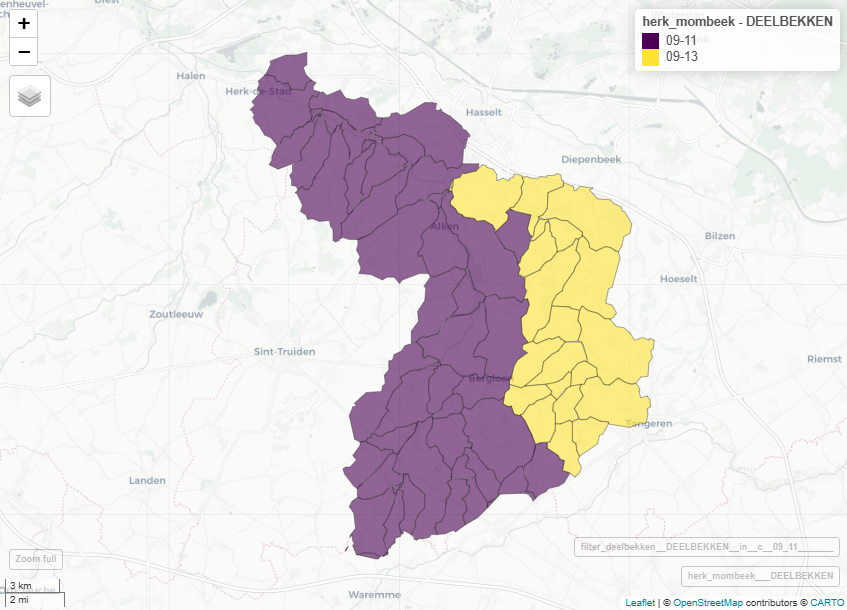

```{r packages, include=FALSE}
library(sf)
library(terra)
library(dplyr)
library(tidyverse)
library(readxl)
library(mapview)
library(tools)     # Handig voor file_ext()

```

## 1. Data inladen en klaarmaken

De data zitten in een map "data" onder de folder van het `studiegebied` (rivierbeek, kleine_nete, dommel, herk_mombeek, ijzer, dijle). De folders van de studiegebieden zitten in de map scenarios, op hetzelfde niveau als het bestand `scenarios.Rproj`. Definieer in de eerste regel het studiegebied.

> | C:/R/NARA2026/nara2026-git
> |    `scenarios.Rproj`
> |    \|—– data
> |    \|—– src -\> `x12_synthese_afbakenen_deelstroomgebieden.Rmd`

## 2. Afbakenen deelstroomgebieden

Het script koppelt de codes van de deelbekkens aan de deelstroomgebiedjes. De polygonen van de deelstroomgebiedjes worden afgebakend via de 'watershed' tool van ArcMap (Zie ArcGis script '`afstroomgebieden`' onder Q:\Projects\PRJ\_NARA_2026\\1_toestand_water\toestand\_water.tbx).



```{r deelstroomgebieden}

# Inlezen polygonen van deelstroomgebieden (Vlaanderendekkend)
# Inlezen polygonen deelbekkens
watershed <- st_read("C:/R/NARA2026/nara2026-git/scenarios/data/watershed_intersect.shp", quiet = TRUE)
deelbekken <- st_read("C:/GIS/basislagen/deelbekken.shp", quiet = TRUE)

watershed <- st_make_valid(watershed)
deelbekken <- st_make_valid(deelbekken)

# 1. Voeg een unieke ID toe aan de afstroomgebieden
watershed <- watershed %>% 
  mutate(unieke_id = row_number())

# 2. Intersect met deelbekkens
overlap <- st_intersection(watershed %>% select(unieke_id), deelbekken %>% select(DEELBEKKEN))

# 3. Bereken de oppervlakte van elk overlappend fragment en selecteer de grootste per polygoon
grootste_overlap <- overlap %>%
  mutate(oppervlakte = as.numeric(st_area(.))) %>%
  st_drop_geometry() %>%
  group_by(unieke_id) %>%
  slice_max(oppervlakte, n = 1, with_ties = FALSE) %>% # Kies de rij met de grootste oppervlakte
  ungroup()

# 4. Voeg de geselecteerde code toe aan de originele deelstroomgebieden
watershed_deelbekken <- watershed %>%
  left_join(grootste_overlap %>% select(unieke_id, DEELBEKKEN), by = "unieke_id")

# Herk en Mombeek (deelbekkencodes 09-11, 09-13)
herk_mombeek <- watershed_deelbekken |> 
  filter(DEELBEKKEN %in% c("09-11", "09-13"))
kleine_nete <- watershed_deelbekken |> 
  filter(DEELBEKKEN %in% c("10-06", "10-07", "10-13", "10-12"))
mapview(watershed_deelbekken, zcol = "DEELBEKKEN") + mapview(deelbekken)
mapview(herk_mombeek, zcol = "DEELBEKKEN") + mapview(deelbekken |> filter(DEELBEKKEN %in% c("09-11", "09-13")))
mapview(kleine_nete, zcol = "DEELBEKKEN") + mapview(deelbekken |> filter(DEELBEKKEN %in% c("10-06", "10-07", "10-13", "10-12")))

```

## 
