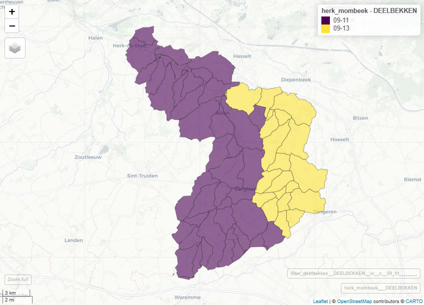

```{r packages, include=FALSE}
library(sf)
library(terra)
library(dplyr)
library(tidyverse)
library(readxl)
library(mapview)
library(tools)     # Handig voor file_ext()

```

## 1. Data inladen en klaarmaken

De data zitten in een map "data" onder de folder van het `studiegebied` (rivierbeek, kleine_nete, dommel, herk_mombeek, ijzer, dijle). De folders van de studiegebieden zitten in de map scenarios, op hetzelfde niveau als het bestand `scenarios.Rproj`. Definieer in de eerste regel het studiegebied.

> | C:/R/NARA2026/nara2026-git
> |    `scenarios.Rproj`
> |    \|—– data
> |    \|—– src -\> `x12_synthese_afbakenen_deelstroomgebieden.Rmd`

## 2. Afbakenen deelstroomgebieden

Het script koppelt de codes van de deelbekkens aan de deelstroomgebiedjes. De polygonen van de deelstroomgebiedjes worden afgebakend via de 'watershed' tool van ArcMap (Zie ArcGis script '`afstroomgebieden`' onder Q:\Projects\PRJ\_NARA_2026\\1_toestand_water\toestand\_water.tbx).



```{r deelstroomgebieden}

# Inlezen polygonen van deelstroomgebieden (Vlaanderendekkend)
# Inlezen polygonen deelbekkens
watershed <- st_read("C:/R/NARA2026/nara2026-git/scenarios/data/watershed_intersect.shp", quiet = TRUE)
deelbekken <- st_read("C:/GIS/basislagen/deelbekken.shp", quiet = TRUE)

watershed <- st_make_valid(watershed)
deelbekken <- st_make_valid(deelbekken)

# 1. Voeg een unieke ID toe aan de afstroomgebieden
watershed <- watershed %>% 
  mutate(unieke_id = row_number())

# 2. Intersect met deelbekkens
overlap <- st_intersection(watershed %>% select(unieke_id), deelbekken %>% select(DEELBEKKEN))

# 3. Bereken de oppervlakte van elk overlappend fragment en selecteer de grootste per polygoon
grootste_overlap <- overlap %>%
  mutate(oppervlakte = as.numeric(st_area(.))) %>%
  st_drop_geometry() %>%
  group_by(unieke_id) %>%
  slice_max(oppervlakte, n = 1, with_ties = FALSE) %>% # Kies de rij met de grootste oppervlakte
  ungroup()

# 4. Voeg de geselecteerde code toe aan de originele deelstroomgebieden
watershed_deelbekken <- watershed %>%
  left_join(grootste_overlap %>% select(unieke_id, DEELBEKKEN), by = "unieke_id")

# Herk en Mombeek (deelbekkencodes 09-11, 09-13)
herk_mombeek <- watershed_deelbekken |> 
  filter(DEELBEKKEN %in% c("09-11", "09-13"))

# Kleine Nete (deelbekkencodes 10-06, 10-07, 10-13, 10-12)
kleine_nete <- watershed_deelbekken |> 
  filter(DEELBEKKEN %in% c("10-06", "10-07", "10-13", "10-12"))

deelbek_kn <- st_union(deelbekken |> filter(DEELBEKKEN %in% c("10-06", "10-07", "10-13", "10-12")))

kleine_nete <- st_intersection(kleine_nete, deelbek_kn)

st_write(kleine_nete, str_c("C:/R/NARA2026/nara2026-git/scenarios/", studiegebied, "/output/watersheds.shp"))

mapview(watershed_deelbekken, zcol = "DEELBEKKEN") + mapview(deelbekken)
mapview(herk_mombeek, zcol = "DEELBEKKEN") + mapview(deelbekken |> filter(DEELBEKKEN %in% c("09-11", "09-13")))
mapview(kleine_nete, zcol = "DEELBEKKEN") + mapview(deelbekken |> filter(DEELBEKKEN %in% c("10-06", "10-07", "10-13", "10-12")))

```

## 

```{r}


library(sf)
library(ggplot2)
library(dplyr)
library(tidyr)
library(viridis)
library(colorspace)
library(exactextractr)

watersheds <- st_read(str_c("C:/R/NARA2026/nara2026-git/scenarios/", studiegebied, "/output/watersheds.shp"))


#///////////////////////////////
# Quickflow
#///////////////////////////////

qf <- rast(str_c("C:/GIS/NARA2026/invest/R/outputs/", studiegebied, "/referentie/QF.tif"))

qf_sc1 <- rast(str_c("C:/GIS/NARA2026/invest/R/outputs/", studiegebied, "/sc1_ont/QF_sc1_ont.tif"))

qf_sc2 <- rast(str_c("C:/GIS/NARA2026/invest/R/outputs/", studiegebied, "/sc2_ont/QF_sc2_ont.tif"))

qf_sc3 <- rast(str_c("C:/GIS/NARA2026/invest/R/outputs/", studiegebied, "/sc3_bos_ont/QF_sc3_bos_ont.tif"))

watersheds$som_ref <- exact_extract(qf, watersheds, 'sum')
watersheds$som_sc1 <- exact_extract(qf_sc1, watersheds, 'sum')
watersheds$som_sc2 <- exact_extract(qf_sc2, watersheds, 'sum')
watersheds$som_sc3 <- exact_extract(qf_sc3, watersheds, 'sum')


#///////////////////////////////
# Infiltratie
#///////////////////////////////

inf <- rast(str_c("C:/GIS/NARA2026/invest/R/outputs/", studiegebied, "/referentie/L.tif"))

inf_sc1 <- rast(str_c("C:/GIS/NARA2026/invest/R/outputs/", studiegebied, "/sc1_ont/L_sc1_ont.tif"))

inf_sc2 <- rast(str_c("C:/GIS/NARA2026/invest/R/outputs/", studiegebied, "/sc2_ont/L_sc2_ont.tif"))

inf_sc3 <- rast(str_c("C:/GIS/NARA2026/invest/R/outputs/", studiegebied, "/sc3_bos_ont/L_sc3_bos_ont.tif"))


watersheds$som_inf_ref <- exact_extract(inf, watersheds, 'sum')
watersheds$som_inf_sc1 <- exact_extract(inf_sc1, watersheds, 'sum')
watersheds$som_inf_sc2 <- exact_extract(inf_sc2, watersheds, 'sum')
watersheds$som_inf_sc3 <- exact_extract(inf_sc3, watersheds, 'sum')


#///////////////////////////////
# Stikstof
#///////////////////////////////

n <- rast(str_c("C:/GIS/NARA2026/invest/R/outputs/", studiegebied, "/NDR/referentie/n_total_export.tif"))

n_sc1 <- rast(str_c("C:/GIS/NARA2026/invest/R/outputs/", studiegebied, "/NDR/sc1_ont/n_total_export_sc1_ont.tif"))

n_sc2 <- rast(str_c("C:/GIS/NARA2026/invest/R/outputs/", studiegebied, "/NDR/sc2_ont/n_total_export_sc2_ont.tif"))

n_sc3 <- rast(str_c("C:/GIS/NARA2026/invest/R/outputs/", studiegebied, "/NDR/sc3_bos_ont/n_total_export_sc3_bos_ont.tif"))


watersheds$som_n_ref <- exact_extract(n, watersheds, 'sum')
watersheds$som_n_sc1 <- exact_extract(n_sc1, watersheds, 'sum')
watersheds$som_n_sc2 <- exact_extract(n_sc2, watersheds, 'sum')
watersheds$som_n_sc3 <- exact_extract(n_sc3, watersheds, 'sum')


# Combineren
watersheds <- watersheds |> 
  mutate(sc1_diff = (som_sc1 - som_ref) / som_ref,
         sc2_diff = (som_sc2 - som_ref) / som_ref,
         sc3_diff = (som_sc3 - som_ref) / som_ref,
         sc1_inf_diff = (som_inf_sc1 - som_inf_ref) / som_inf_ref,
         sc2_inf_diff = (som_inf_sc2 - som_inf_ref) / som_inf_ref,
         sc3_inf_diff = (som_inf_sc3 - som_inf_ref) / som_inf_ref,
         sc1_n_diff = (som_n_sc1 - som_n_ref) / som_n_ref,
         sc2_n_diff = (som_n_sc2 - som_n_ref) / som_n_ref,
         sc3_n_diff = (som_n_sc3 - som_n_ref) / som_n_ref)

# 1. Transformeer de data van breed naar lang formaat
# Quickflow
watersheds_long_qf <- watersheds %>%
  pivot_longer(
    cols = c(sc1_diff, sc2_diff, sc3_diff),
    names_to = "scenario",
    values_to = "diff_var"
  ) %>%
  mutate(scenario = recode(scenario,
                           "sc1_diff" = "Scenario 1",
                           "sc2_diff" = "Scenario 2",
                           "sc3_diff" = "Scenario 3"
  ))

# Infiltratie
watersheds_long_inf <- watersheds %>%
  pivot_longer(
    cols = c(sc1_inf_diff, sc2_inf_diff, sc3_inf_diff),
    names_to = "scenario",
    values_to = "diff_var"
  ) %>%
  filter(diff_var <= 1) |> 
  mutate(scenario = recode(scenario,
                           "sc1_inf_diff" = "Scenario 1 inf",
                           "sc2_inf_diff" = "Scenario 2 inf",
                           "sc3_inf_diff" = "Scenario 3 inf"
  ))


# Stikstof
watersheds_long_n <- watersheds %>%
  pivot_longer(
    cols = c(sc1_n_diff, sc2_n_diff, sc3_n_diff),
    names_to = "scenario",
    values_to = "diff_var"
  ) %>%
  filter(diff_var <= 1) |> 
  mutate(scenario = recode(scenario,
                           "sc1_n_diff" = "Scenario 1 N",
                           "sc2_n_diff" = "Scenario 2 N",
                           "sc3_n_diff" = "Scenario 3 N"
  ))


# 2. 2x2 matrix
ggplot(data = watersheds_long_n) +
  geom_sf(aes(fill = diff_var), color = "white", size = 0.1) +
  facet_wrap(~scenario, ncol = 3) +
  scale_fill_gradient2(
    low = "deeppink3",
    mid = "white",
    high = "turquoise4",
    midpoint = 0,
    trans = scales::pseudo_log_trans(sigma = 0.01)
  ) +
  # scale_fill_continuous_divergingx(palette = 'Spectral', mid = 0) +
  # scale_fill_viridis_c(option = "magma", name = "% diff") +
  theme_minimal() +
  theme(
    panel.grid = element_blank(),
    axis.text = element_blank(),
    strip.text = element_text(face = "bold", size = 11),
    plot.title = element_text(face = "bold", size = 14, hjust = 0.5),
    legend.position = "bottom", 
    legend.key.width = unit(2, "cm")
  )


```
