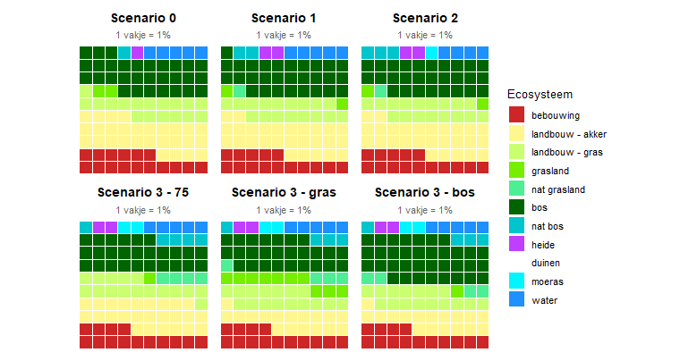

```{r packages, include=FALSE}
library(data.table)
library(sf)
library(terra)
library(dplyr)
library(tidyverse)
library(readxl)
library(viridis)
library(mapview)
library(tools)     # Handig voor file_ext()
library(exactextractr)
library(kableExtra)
# if (!requireNamespace("remotes", quietly = TRUE)) {install.packages("remotes")}
library(waffle)
library(patchwork)

```

## 0. Data inladen en klaarmaken

De data zitten in de mappen "output" en "data" onder de folder van het `studiegebied` (rivierbeek, kleine_nete, dommel, herk_mombeek, ijzer, dijle). De folders van de studiegebieden zitten in de map scenarios, op hetzelfde niveau als het bestand `scenarios.Rproj`. Definieer in de eerste regel het studiegebied.

> | C:/R/NARA2026/nara2026-git/scenarios
> |    `scenarios.Rproj`
> |    \|—– data
> |    \|—– src -\> `16_resultaten_synthesefiguren.Rmd`
> |    \|—– `studiegebied`
> |          \|—– data
> |          \|—– output
> |          \|—– temp

```{r}


studiegebied <- "kleine_nete"


folder_output <- str_c("C:/R/NARA2026/nara2026-git/scenarios/", studiegebied, "/output/")
folder_data <- str_c("C:/R/NARA2026/nara2026-git/scenarios/", studiegebied, "/data/")
folder_temp <- str_c("C:/R/NARA2026/nara2026-git/scenarios/", studiegebied, "/temp/")
hoofdfolder_data <- str_c("C:/R/NARA2026/nara2026-git/scenarios/data/")


#////////////////////////
# Ecosysteemkaarten
#////////////////////////

ecosysteem_2022_nat <- rast(file.path(folder_output, "ecosysteem_2022_nat.tif"))

scen1_ecosysteem_finaal <- rast(file.path(folder_output, "scen1_ecosysteem_finaal.tif"))

scen2_ecosysteem_finaal <- rast(file.path(folder_output, "scen2_ecosysteem_finaal.tif"))

scen3_bos_ecosysteem_finaal <- rast(file.path(folder_output,  "scen3_bos_ecosysteem_finaal.tif"))

scen3_gras_ecosysteem_finaal <- rast(file.path(folder_output, "scen3_gras_ecosysteem_finaal.tif"))

scen3_75_ecosysteem_finaal <- rast(file.path(folder_output, "scen3_75_ecosysteem_finaal.tif"))


#////////////////////////
# Natuurdoelen
#////////////////////////

gebied <- st_read(file.path(folder_data, "gebied.shp"))

toekomstlaag <- st_read(file.path(folder_data, "toekomstlaag.shp"))

grondwaterregime_habitats <- read_excel(file.path(hoofdfolder_data, "grondwaterregime_habitats.xlsx"))

deel_3_reclass_natdoel <- read_excel(file.path(hoofdfolder_data, "deel_3_reclass_natdoel.xlsx"))

overstromingstolerantie_habitats_gis <- read_excel(file.path(hoofdfolder_data, "overstromingstolerantie_habitats_gis.xlsx"))

```

```{r functie_codes}

# Functie om twee rasters met textcodes (natuurstreefbeeldcodes) te combineren

combineer_categorisch <- function(r_basis, r_aanvulling,
                                  laagnaam = "code",
                                  hergebruik_geometrie = TRUE) {
  # r_basis:      raster waarvan de waarden behouden blijven
  # r_aanvulling: raster waarvan de waarden de NA's van r_basis opvullen
  # laagnaam:     naam van de labelkolom/laag in het resultaat
  # hergebruik_geometrie: indien TRUE wordt r_aanvulling automatisch
  #   geprojecteerd/geresampled (nearest neighbour) naar r_basis als
  #   extent, resolutie of CRS niet overeenkomen
  
  stopifnot(inherits(r_basis, "SpatRaster"), inherits(r_aanvulling, "SpatRaster"))
  
  # 1. Lookup-tabellen (ID + label = eerste twee kolommen)
  haal_lookup <- function(r) {
    lv <- levels(r)[[1]]
    if (is.null(lv) || ncol(lv) < 2) {
      stop("Raster heeft geen categorieën (levels). Zet eerst levels(r) <- data.frame(ID=..., label=...).")
    }
    out <- data.frame(ID = lv[[1]], code = as.character(lv[[2]]))
    out[!is.na(out$code), ]
  }
  lev1 <- haal_lookup(r_basis)
  lev2 <- haal_lookup(r_aanvulling)
  
  # 2. Gezamenlijke set unieke codes met nieuwe ID's
  alle_codes <- data.frame(code = unique(c(lev1$code, lev2$code)),
                           stringsAsFactors = FALSE)
  alle_codes$nieuw_ID <- seq_len(nrow(alle_codes))
  
  # 3. Oude ID -> nieuwe ID
  rcl1 <- cbind(lev1$ID, alle_codes$nieuw_ID[match(lev1$code, alle_codes$code)])
  rcl2 <- cbind(lev2$ID, alle_codes$nieuw_ID[match(lev2$code, alle_codes$code)])
  
  # 4. Labels weghalen zodat de ruwe ID's overblijven, dan hercoderen
  zonder_labels <- function(r) {
    r <- r[[1]]
    levels(r) <- NULL
    r
  }
  r1 <- classify(zonder_labels(r_basis),      rcl1, others = NA)
  r2 <- classify(zonder_labels(r_aanvulling), rcl2, others = NA)
  
  # 5. Geometrie gelijktrekken indien nodig
  if (!compareGeom(r1, r2, stopOnError = FALSE)) {
    if (!hergebruik_geometrie) {
      stop("Rasters hebben verschillende extent/resolutie/CRS. Gebruik hergebruik_geometrie = TRUE.")
    }
    r2 <- project(r2, r1, method = "near")
  }
  
  # 6. NA's van r1 opvullen met r2
  combi <- cover(r1, r2)
  
  # 7. Labels terugzetten
  lab <- data.frame(ID = alle_codes$nieuw_ID, code = alle_codes$code)
  names(lab)[2] <- laagnaam
  levels(combi) <- lab
  names(combi) <- laagnaam
  
  combi
}

```

## 1. Natte natuur

### a) Kaarten natte natuur

-\> Kaarten met nieuwe natte natuur

```{r natte_natuur}

# Natte natuurklassen
natte_natuur <- c(320, 410, 420, 701, 702, 901, 902)

# Natte natuur in 2022
nattenatuur_ref <- ifel(ecosysteem_2022_nat %in% natte_natuur, 1, NA)

# Natte natuur in scenario's
nattenatuur_sc1 <- ifel(scen1_ecosysteem_finaal %in% natte_natuur, 1, NA)

nattenatuur_sc2 <- ifel(scen2_ecosysteem_finaal %in% natte_natuur, 1, NA)

nattenatuur_sc3_bos <- ifel(scen3_bos_ecosysteem_finaal %in% natte_natuur, 1, NA)

nattenatuur_sc3_gras <- ifel(scen3_gras_ecosysteem_finaal %in% natte_natuur, 1, NA)

nattenatuur_sc3_75 <- ifel(scen3_75_ecosysteem_finaal %in% natte_natuur, 1, NA)

# Nieuwe natte natuur
sc1_nieuwe_nattenatuur <- ifel(!is.na(nattenatuur_sc1) & is.na(nattenatuur_ref), scen1_ecosysteem_finaal, NA)

sc2_nieuwe_nattenatuur <- ifel(!is.na(nattenatuur_sc2) & is.na(nattenatuur_ref), scen2_ecosysteem_finaal, NA)

sc3_bos_nieuwe_nattenatuur <- ifel(!is.na(nattenatuur_sc3_bos) & is.na(nattenatuur_ref), scen3_bos_ecosysteem_finaal, NA)

sc3_gras_nieuwe_nattenatuur <- ifel(!is.na(nattenatuur_sc3_gras) & is.na(nattenatuur_ref), scen3_gras_ecosysteem_finaal, NA)

sc3_75_nieuwe_nattenatuur <- ifel(!is.na(nattenatuur_sc3_75) & is.na(nattenatuur_ref), scen3_75_ecosysteem_finaal, NA)


# Wegschrijven

writeRaster(sc1_nieuwe_nattenatuur,
            filename = str_c("C:/R/NARA2026/nara2026-git/scenarios/",
                             studiegebied, "/output/sc1_nieuwe_nattenatuur.tif"), overwrite = TRUE)
writeRaster(sc2_nieuwe_nattenatuur,
            filename = str_c("C:/R/NARA2026/nara2026-git/scenarios/",
                             studiegebied, "/output/sc2_nieuwe_nattenatuur.tif"), overwrite = TRUE)
writeRaster(sc3_bos_nieuwe_nattenatuur,
            filename = str_c("C:/R/NARA2026/nara2026-git/scenarios/",
                             studiegebied, "/output/sc3_bos_nieuwe_nattenatuur.tif"), overwrite = TRUE)
writeRaster(sc3_gras_nieuwe_nattenatuur,
            filename = str_c("C:/R/NARA2026/nara2026-git/scenarios/",
                             studiegebied, "/output/sc3_gras_nieuwe_nattenatuur.tif"), overwrite = TRUE)
writeRaster(sc3_75_nieuwe_nattenatuur,
            filename = str_c("C:/R/NARA2026/nara2026-git/scenarios/",
                             studiegebied, "/output/sc3_75_nieuwe_nattenatuur.tif"), overwrite = TRUE)


# Tabel met oppervlaktes

kaarten <- list(
  sc1 = sc1_nieuwe_nattenatuur,
  sc2 = sc2_nieuwe_nattenatuur,
  sc3_bos = sc3_bos_nieuwe_nattenatuur,
  sc3_gras = sc3_gras_nieuwe_nattenatuur,
  sc3_75 = sc3_75_nieuwe_nattenatuur
)

codes <- c(320, 410, 420, 701, 702, 901, 902)

# Aantallen per code en per raster
tabel <- sapply(kaarten, function(r) {
  f <- freq(r)
  x <- setNames(f$count, f$value)
  x <- x[as.character(codes)]
  x[is.na(x)] <- 0
  x
})

# Omzetten naar dataframe
tabel <- as.data.frame(tabel)
tabel$Code <- codes

# Code als eerste kolom
tabel <- tabel[, c("Code", names(kaarten))]

totaalrij <- c(
  Code = "Totaal",
  as.list(colSums(tabel[, names(kaarten)]))
)

tabel <- rbind(tabel, totaalrij)
row.names(tabel) <- NULL

```

### b) Natte en droge natuur

-\> natuurdoelen (toekomstkaart) opdelen in natte en droge types en nagaan welke doelen al dan niet gerealiseerd kunnen worden onder de scenario's

- Grondwaterregimes (GLG, m onder maaiveld) voor grondwaterafhankelijke terrestrische habitattypen en rbb:
  - groep_glg = 1 of 2 -\> zeer nat/veenvormend: 0 - 0.25 m
  - groep_glg = 3 -\> nat: 0.25 - 0.5 m
  - groep_glg = 4 -\> vochtig: 0.5 - 1.2 m
  - groep_glg = 5 lokaal vochtig of droog: \> 1.2 m

```{r natte_droge_natuur}

#/////////////////////////////////////////////
# 1. glg van natuurtypes in de toekomstlaag
#/////////////////////////////////////////////

percelen <- st_intersection(toekomstlaag, gebied)

rcl_hab <- grondwaterregime_habitats # grondwaterklassen habitats
rcl_eco <- deel_3_reclass_natdoel

percelen_hab1 <- percelen |>
  left_join(rcl_hab, by = c("HAB1" = "habitat"))

percelen_hab1_eco <- percelen |>
  left_join(rcl_eco, by = c("HAB1" = "habitat"))

# 1.1. Op basis van het grondwaterregime
doel_glg_gwr <- rasterize(percelen_hab1, ecosysteem_2022_nat, field = "groep_glg")
# aantal klassen reduceren: zeer nat (1 en 2) -> 1, nat -> 3, vochtig en droog  (4 en 5)-> 5
doel_glg_gwr <- ifel(doel_glg_gwr %in% c(1, 2), 1, ifel(doel_glg_gwr == 3, 3, ifel(doel_glg_gwr %in% c(4, 5), 5, 5)))

zeer_nat <- c(420, 701, 702, 801, 802, 901, 902) # groep_glg = 1 en 2
nat <- c(320, 410) # groep_glg = 3

# 1.2. Op basis van de ecosysteemcode en gwates
# natuurstreefbeelden omzetten naar raster ecosystemen
toekomst_eco <- rasterize(percelen_hab1_eco, ecosysteem_2022_nat, field = "eco")

# Codes voor grasland (302) en bos (402) omzetten naar natte codes op basis van aanwezigheid GWATES/moerasbos -> codes worden 320 (natte graslanden) en 410 (valleibos) of 420 (moerasbos)
# gwates in de toekomstlaag
gwates_doel <- rasterize(percelen_hab1_eco, ecosysteem_2022_nat, field = "gwates")

# Moerasbos in toekomstlaag
moerasbos_doel <- rasterize(percelen_hab1_eco |> filter(HAB1 %in% c("91E0_vn", "91E0_vm", "91E0_vo", "91E0_eutr", "91E0_meso", "91E0_oli")), ecosysteem_2022_nat, field = 1)

doel_glg_eco <- ifel(!is.na(gwates_doel) & toekomst_eco == 302, 320, ifel(!is.na(moerasbos_doel) & toekomst_eco == 401, 420, ifel(!is.na(gwates_doel) & toekomst_eco == 401, 410, toekomst_eco)))

doel_glg_eco <- ifel(is.na(doel_glg_eco), NA, ifel(doel_glg_eco %in% nat, 3, ifel(doel_glg_eco %in% zeer_nat, 1, 5)))


#/////////////////////////////////////////////
# 2.glg van ecosystemen in de scenario's
#/////////////////////////////////////////////

huidig_glg <- ifel(ecosysteem_2022_nat %in% zeer_nat, 1, ifel(ecosysteem_2022_nat %in% nat, 3, 5))

sc1_glg <- ifel(scen1_ecosysteem_finaal %in% zeer_nat, 1, ifel(scen1_ecosysteem_finaal %in% nat, 3, 5))

sc2_glg <- ifel(scen2_ecosysteem_finaal %in% zeer_nat, 1, ifel(scen2_ecosysteem_finaal %in% nat, 3, 5))

sc3_75_glg <- ifel(scen3_75_ecosysteem_finaal %in% zeer_nat, 1, ifel(scen3_75_ecosysteem_finaal %in% nat, 3, 5))

sc3_gras_glg <- ifel(scen3_gras_ecosysteem_finaal %in% zeer_nat, 1, ifel(scen3_gras_ecosysteem_finaal %in% nat, 3, 5))

sc3_bos_glg <- ifel(scen3_bos_ecosysteem_finaal %in% zeer_nat, 1, ifel(scen3_bos_ecosysteem_finaal %in% nat, 3, 5))


# 3. matcht de grondwaterstand van de natuurdoelen met de grondwaterstand in de scenario's? -> -1 = te nat voor doel, 1 = te droog voor doel, 0 = grondwaterstand is OK

doel_glg <- doel_glg_eco # Kies doel op basis van grondwaterregime (doel_glg_gwr) of het ecosysteemtype (doel_glg_eco)

huidig_natdoel <- ifel(doel_glg > huidig_glg, -1, ifel(doel_glg < huidig_glg, 1, 0))

sc1_natdoel <- ifel(doel_glg > sc1_glg, -1, ifel(doel_glg < sc1_glg, 1, 0))

sc2_natdoel <- ifel(doel_glg > sc2_glg, -1, ifel(doel_glg < sc2_glg, 1, 0))

sc3_75_natdoel <- ifel(doel_glg > sc3_75_glg, -1, ifel(doel_glg < sc3_75_glg, 1, 0))

# Natuurdoelen in scenario 3 zijn identiek
# sc3_gras_natdoel <- ifel(doel_glg > sc3_gras_glg, -1, ifel(doel_glg < sc3_gras_glg, 1, 0))
# 
# sc3_bos_natdoel <- ifel(doel_glg > sc3_bos_glg, -1, ifel(doel_glg < sc3_bos_glg, 1, 0))


# Opkuis watercellen (onwaarschijnlijk dat die veranderen)
water <- c(801, 802, 901, 902)

water_huidig <- ifel(!is.na(ecosysteem_2022_nat) & !ecosysteem_2022_nat %in% water, 1, NA)
water_sc1 <- ifel(!is.na(scen1_ecosysteem_finaal) & !scen1_ecosysteem_finaal %in% water, 1, NA)
water_sc2 <- ifel(!is.na(scen2_ecosysteem_finaal) & !scen2_ecosysteem_finaal %in% water, 1, NA)
water_sc3 <- ifel(!is.na(scen3_75_ecosysteem_finaal) & !scen3_75_ecosysteem_finaal %in% water, 1, NA)

huidig_natdoel <- mask(huidig_natdoel, water_huidig)

sc1_natdoel <- mask(sc1_natdoel, water_sc1)

sc2_natdoel <- mask(sc2_natdoel, water_sc2)

sc3_75_natdoel <- mask(sc3_75_natdoel, water_sc3)


# Grafiek
scenarios_nat <- c(
  "huidig" = huidig_natdoel,
  "scenario 1" = sc1_natdoel,
  "scenario 2" = sc2_natdoel,
  "scenario 3" = sc3_75_natdoel
)

bereken_natuur_scenario <- function(r, scenario_naam) {
  resultaat <- data.frame(
    scenario = scenario_naam,
    te_nat = round(freq(r, value = -1)$count/100, 0),
    te_droog = round(freq(r, value = 1)$count/100, 0),
    ok = round(freq(r, value = 0)$count/100, 0)
  )
  return(resultaat)
}

results_natuur <- bind_rows(
  lapply(names(scenarios_nat), function(scen) {
    bereken_natuur_scenario(
      r = scenarios_nat[[scen]],
      scenario_naam = scen
    )
  })
)


# 2. Omvormen van breed naar lang formaat voor ggplot
df_long <- results_natuur |> 
  pivot_longer(
    cols = c("te_nat", "te_droog", "ok"),
    names_to = "categorie",
    values_to = "aantal"
  ) |> 
  mutate(
    opp = aantal/100,
    scenario = factor(scenario, levels = c("huidig", "scenario 1", "scenario 2", "scenario 3")),
    categorie = factor(categorie, levels = c("ok", "te_nat", "te_droog"))
  )

# 3. Kies hier zelf je gewenste kleuren (gebruik kleurcodes of kleurnaam-tekst)
eigen_kleuren <- c(
  "ok"       = "lightgrey", # Groen
  "te_nat"   = "dodgerblue3", # Blauw
  "te_droog" = "yellow3"  # Rood
)

# 4. Gestapeld staafdiagram maken
p <- ggplot(df_long, aes(x = scenario, y = opp, fill = categorie)) +
  geom_col(position = "stack", width = 0.6) +
  scale_fill_manual(
    values = eigen_kleuren,
    labels = c("ok" = "Niet afwijkend", "te_nat" = "Te nat", "te_droog" = "Te droog")
  ) +
  labs(
    title = "",
    x = "",
    y = "Oppervlakte (ha)",
    fill = ""
  ) +
  theme_minimal(base_size = 12) +
  theme(legend.position = "bottom")

p + scale_y_break(c(20, 90), ticklabels = c(10, 20, 100))

plot(sc1_natdoel, type = "classes", col = c("dodgerblue", "lightgrey", "yellow3"))
```

### c) Overstromingen

```{r overstromingen}

#///////////////////////////////////////
# 1. Data inladen en klaarmaken
#///////////////////////////////////////

# Tabel met overstromingstoleranties
tbl_flood <- overstromingstolerantie_habitats_gis
# Tabel met ecosysteemcodes
rcl_eco <- deel_3_reclass_natdoel

# kaarte overstromingsdiepte
waterdiepte <- rast(file.path(folder_data, "overstromingsdiepte_t100_flu_plu.tif"))

# Resultaten vrijstromendheid -> 10 = vernatting, 100 = overstromingen, 110 = overstromingen + vernatting
sc1_ffr <- rast(file.path(folder_temp, "sc1_vrijstromend.tif"))
sc2_ffr <- rast(file.path(folder_temp, "sc2_vrijstromend.tif"))
sc3_ffr <- rast(file.path(folder_temp, "sc3_vrijstromend.tif"))

sc1_flood <- ifel(sc1_ffr >= 100, 1, NA)
sc2_flood <- ifel(sc2_ffr >= 100, 1, NA)
sc3_flood <- ifel(sc3_ffr >= 100, 1, NA)

sc1_waterdiepte <- sc1_flood * waterdiepte
sc2_waterdiepte <- sc2_flood * waterdiepte
sc3_waterdiepte <- sc3_flood * waterdiepte


#///////////////////////////////////////////////////////////////////
# 2. Toekomstlaag verrasteren
#///////////////////////////////////////////////////////////////////

percelen <- st_intersection(toekomstlaag, gebied)

percelen_hab1_flood <- percelen |>
  left_join(tbl_flood, by = c("HAB1" = "habitat")) |> 
  left_join(rcl_eco, by = c("HAB1" = "habitat"))

# verrasteren habitatcode van de toekomstlaag
toekomst_habitat <- rasterize(percelen_hab1_flood, ecosysteem_2022_nat, field = "HAB1")
# Geen natuurstreefbeeld -> op NA zetten
toekomst_habitat <- ifel(toekomst_habitat %in% c("geen habitat", "geen vegetatie NSB", "gh"), NA, toekomst_habitat)

# verrasteren eco-code van de toekomstlaag
toekomst_eco <- rasterize(percelen_hab1_flood, ecosysteem_2022_nat, field = "eco")

gwates_toekomst <- rasterize(percelen_hab1_flood, ecosysteem_2022_nat, field = "gwates")

moerasbos_toekomst <- rasterize(percelen_hab1_flood |> filter(HAB1 %in% c("91E0_vn", "91E0_vm", "91E0_vo", "91E0_eutr", "91E0_meso", "91E0_oli")), ecosysteem_2022_nat, field = 1)

# aanpassing eco-code voor natte natuurtypes
toekomst_eco_nat <- ifel(!is.na(gwates_toekomst) & toekomst_eco == 302, 320, ifel(!is.na(moerasbos_toekomst) & toekomst_eco == 401, 420, ifel(!is.na(gwates_toekomst) & toekomst_eco == 401, 410, toekomst_eco)))

# Geen natuurstreefbeeld (code 0) -> op NA zetten 
toekomst_eco_nat <- ifel(toekomst_eco_nat == 0, NA, toekomst_eco_nat)


#///////////////////////////////////////////////////////////////////
# 3. Natuurstreefbeelden toekennen aan ecosysteemkaarten scenario's
#///////////////////////////////////////////////////////////////////

#////////////////
# Doelkaart
#////////////////

# correctie verrasterde toekomstlaag voor gebouwen (101), wegen (102) en water (801, 802, 901, 902, 1001, 1003)
toekomst_habitat_doel <- ifel(!is.na(toekomst_habitat) & ecosysteem_2022_nat %in% c(101, 102, 801, 802, 901, 902, 1001, 1003), NA, toekomst_habitat)


#////////////////
# Scenario 1
#////////////////

# 1. waar zijn de ecosysteemcodes van de toekomstlaag en de ecosysteemkaart hetzelfde? -> uitzonderingen geven aan waar we de verschillen tussen de doelenkaart en de ecosysteemkaart minder streng beoordelen (cf inpuzzelen toekomstlaag in compilatiescript)

uitzonderingen <- 
  scen1_ecosysteem_finaal %in% c(101, 102, 801, 802) |
  (scen1_ecosysteem_finaal %in% c(701, 901) & toekomst_eco_nat == 902) |
  (scen1_ecosysteem_finaal %in% c(501, 602) & toekomst_eco_nat %in% c(302, 501, 902, 702)) |
  (scen1_ecosysteem_finaal == 702 & toekomst_eco_nat %in% c(501, 902)) |
  (scen1_ecosysteem_finaal %in% c(701, 702, 420))

mask <- (toekomst_eco_nat == scen1_ecosysteem_finaal) | uitzonderingen

toekomst_habitat_zelfde <- mask(toekomst_habitat, mask, maskvalue = FALSE)

# correctie verrasterde toekomstlaag voor gebouwen (101), wegen (102) en water (801, 802, 901, 902, 1001, 1003)
toekomst_habitat_zelfde <- ifel(!is.na(toekomst_habitat_zelfde) & scen1_ecosysteem_finaal %in% c(101, 102, 801, 802, 901, 902, 1001, 1003), NA, toekomst_habitat_zelfde)


# 2. waar zijn de ecosysteemcodes van de toekomstlaag en de ecosysteemkaart verschillend?

toekomst_habitat_verschil <- mask(scen1_ecosysteem_finaal, mask, maskvalue = TRUE)
toekomst_habitat_verschil <- mask(toekomst_habitat_verschil, toekomst_habitat)
toekomst_habitat_verschil <- ifel(!is.na(toekomst_habitat_verschil) &
   scen1_ecosysteem_finaal %in% c(101, 102, 801, 802, 901, 902, 1001, 1003),
   NA, toekomst_habitat_verschil)

# 3. Ecosysteemcodes van vorige stap omzetten naar wenselijk natuurstreefbeeld
# Hoog en laag groen onder natuurcode = verrezen habitatcellen die onder verharding lagen en na ontharding weer opduiken -> foute classificatie natuurdoel en dus negeren (+ 501 al verwijderen)
habitat_verschil <- ifel(toekomst_habitat_verschil %in% c(103, 104, 501), NA, toekomst_habitat_verschil)
# Heide onder verkeerde natuurcode = zit in complex met grasland (302) -> habitatcode overnemen
mask_501 <- ifel(toekomst_habitat_verschil == 501, 1, NA)
habitat_verschil_501 <- mask(toekomst_habitat, mask_501)
# Akkercodes onder natuurcode = soortenrijke akker (andere_b*)
# Nieuwe natte natuur toewijzen aan meest tolerant natuurstreefbeeld dat onder die code past
tbl_cor <- data.frame(
  code = c(320, 410, 420, 701, 702,
           201,  202, 203, 204, 205, 2005, 2015, 2025, 2035, 2305, 2315, 2325, 2335),
  habitat = c("6430", "91E0_va", "91E0_vn", "rbbmc", "7140_base",
              "andere_b*", "andere_b*", "andere_b*", "andere_b*", "andere_b*", "andere_b*", "andere_b*", "andere_b*", "andere_b*", "andere_b*", "andere_b*", "andere_b*", "andere_b*"))

habitat_verschil  <- subst(habitat_verschil, from = tbl_cor$code, to = tbl_cor$habitat, others = NA)

# Habitatkaarten combineren
combi_verschil <- combineer_categorisch(habitat_verschil, habitat_verschil_501)
toekomst_habitat_sc1 <- combineer_categorisch(toekomst_habitat_zelfde, combi_verschil)


#////////////////
# Scenario 2
#////////////////

# 1. waar zijn de ecosysteemcodes van de toekomstlaag en de ecosysteemkaart hetzelfde?

uitzonderingen <- 
  scen2_ecosysteem_finaal %in% c(101, 102, 801, 802) |
  (scen2_ecosysteem_finaal %in% c(701, 901) & toekomst_eco_nat == 902) |
  (scen2_ecosysteem_finaal %in% c(501, 602) & toekomst_eco_nat %in% c(302, 501, 902, 702)) |
  (scen2_ecosysteem_finaal == 702 & toekomst_eco_nat %in% c(501, 902)) |
  (scen2_ecosysteem_finaal %in% c(701, 702, 420))

mask <- (toekomst_eco_nat == scen2_ecosysteem_finaal) | uitzonderingen

toekomst_habitat_zelfde <- mask(toekomst_habitat, mask, maskvalue = FALSE)

# correctie verrasterde toekomstlaag voor gebouwen (101), wegen (102) en water (801, 802, 901, 902, 1001, 1003)
toekomst_habitat_zelfde <- ifel(!is.na(toekomst_habitat_zelfde) & scen2_ecosysteem_finaal %in% c(101, 102, 801, 802, 901, 902, 1001, 1003), NA, toekomst_habitat_zelfde)


# 2. waar zijn de ecosysteemcodes van de toekomstlaag en de ecosysteemkaart verschillend?

toekomst_habitat_verschil <- mask(scen2_ecosysteem_finaal, mask, maskvalue = TRUE)
toekomst_habitat_verschil <- mask(toekomst_habitat_verschil, toekomst_habitat)
toekomst_habitat_verschil <- ifel(!is.na(toekomst_habitat_verschil) &
                                    scen2_ecosysteem_finaal %in% c(101, 102, 801, 802, 901, 902, 1001, 1003), NA, toekomst_habitat_verschil)

# 3. Ecosysteemcodes van vorige stap omzetten naar wenselijk natuurstreefbeeld
# Hoog en laag groen onder natuurcode = verrezen habitatcellen die onder verharding lagen en na ontharding weer opduiken -> foute classificatie natuurdoel en dus negeren (+ 501 al verwijderen)
habitat_verschil <- ifel(toekomst_habitat_verschil %in% c(103, 104, 501), NA, toekomst_habitat_verschil)
# Heide onder verkeerde natuurcode = zit in complex met grasland (302) -> habitatcode overnemen
mask_501 <- ifel(toekomst_habitat_verschil == 501, 1, NA)
habitat_verschil_501 <- mask(toekomst_habitat, mask_501)
# Akkercodes onder natuurcode = soortenrijke akker (andere_b*)
# Nieuwe natte natuur toewijzen aan meest tolerant natuurstreefbeeld dat onder die code past
tbl_cor <- data.frame(
  code = c(320, 410, 420, 701, 702,
           201,  202, 203, 204, 205, 2005, 2015, 2025, 2035, 2305, 2315, 2325, 2335),
  habitat = c("6430", "91E0_va", "91E0_vn", "rbbmc", "7140_base",
              "andere_b*", "andere_b*", "andere_b*", "andere_b*", "andere_b*", "andere_b*", "andere_b*", "andere_b*", "andere_b*", "andere_b*", "andere_b*", "andere_b*", "andere_b*"))

habitat_verschil  <- subst(habitat_verschil, from = tbl_cor$code, to = tbl_cor$habitat, others = NA)

# Habitatkaarten combineren
combi_verschil <- combineer_categorisch(habitat_verschil, habitat_verschil_501)
toekomst_habitat_sc2 <- combineer_categorisch(toekomst_habitat_zelfde, combi_verschil)


#////////////////
# Scenario 3
#////////////////

# 1. waar zijn de ecosysteemcodes van de toekomstlaag en de ecosysteemkaart hetzelfde?

uitzonderingen <- 
  scen3_gras_ecosysteem_finaal %in% c(101, 102, 801, 802) |
  (scen3_gras_ecosysteem_finaal %in% c(701, 901) & toekomst_eco_nat == 902) |
  (scen3_gras_ecosysteem_finaal %in% c(501, 602) & toekomst_eco_nat %in% c(302, 501, 902, 702)) |
  (scen3_gras_ecosysteem_finaal == 702 & toekomst_eco_nat %in% c(501, 902)) |
  (scen3_gras_ecosysteem_finaal %in% c(701, 702, 420))

mask <- (toekomst_eco_nat == scen3_gras_ecosysteem_finaal) | uitzonderingen

toekomst_habitat_zelfde <- mask(toekomst_habitat, mask, maskvalue = FALSE)

# correctie verrasterde toekomstlaag voor gebouwen (101), wegen (102) en water (801, 802, 901, 902, 1001, 1003)
toekomst_habitat_zelfde <- ifel(!is.na(toekomst_habitat_zelfde) & scen3_gras_ecosysteem_finaal %in% c(101, 102, 801, 802, 901, 902, 1001, 1003), NA, toekomst_habitat_zelfde)


# 2. waar zijn de ecosysteemcodes van de toekomstlaag en de ecosysteemkaart verschillend?

toekomst_habitat_verschil <- mask(scen3_gras_ecosysteem_finaal, mask, maskvalue = TRUE)
toekomst_habitat_verschil <- mask(toekomst_habitat_verschil, toekomst_habitat)
toekomst_habitat_verschil <- ifel(!is.na(toekomst_habitat_verschil) &
                                    scen3_gras_ecosysteem_finaal %in% c(101, 102, 801, 802, 901, 902, 1001, 1003), NA, toekomst_habitat_verschil)

# 3. Ecosysteemcodes van vorige stap omzetten naar wenselijk natuurstreefbeeld
# Hoog en laag groen onder natuurcode = verrezen habitatcellen die onder verharding lagen en na ontharding weer opduiken -> foute classificatie natuurdoel en dus negeren (+ 501 al verwijderen)
habitat_verschil <- ifel(toekomst_habitat_verschil %in% c(103, 104, 501), NA, toekomst_habitat_verschil)
# Heide onder verkeerde natuurcode = zit in complex met grasland (302) -> habitatcode overnemen
mask_501 <- ifel(toekomst_habitat_verschil == 501, 1, NA)
habitat_verschil_501 <- mask(toekomst_habitat, mask_501)
# Akkercodes onder natuurcode = soortenrijke akker (andere_b*)
# Nieuwe natte natuur toewijzen aan meest tolerant natuurstreefbeeld dat onder die code past
tbl_cor <- data.frame(
  code = c(320, 410, 420, 701, 702,
           201,  202, 203, 204, 205, 2005, 2015, 2025, 2035, 2305, 2315, 2325, 2335),
  habitat = c("6430", "91E0_va", "91E0_vn", "rbbmc", "7140_base",
              "andere_b*", "andere_b*", "andere_b*", "andere_b*", "andere_b*", "andere_b*", "andere_b*", "andere_b*", "andere_b*", "andere_b*", "andere_b*", "andere_b*", "andere_b*"))

habitat_verschil  <- subst(habitat_verschil, from = tbl_cor$code, to = tbl_cor$habitat, others = NA)

# Habitatkaarten combineren
combi_verschil <- combineer_categorisch(habitat_verschil, habitat_verschil_501)
toekomst_habitat_sc3 <- combineer_categorisch(toekomst_habitat_zelfde, combi_verschil)


#///////////////////////////////////////////////////////////////////
# 4. Combineerbaarheid berekenen met overstromingen
#///////////////////////////////////////////////////////////////////

scenarios_flood <- list(
  "doel" = toekomst_habitat_doel,
  "sc1" = toekomst_habitat_sc1,
  "sc2" = toekomst_habitat_sc2,
  "sc3" = toekomst_habitat_sc3
)


# Functie om combineerbaarheid te berekenen
bereken_combineerbaarheid <- function(r, waterdiepte_raster, tabel) {
  lv <- levels(r)[[1]]
  names(lv) <- c("ID", "habitat")
  
  r_id <- r
  levels(r_id) <- NULL
  
  koppel1 <- merge(lv, tabel[, c("habitat", "minwd20")], by = "habitat", all.x = TRUE)
  koppel2 <- merge(lv, tabel[, c("habitat", "minw20d50")], by = "habitat", all.x = TRUE)
  koppel3 <- merge(lv, tabel[, c("habitat", "minw50d")], by = "habitat", all.x = TRUE)
  
  r_wd20 <- subst(r_id, from = koppel1$ID, to = koppel1$minwd20)
  r_w20d50 <- subst(r_id, from = koppel2$ID, to = koppel2$minw20d50)
  r_w50d <- subst(r_id, from = koppel3$ID, to = koppel3$minw50d)
  
  combineerbaarheid <- ifel(waterdiepte_raster < 20, r_wd20,
                            ifel(waterdiepte_raster >= 20 & waterdiepte_raster <= 50, r_w20d50,
                                 ifel(waterdiepte_raster > 50, r_w50d, NA)))
  return(combineerbaarheid)
}

# Voer de functie uit voor alle scenario's in de lijst
resultaten_combineerbaarheid <- lapply(scenarios_flood, function(r) {
  bereken_combineerbaarheid(r, waterdiepte_raster = waterdiepte, tabel = tbl_flood)
})

# Geef de rasters in de lijst de gewenste naam met "_combineerbaarheid"
names(resultaten_combineerbaarheid) <- paste0(names(scenarios_flood), "_combineerbaarheid")


#//////////////////////////////////////////////////
# Grafiek
#//////////////////////////////////////////////////

list_flood <- c(
  "doel" = resultaten_combineerbaarheid$doel_combineerbaarheid,
  "sc1" = resultaten_combineerbaarheid$sc1_combineerbaarheid,
  "sc2" = resultaten_combineerbaarheid$sc2_combineerbaarheid,
  "sc3" = resultaten_combineerbaarheid$sc3_combineerbaarheid
)

# 0 = niet combineerbaar - 3 = combineerbaar
# Voor de finale beoordeling: score 0 en 1 zijn niet combineerbaar
freq(sc1_combineerbaarheid)
r <- resultaten_combineerbaarheid$doel_combineerbaarheid
scenario_naam <- "doel"
bereken_flood_scenario <- function(r, scenario_naam) {
  resultaat <- data.frame(
    scenario = scenario_naam,
    klasse = freq(r)$value,
    opp = round(freq(r)$count/100, 0)
  )
  return(resultaat)
}

results_flood <- bind_rows(
  lapply(names(list_flood), function(scen) {
    bereken_flood_scenario(
      r = list_flood[[scen]],
      scenario_naam = scen
    )
  })
)


# Omzetten naar factoren voor de juiste volgorde en handmatige kleuring
results_flood <- results_flood %>%
  mutate(
    scenario = factor(scenario, levels = c("doel", "sc1", "sc2", "sc3")),
    klasse   = factor(klasse, levels = c("0", "1", "2", "3")) # Volgorde van stapeling
  ) |> 
  group_by(scenario) |> 
  mutate(opp_totaal = sum(opp)) |> 
  ungroup() |> 
  mutate(opp_pc = opp/opp_totaal)

# Kies gewenste kleuren per klasse
eigen_kleuren <- c(
  "0" = "firebrick3",
  "1" = "firebrick1",
  "2" = "#41b6c4",
  "3" = "#225ea8"
)

# staafdiagram

ggplot(results_flood , aes(x = scenario, y = opp_pc, fill = klasse)) +
  geom_col(position = "stack", width = 0.6) +
  scale_fill_manual(
    values = eigen_kleuren
  ) +
  labs(
    title = "",
    x = "",
    y = "Oppervlakte (ha)",
    fill = "combineerbaarheid"
  ) +
  theme_minimal(base_size = 12) +
  theme(legend.position = "bottom")

ggplot(results_flood |> filter(!klasse %in% c(2, 3)), aes(x = scenario, y = opp_pc, fill = klasse)) +
  geom_col(position = "stack", width = 0.6) +
  scale_y_continuous(labels = scales::percent) +
  scale_fill_manual(
    values = eigen_kleuren
  ) +
  labs(
    title = "",
    x = "",
    y = "% oppervlakte",
    fill = "combineerbaarheid"
  ) +
  theme_minimal(base_size = 12) +
  theme(legend.position = "bottom")
```

## 2. Figuur ecosysteemoppervlaktes

-\> Wafflefiguur met oppervlaktes hoofdecosystemen (natte types apart)



```{r waffle}

reclass_tabel <- data.frame(
  code = c(
    101, 102, 103, 104, 105, 106, 201, 202, 203, 204, 205, 300, 301, 302, 
    400, 401, 402, 403, 404, 501, 601, 602, 701, 702, 801, 802, 901, 902, 
    1001, 1002, 1003, 1102, 1103, 320, 410, 420, 210, 220, 230, 330, 
    2005, 2015, 2025, 2035, 3005, 3015, 3025, 3035, 2305, 2315, 2325, 2335
  ),
  lu_reduct = c(
    100, 100, 400, 300, 800, 100, 200, 200, 200, 200, 200, 300, 300, 302, 
    400, 400, 400, 400, 400, 500, 500, 500, 700, 700, 800, 800, 800, 800, 
    800, 700, 800, 500, 700, 320, 420, 420, 200, 200, 200, 300, 
    200, 200, 200, 200, 300, 300, 300, 300, 200, 200, 200, 200
  )
)

sc0_reclass <- classify(ecosysteem_2022_nat, rcl = as.matrix(reclass_tabel))
sc1_reclass <- classify(scen1_ecosysteem_finaal, rcl = as.matrix(reclass_tabel))
sc2_reclass <- classify(scen2_ecosysteem_finaal, rcl = as.matrix(reclass_tabel))
sc3_75_reclass <- classify(scen3_75_ecosysteem_finaal, rcl = as.matrix(reclass_tabel))
sc3_gras_reclass <- classify(scen3_gras_ecosysteem_finaal, rcl = as.matrix(reclass_tabel))
sc3_bos_reclass <- classify(scen3_bos_ecosysteem_finaal, rcl = as.matrix(reclass_tabel))


# 2. Definieer jouw eigen kleuren per ecosysteemcode
colors <- c(
  "100" = "firebrick3",  
  "200" = "khaki1",
  "300" = "darkolivegreen1",
  "302" = "chartreuse2",
  "320" = "seagreen2",
  "400" = "darkgreen",
  "420" = "turquoise3",
  "500" = "darkorchid1",
  "600" = "gold2",
  "700" = "turquoise1",
  "800" = "dodgerblue"
)

labels <- c(
  "100" = "bebouwing",
  "200" = "landbouw - akker",
  "300" = "landbouw - gras",
  "302" = "grasland",
  "320" = "nat grasland",
  "400" = "bos",
  "420" = "nat bos",
  "500" = "heide",
  "600" = "duinen",
  "700" = "moeras",
  "800" = "water"
)

# 2. Algoritme dat garandeert dat afgeronde percentages exact sommeren tot 100
smart_round <- function(x, target = 100) {
  pcts <- (x / sum(x)) * target
  res <- floor(pcts)
  remainder <- pcts - res
  diff <- target - sum(res)
  if (diff > 0) {
    idx <- order(remainder, decreasing = TRUE)[seq_len(diff)]
    res[idx] <- res[idx] + 1
  }
  return(res)
}


# 3. Raster verwerken met herindeling en slimme afronding
verwerk_raster <- function(r) {
  df_freq <- freq(r) %>%
    as.data.frame() %>%
    select(code = value, count) %>%
    filter(!is.na(code)) %>%
    mutate(
      code = factor(as.character(code), levels = names(colors)),
      percentage = smart_round(count, target = 100)
    ) %>%
    filter(percentage > 0) # Verwijder categorieën die op 0% uitkomen
  
  return(df_freq)
}

data_scen0 <- verwerk_raster(sc0_reclass)
data_scen1 <- verwerk_raster(sc1_reclass)
data_scen2 <- verwerk_raster(sc2_reclass)
data_scen3_75 <- verwerk_raster(sc3_75_reclass)
data_scen3_gras <- verwerk_raster(sc3_gras_reclass)
data_scen3_bos <- verwerk_raster(sc3_bos_reclass)

# 4. Aangepaste waffle-functie
maak_waffle <- function(df, titel, verberg_legende = FALSE) {
  p <- ggplot(df, aes(fill = code, values = percentage)) +
    geom_waffle(
      rows = 10, 
      size = 0.5, 
      color = "white", 
      flip = TRUE
    ) +
    scale_fill_manual(
      values = colors,
      labels = labels,
      limits = names(colors),
      drop = FALSE,
      name = "Ecosysteem"
    ) +
    labs(
      title = titel,
      subtitle = "1 vakje = 1%"
    ) +
    coord_equal() +
    theme_void() +
    theme(
      plot.title = element_text(face = "bold", size = 12, hjust = 0.5),
      plot.subtitle = element_text(size = 9, hjust = 0.5, color = "gray40")
    )
  
  # Verwijder de legende voor deze specifieke plot als 'verberg_legende = TRUE'
  if (verberg_legende) {
    p <- p + theme(legend.position = "none")
  }
  
  return(p)
}

# 2. Maak de plots, en behoud ALLEEN de legende bij de eerste plot (p0)
p0 <- maak_waffle(data_scen0, "Scenario 0", verberg_legende = TRUE)
p1 <- maak_waffle(data_scen1, "Scenario 1", verberg_legende = TRUE)
p2 <- maak_waffle(data_scen2, "Scenario 2", verberg_legende = TRUE)
p3 <- maak_waffle(data_scen3_75, "Scenario 3 - 75", verberg_legende = FALSE)
p4 <- maak_waffle(data_scen3_gras, "Scenario 3 - gras", verberg_legende = TRUE)
p5 <- maak_waffle(data_scen3_bos, "Scenario 3 - bos", verberg_legende = TRUE)

# 3. Combineer de plots
# Omdat er in totaal nog maar 1 legende bestaat (die van p0), 
# verzamelt patchwork deze vlekkeloos en plaatst hem onderaan de hele figuur.
gecombineerde_plot <- (p0 + p1 + p2 + p3 + p4 + p5) + 
  plot_layout(
    ncol = 3, 
    guides = "collect"
  )

# 4. Toon het resultaat
print(gecombineerde_plot)

```

## 3. Resultaten vernatting

### a) Rivierherstel

```{r rivierherstel}

#////////////////////////////////////////////////////////////
# STAP 1 - Hoeveel rivierlengte is er en hoeveel is reeds vrijstromend?
#////////////////////////////////////////////////////////////

# Toestand 2025 inladen en bijsnijden met studiegebied
ffr_2025_netwerk <- st_read(file.path(hoofdfolder_data, "ffr_finaal_2025.shp"))
gebied <- st_read(file.path(folder_data, "gebied.shp"))

ffr_2025_netwerk <- st_intersection(ffr_2025_netwerk, gebied)

ffr_2025 <- ffr_2025_netwerk |>  
  filter(ffr_final == 1)

ffr_lengte_2025 <- round(
  sum(as.numeric(st_length(ffr_2025)), na.rm = TRUE)/1000, 
  1)

ffr_nhv <- round(
  sum(as.numeric(st_length(ffr_2025_netwerk)), na.rm = TRUE)/1000, 
  1)


#////////////////////////////////////////////////////////////
# STAP 2 - Hoeveel km rivierherstel komt erbij?
#////////////////////////////////////////////////////////////

# 1. VHA inladen en alleen natuurlijke rivieren selecteren
vha <- st_read(file.path(folder_data, "vha.shp"))

vha_select <- vha %>%
  dplyr::filter(CATC %in% c(1, 2, 3) & 
                  (is.na(BEHEER) |!grepl("^P", BEHEER)) & 
                  (CODSTATOWL != "KWL" | is.na(CODSTATOWL)) & 
                  !CODTYPOWL %in% c("Pz", "Pb")
  )

# 2. Resultaten beekherstel en vrijstromendheid inladen

# Beekherstel (alleen sc1 en 2 -> 3 overlapt met vrijstromendheid)
sc1_beek <- rast(file.path(folder_temp, "sc1_beekherstel.tif"))

sc2_beek <- rast(file.path(folder_temp, "sc2_beekherstel.tif"))

# Vrijstromendheid
sc1_ffr <- rast(file.path(folder_temp, "sc1_vrijstromend.tif"))
sc2_ffr <- rast(file.path(folder_temp, "sc2_vrijstromend.tif"))
sc3_ffr <- rast(file.path(folder_temp, "sc3_vrijstromend.tif"))

# 3. Kaart rivierherstel maken (combinatie beekherstel en vrijstromendheid)

sc1_rivier <- ifel(!is.na(sc1_beek) | !is.na(sc1_ffr), 1, NA)
sc2_rivier <- ifel(!is.na(sc2_beek) | !is.na(sc2_ffr), 1, NA)
sc3_rivier <- ifel(!is.na(sc3_ffr), 1, NA)

# 4. Lengte herstelde rivieren berekenen

# Scenario's definiëren
scenarios <- c(
  "scenario 1" = sc1_rivier,
  "scenario 2" = sc2_rivier,
  "scenario 3" = sc3_rivier
)

# Functie om de overlap en lengte per scenario te berekenen
bereken_overlap_scenario <- function(r, scenario_naam, lijnen_sf) {
  r_mask <- r
  # Zet rastercellen (waarde 1) om naar polygonen
  poly_terra <- as.polygons(r_mask, values = TRUE)
  poly_sf <- st_as_sf(poly_terra)
  if (st_crs(lijnen_sf) != st_crs(poly_sf)) {
    lijnen_sf <- st_transform(lijnen_sf, st_crs(poly_sf))
  }
  # st_intersection bewaart enkel het overlappende deel
  overlap <- st_intersection(lijnen_sf, poly_sf)
  if (nrow(overlap) == 0) {
    return(data.frame(
      scenario = scenario_naam,
      totale_lengte_m = 0
    ))
  }
  overlap$overlap_lengte <- as.numeric(st_length(overlap))
  resultaat <- data.frame(
    scenario = scenario_naam,
    lengte = round(sum(overlap$overlap_lengte, na.rm = TRUE)/1000, 1)
  )
  return(resultaat)
}


# Functie toepassen en resultaat wegschrijven naar database
resultaten <- bind_rows(
  lapply(names(scenarios), function(scen) {
    bereken_overlap_scenario(
      r = scenarios[[scen]],
      scenario_naam = scen,
      lijnen_sf = vha_select
    )
  })
)


# Lengte die erbij komt op waterlopen die zijn aangemeld voor de NHV
results_ffr <- bind_rows(
  lapply(names(scenarios), function(scen) {
    bereken_overlap_scenario(
      r = scenarios[[scen]],
      scenario_naam = scen,
      lijnen_sf = ffr_2025_netwerk
    )
  })
)

# Lengte op waterlopen die reeds vrijstromend zijn
results_ffr_2025 <- bind_rows(
  lapply(names(scenarios), function(scen) {
    bereken_overlap_scenario(
      r = scenarios[[scen]],
      scenario_naam = scen,
      lijnen_sf = ffr_2025
    )
  })
)

resultaten <- resultaten |> 
  left_join(results_ffr, by = "scenario") |> 
  left_join(results_ffr_2025, by = "scenario") |>
  rename(beekherstel_all = lengte.x, beekherstel_ffr = lengte.y, ffr_2025 = lengte) |>
  mutate(l_vha = round(sum(as.numeric(st_length(vha_select), na.rm = TRUE)/1000, 1)))


resultaten <- resultaten |>
  mutate(l_nhv = ffr_nhv) |>
  mutate(herstel_all_notnhv = beekherstel_all - beekherstel_ffr)
```

### b) Veenherstel

```{r veenherstel}

#//////////////////////////////////////////////////
# STAP 1 - Hoeveel veen is er? -> zie script IHD
#//////////////////////////////////////////////////

# veenkaart inladen
veen <- st_read(file.path(hoofdfolder_data, "veen1970_poly.shp"))
ecosysteem_2022_nat <- rast(file.path(folder_output, "ecosysteem_2022_nat.tif"))
bwk_habitat <- st_read(file.path(folder_data, "bwk_habitat.shp"))
tbl_regime <- read_excel(file.path(hoofdfolder_data, "grondwaterregime_habitats.xlsx"))


# Stap 1 - Veenkaart verrasteren
r_veen   <- crop(rasterize(veen, ecosysteem_2022_nat, field = "gridcode"), ecosysteem_2022_nat)
r_veen <- mask(r_veen, ecosysteem_2022_nat) # 1 = ondiep veen; 2 = oppervlakkig veen

# Stap 2 - Habitatkaart verrasteren: natste habitats of rbb's per perceel (minstens 30% bedekking)
habitat <- bwk_habitat %>% select(starts_with("HAB"), starts_with("PHAB"), -"HABLEGENDE") |> 
  mutate(ID_perceel = row_number())

percelen_df <- as.data.frame(habitat) %>%
  pivot_longer(
    cols = starts_with("HAB"), 
    names_to = "HAB_nr", 
    values_to = "HAB_type"
  ) %>%
  # Match de bedekkingsgraad (PHAB) bij het juiste HAB_type
  mutate(p_nr = sub("HAB", "PHAB", HAB_nr)) %>%
  rowwise() %>%
  mutate(bedekking = get(p_nr)) %>%
  filter(bedekking > 30) # Criterium: alleen bedekkingsgraad > 30% telt mee

# Koppel de tolerantiescores uit Excel
percelen_scores_glg <- percelen_df %>%
  left_join(tbl_regime, by = c("HAB_type" = "habitat")) %>%
  group_by(ID_perceel) %>%
  # Kies per perceel het vegetatietype met de hoogste grondwaterstand
  summarise(min_glg = min(groep_glg, na.rm = TRUE)) %>%
  mutate(across(starts_with("min_"), ~ ifelse(is.infinite(.), NA, .))) # inf op NA zetten

# Voeg scores terug toe aan de vector data
percelen_final <- merge(habitat, percelen_scores_glg, by.x = "ID_perceel", by.y = "ID_perceel", all.x = FALSE)

# Verraster de grondwatergemes naar 10x10m
percelen_glg <- rasterize(percelen_final, ecosysteem_2022_nat, field = "min_glg")
habitat_glg <- ifel(is.na(percelen_glg), 4, percelen_glg)

# Stap 3 - Ecosysteemkaart omzetten naar grondwaterregime
ecosysteem_glg <- ifel(ecosysteem_2022_nat %in% 
                         c(101, 102, 103, 104, 105, 106,  201, 202, 203, 204, 205, 300, 301, 402), 5, 
                       ifel(ecosysteem_2022_nat %in% c(302, 400, 401, 403, 404, 501, 602, 1102), 4, 
                            ifel(is.na(ecosysteem_2022_nat), NA, 1)))


# Stap 4 - Ecosysteemkaart en habitatkaart combineren
glg_huidig <- ifel(
  ecosysteem_glg == 1, 1, ifel(
    ecosysteem_glg == 5, 5, ifel(
      ecosysteem_glg == 4 & habitat_glg %in% c(1, 2), 1, ifel(
        ecosysteem_glg == 4 & habitat_glg == 3, 3, ifel(
          ecosysteem_glg == 4 & habitat_glg == 4, 4, 5)))))

# Stap 5 - Verdroogd veen (1 = verdroogd, 2 = niet verdroogd)
veen_verdroogd <- ifel(r_veen == 1 & glg_huidig != 1, 1, ifel(r_veen == 2 & (glg_huidig != 1 | glg_huidig != 2), 1, 2))

# Rivieren verwijderen uit veenlaag
veen_verdroogd <- ifel(ecosysteem_2022_nat %in% c(801, 802) & veen_verdroogd > 0, NA, veen_verdroogd)


# Oppervlakte veen en verdroogd veen
opp_veen <- data.frame(
  veen_all = round(global(veen_verdroogd %in% c(1, 2), "sum", na.rm = TRUE)$sum / 100, 0),
  veen_verdroogd = round(global(veen_verdroogd == 1, "sum", na.rm = TRUE)$sum / 100, 0)
)

resultaten <- resultaten |> 
  mutate(veen_all = opp_veen$veen_all,
         verdroogd = opp_veen$veen_verdroogd)


#//////////////////////////////////////////////////
# STAP 2 - Hoeveel hersteld veen komt erbij?
#//////////////////////////////////////////////////

# Kaarten veenherstel inladen
sc1_veen <- rast(file.path(folder_temp, "sc1_veenherstel.tif"))
sc2_veen <- rast(file.path(folder_temp, "sc2_veenherstel.tif"))
sc3_veen <- rast(file.path(folder_temp, "sc3_veenherstel.tif"))

# 1 ondiep veen ; 2 = oppervlakkig veen

scenarios_veen <- c(
  "scenario 1" = sc1_veen,
  "scenario 2" = sc2_veen,
  "scenario 3" = sc3_veen
)

bereken_opp_scenario <- function(r, scenario_naam) {
  resultaat <- data.frame(
    scenario = scenario_naam,
    veen_ondiep = round(freq(r, value = 1)$count/100, 0),
    veen_vlakte = round(freq(r, value = 2)$count/100, 0)
  )
  return(resultaat)
}

results_veen <- bind_rows(
  lapply(names(scenarios_veen), function(scen) {
    bereken_opp_scenario(
      r = scenarios_veen[[scen]],
      scenario_naam = scen
    )
  })
)

resultaten <- resultaten |> 
  left_join(results_veen, by = "scenario")
```

### c) Grafieken

```{r grafieken}


# ------------------------------------------------------------------------------
# FIGUUR 1: Veenoppervlakte per scenario
# ------------------------------------------------------------------------------

# Zorg dat veen_ondiep en veen_vlakte onder elkaar komen voor de stapeling
data_veen <- resultaten |> 
  select(scenario, veen_ondiep, veen_vlakte) |> 
  pivot_longer(
    cols = c("veen_ondiep", "veen_vlakte"),
    names_to = "veen_type",
    values_to = "oppervlakte"
  ) |> 
  mutate(veen_type = factor(veen_type, 
                            levels = c("veen_vlakte", "veen_ondiep"),
                            labels = c("Oppervlakteveen", "Ondiep veen")))

figuur_veen <- ggplot() +
  geom_col(data = data_veen, aes(x = scenario, y = oppervlakte, fill = veen_type), width = 0.5) +
  geom_hline(yintercept = resultaten$veen_all[1], linetype = "dashed", color = "darkred", linewidth = 0.8) +
  annotate("text", x = 0.6, y = resultaten$veen_all[1] + 130, label = "Totale oppervlakte veen", 
           color = "darkred", hjust = 0, fontface = "italic") +
  geom_hline(yintercept = resultaten$verdroogd[1], linetype = "dashed", color = "brown1", linewidth = 0.8) +
  annotate("text", x = 0.6, y = resultaten$verdroogd[1] - 100, label = "Oppervlakte verdroogd veen", 
           color = "brown1", hjust = 0, fontface = "italic") +
  scale_fill_manual(values = c("Ondiep veen" = "#76b7b2", "Oppervlakteveen" = "#4e79a7")) +
  labs(
    x = "",
    y = "Oppervlakte (ha)",
    fill = ""
  ) +
  theme_minimal(base_size = 12) +
  theme(legend.position = "bottom")

print(figuur_veen)


# ------------------------------------------------------------------------------
# FIGUUR 2: Vrijstromende en herstelde rivieren
# ------------------------------------------------------------------------------

data_rivieren <- resultaten |> 
  select(scenario, herstel_all_notnhv, beekherstel_ffr) |> 
  pivot_longer(
    cols = c("herstel_all_notnhv", "beekherstel_ffr"),
    names_to = "categorie",
    values_to = "lengte"
  ) |> 
  mutate(categorie = factor(
    categorie,
    levels = c("herstel_all_notnhv", "beekherstel_ffr"),
    labels = c("Beekherstel totaal", "Beekherstel NHV-netwerk")
  ))

figuur_rivieren <- ggplot(data_rivieren, aes(x = scenario, y = lengte, fill = categorie)) +
  geom_col(position = position_stack(), width = 0.7) +
  scale_fill_manual(values = c(
    "Beekherstel totaal"     = "#a0cbe8",
    "Beekherstel NHV-netwerk" = "#1f77b4")) +
  geom_hline(yintercept = resultaten$l_nhv[1], linetype = "dashed", color = "#1f77b4", linewidth = 0.8) +
  annotate("text", x = 0.6, y = resultaten$l_nhv[1] + 20, label = "Lengte NHV-netwerk",
           color = "#1f77b4", hjust = 0, fontface = "italic") +
  geom_hline(yintercept = resultaten$l_vha[1], linetype = "dashed", color = "grey", linewidth = 0.8) +
  annotate("text", x = 0.6, y = resultaten$l_vha[1] +20 , label = "Lengte rivieren",
           color = "grey", hjust = 0, fontface = "italic") +
  geom_hline(yintercept = resultaten$ffr_2025[1], linetype = "dashed", color = "brown1", linewidth = 0.8) +
  # annotate("text", x = 0.6, y = resultaten$ffr_2025[1] + 30, label = "Lengte huidig vrijstromend", 
           # color = "brown1", hjust = 0, fontface = "italic") +
  # facet_zoom(y = lengte <= 250, split = TRUE) + # Om de totaalgrafiek en de zoom op de lagere waarden apart in beeld te brengen
  labs(
    x = "",
    y = "Lengte (km)",
    fill = ""
  ) +
  theme_minimal(base_size = 12) +
  theme(legend.position = "bottom")

figuur_rivieren + scale_y_break(c(210, 700), ticklabels = c(150, 200, 800))

print(figuur_rivieren)

library(ggforce)
library(ggbreak)
```

## 4. Actoren

### a) Opbouw actorenkaart

```{r actoren}
ecosysteemkaart <- rast(file.path(hoofdfolder_data, "ecosysteemkaart_zonderzee.tif"))

eigendom <- rast(file.path(hoofdfolder_data, "eigendom_2022.tif"))
eigendom[eigendom == 0] <- NA
eigendom <- resample(eigendom, ecosysteemkaart, method = "near")

overheid <- ifel(eigendom < 10, 1, NA)
overheid <- resample(overheid, ecosysteemkaart, method = "near")

natuurbeheer_poly <- st_read(file.path(hoofdfolder_data, "natuurbeheerplannen_poly.shp"))
natuurbeheer_poly <- natuurbeheer_poly |> filter(natuurbehe != "Natuurbeheerplan Type 1")
natuurbeheer <- rasterize(natuurbeheer_poly, ecosysteemkaart, field = "natuurbehe")
writeRaster(natuurbeheer, str_c(hoofdfolder_data, "natuurbeheer.tif"), overwrite=TRUE)

landbouw <- rast(file.path(hoofdfolder_data, "lbgp_2022.tif"))
landbouw <- ifel(!is.na(landbouw), 1, NA)
landbouw <- resample(landbouw, ecosysteemkaart, method = "near")
landbouw <- ifel(!is.na(natuurbeheer) & !is.na(landbouw), NA, landbouw)
writeRaster(landbouw, str_c(hoofdfolder_data, "landbouw.tif"), overwrite=TRUE)

lu_niv2 <- rast(file.path(hoofdfolder_data, "niveau2_vla_2022_v3.tif"))
lu_niv2 <- resample(lu_niv2, ecosysteemkaart, method = "near")
lu_niv2[lu_niv2 == 0] <- NA

lu_niv2_res <- ifel(lu_niv2 == 12, 1, NA)
lu_niv2_bedrijf <- ifel(is.na(overheid) & is.na(lu_niv2_res) & lu_niv2 >= 13, 1, NA)
lu_niv2_overig <- ifel(!is.na(lu_niv2) & (is.na(lu_niv2_res) | is.na(lu_niv2_bedrijf)), 1, NA)

# Eigendomsklassen:
# overheid_natuur -> eigendom < 10 & natuurbeheer == 1
# overheid_landbouw > eigendom < 10 & landbouw == 1
# overheid_rest -> eigendom < 10
# privaat_landbouw -> eigendom == 10 & landbouw == 1
# privaat_residentieel -> lu_niv2_res
# privaat_bedrijven -> lu_niv2_bedrijf (geen overheid en geen residentieel maar wel in li_niv2)
# privaat_tbh -> eigendom == 20

overheid_nat_lb <- ifel(!is.na(overheid) & !is.na(natuurbeheer), 11,
                        ifel(!is.na(overheid) & !is.na(landbouw), 12, 
                             ifel(!is.na(overheid), 10, NA)))
writeRaster(overheid_nat_lb, str_c(hoofdfolder_data, "overheid_nat_lb.tif"), overwrite=TRUE)

privaat <- ifel(is.na(eigendom), NA, 
                ifel(is.na(overheid) & !is.na(natuurbeheer), 21,
                ifel(is.na(overheid) & !is.na(landbouw), 22,
                ifel(is.na(overheid) & !is.na(lu_niv2_res), 23,
                ifel(is.na(overheid) & !is.na(lu_niv2_bedrijf), 24,
                ifel(is.na(overheid) & !is.na(lu_niv2_overig), 25,
                30))))))
writeRaster(privaat, str_c(hoofdfolder_data, "privaat.tif"), overwrite=TRUE)


actoren <- ifel(!is.na(overheid_nat_lb), overheid_nat_lb, privaat)
crs(actoren) <- crs(ecosysteemkaart)
actoren_vl <- cover(actoren, ecosysteemkaart)

# opvullen NA's (vooral water en wegen)
codes <- unique(actoren_vl)[, 1]

nieuwe_codes <- codes
nieuwe_codes[codes > 100] <- 11 # natuur (vooral slikken en schorren)
nieuwe_codes[codes == 102] <- 13 # verharding (vooral wegen)
nieuwe_codes[codes %in% c(105, 801, 802, 901, 902, 1001, 1003)] <- 14 # water

actoren_vl <- subst(x = actoren_vl, from = codes, to = nieuwe_codes)

writeRaster(actoren_vl, str_c(hoofdfolder_data, "actoren_vl.tif"), overwrite=TRUE)


# laag eigendom:
  "1" = "Lokale overheid"
  "2" = "OCMW"
  "3" = "Regionale overheid"
  "4" = "Overig"
  "5" = "Publiek samenwerkingsverband"
  "6" = "Publieke levensbeschouwelijke instelling"
  "7" = "Federale overheid"
  "8" = "Provinciale overheid"
  "9" = "Complex publiek eigendomsrecht"
  "10" = "Privaat - regulier"
  "20" = "Privaat - TBH"
```

### b) Actorenanalyse per deelgebied

```{r actoren_deelgebied}

actoren_vl <- rast(str_c(hoofdfolder_data, "actoren_vl.tif"))

# Actorenkaart deelgebied
actoren <- crop(actoren_vl, ecosysteem_2022_nat, mask = TRUE)

# 1. Natte natuur

act_natnat_sc1 <- crop(actoren, sc1_nieuwe_nattenatuur, mask = TRUE)
act_natnat_sc2 <- crop(actoren, sc2_nieuwe_nattenatuur, mask = TRUE)
act_natnat_sc3 <- crop(actoren, sc3_gras_nieuwe_nattenatuur, mask = TRUE)
act_natnat_sc3 <- crop(actoren, sc3_75_nieuwe_nattenatuur, mask = TRUE)


# 2. Ontharding
sc1_onthard_cellen <- rast(str_c(folder_output, "sc1_onthard_cellen.tif"))
sc2_onthard_cellen <- rast(str_c(folder_output, "sc2_onthard_cellen.tif"))
sc3_75_onthard_cellen <- rast(str_c(folder_output, "sc3_75_onthard_cellen.tif"))

act_onth_sc1 <- crop(actoren, sc1_onthard_cellen, mask = TRUE)
act_onth_sc2 <- crop(actoren, sc2_onthard_cellen, mask = TRUE)
act_onth_sc3 <- crop(actoren, sc3_gras_onthard_cellen, mask = TRUE)


# 3. Dedrainage
sc1_dedrain_cellen <- rast(str_c(folder_output, "sc1_dedrain_cellen.tif"))
sc2_dedrain_cellen <- rast(str_c(folder_output, "sc2_dedrain_cellen.tif"))
sc3_25_dedrain_cellen <- rast(str_c(folder_output, "sc3_dedrain_cellen_25.tif"))

act_dedrain_sc1 <- crop(actoren, sc1_dedrain_cellen, mask = TRUE)
act_dedrain_sc2 <- crop(actoren, sc2_dedrain_cellen, mask = TRUE)
act_dedrain_sc3 <- crop(actoren, sc3_25_dedrain_cellen, mask = TRUE)

# Grafieken

list_actor <- c(
  "sc1" = act_natnat_sc1,
  "sc2" = act_natnat_sc2,
  "sc3" = act_natnat_sc3,
  "sc1_onth" = act_onth_sc1,
  "sc2_onth" = act_onth_sc2,
  "sc3_onth" = act_onth_sc3,
  "sc1_dedrain" = act_dedrain_sc1,
  "sc2_dedrain" = act_dedrain_sc2,
  "sc3_dedrain" = act_dedrain_sc3
  
)

bereken_actor_scenario <- function(r, scenario_naam) {
  resultaat <- data.frame(
    scenario = scenario_naam,
    klasse = freq(r)$value,
    opp = round(freq(r)$count/100, 0)
  )
  return(resultaat)
}

results_actor <- bind_rows(
  lapply(names(list_actor), function(scen) {
    bereken_actor_scenario(
      r = list_actor[[scen]],
      scenario_naam = scen
    )
  })
)

# Omzetten naar factoren voor de juiste volgorde en handmatige kleuring
results_actor <- results_actor %>%
  mutate(
    scenario = factor(scenario, levels = c("sc1", "sc2", "sc3", "sc1_onth", "sc2_onth", "sc3_onth", "sc1_dedrain", "sc2_dedrain", "sc3_dedrain")),
    klasse   = factor(klasse, levels = c("10", "11", "12", "13", "14",
                                         "21", "22", "23", "24", "25", "30")),
    maatregel = case_when(
      scenario %in% c("sc1", "sc2", "sc3") ~ "natte natuur",
      scenario %in% c("sc1_onth", "sc2_onth", "sc3_onth") ~ "ontharding",
      scenario %in% c("sc1_dedrain", "sc2_dedrain", "sc3_dedrain") ~ "dedrainage"
  )) |> 
  group_by(scenario) |> 
  mutate(opp_totaal = sum(opp)) |> 
  ungroup() |> 
  mutate(opp_pc = opp/opp_totaal)

# Kies gewenste kleuren per klasse
eigen_kleuren <- c(
  "10" = "yellow2",
  "11" = "green3",
  "12" = "khaki1",
  "13" = "grey",
  "14" = "dodgerblue",
  "21" = "darkgreen",
  "22" = "khaki3",
  "23" = "firebrick1",
  "24" = "firebrick",
  "25" = "firebrick4",
  "30" = "hotpink2"
)

ggplot(results_actor, aes(x = scenario, y = opp_pc, fill = klasse)) +
  geom_col(position = "stack", width = 0.6) +
  scale_fill_manual(
    values = eigen_kleuren
  ) +
  facet_wrap(~ maatregel, scales = "free_x") +
  labs(
    title = "",
    x = "",
    y = "Oppervlakte (ha)",
    fill = "actor"
  ) +
  theme_minimal(base_size = 12) +
  theme(legend.position = "bottom")
```

## 5) Dedrainage

```{r dedrainage}

data <- readRDS(str_c("C:/R/NARA2026/nara2026-git/scenarios/", studiegebied, "/output/results_dedrainage.rds"))

ggplot(data, aes(x = scenario, y = volume)) +
  geom_col(position = "stack", width = 0.6, fill = "steelblue1") +
  labs(
    title = "Kleine Nete - Extra grondwatervolume",
    x = "",
    y = "Berging grondwater (miljoen m³)"
  ) +
  theme_minimal(base_size = 14) +
  theme(legend.position = "none")
```
